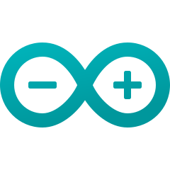

### About the Notes
>Each note will provide a summary of the most important points regarding the topic. This is useful for getting a higher-level understanding or refreshing your memory. If you want more details, you can use the resources at the end of the note as a curated list of resources.

### About the Author
Have an experience with programming and system designs for about more than 7 years.
Love talking to Clients on a daily basis. Love talking new Open Source Technologies & UI Designs.

#### Experience with technologies and tools below

