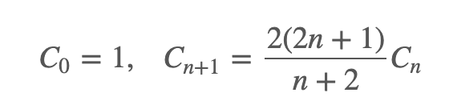

# Medium

## Contents

-   [Add Two Numbers](#add-two-numbers)
    -   [Inputs](#inputs)
    -   [Process](#process)
    -   [Edge Cases](#edge-cases)
-   [Longest Substring Without Repeating Characters](#longest-substring-without-repeating-characters)
    -   [Inputs](#inputs-1)
    -   [Process](#process-1)
    -   [Edge Cases](#edge-cases-1)
-   [Longest Palindromic Substring](#longest-palindromic-substring)
-   [Zigzag Conversion](#zigzag-conversion)
-   [Reverse Integer](#reverse-integer)
-   [String to Integer (atoi)](#string-to-integer-atoi)
-   [Container With Most Water](#container-with-most-water)
-   [Integer to Roman](#integer-to-roman)
-   [3Sum](#3sum)
-   [3Sum Closest](#3sum-closest)
-   [Letter Combinations of a Phone Number](#letter-combinations-of-a-phone-number)
-   [4Sum](#4sum)
-   [Remove Nth Node From End of List](#remove-nth-node-from-end-of-list)
-   [Generate Parentheses](#generate-parentheses)
-   [Swap Nodes in Pairs](#swap-nodes-in-pairs)
-   [Divide Two Integers](#divide-two-integers)
-   [Next Permutation](#next-permutation)
-   [Search in Rotated Sorted Array](#search-in-rotated-sorted-array)
-   [Find First and Last Position of Element in Sorted Array](#find-first-and-last-position-of-element-in-sorted-array)
-   [Valid Sudoku](#valid-sudoku)
-   [Count and Say](#count-and-say)
-   [Combination Sum](#combination-sum)
-   [Combination Sum II](#combination-sum-ii)
-   [Multiply Strings](#multiply-strings)
-   [Jump Game II](#jump-game-ii)
-   [Permutations](#permutations)
-   [Permutations II](#permutations-ii)
-   [Rotate Image](#rotate-image)
-   [Group Anagrams](#group-anagrams)
-   [Pow(x, n)](#powx-n)
-   [Spiral Matrix](#spiral-matrix)
-   [Jump Game](#jump-game)
-   [Merge Intervals](#merge-intervals)
-   [Insert Interval](#insert-interval)
-   [Spiral Matrix II](#spiral-matrix-ii)
-   [Rotate List](#rotate-list)
-   [Unique Paths](#unique-paths)
-   [Unique Paths II](#unique-paths-ii)
-   [Minimum Path Sum](#minimum-path-sum)
-   [Simplify Path](#simplify-path)
-   [Set Matrix Zeroes](#set-matrix-zeroes)
-   [Search a 2D Matrix](#search-a-2d-matrix)
-   [Sort Colors](#sort-colors)
-   [Combinations](#combinations)
-   [Subsets](#subsets)
-   [Word Search](#word-search)
-   [Remove Duplicates from Sorted Array II](#remove-duplicates-from-sorted-array-ii)
-   [Search in Rotated Sorted Array II](#search-in-rotated-sorted-array-ii)
-   [Remove Duplicates from Sorted List II](#remove-duplicates-from-sorted-list-ii)
-   [Partition List](#partition-list)
-   [Gray Code](#gray-code)
-   [Subsets II](#subsets-ii)
-   [Decode Ways](#decode-ways)
-   [Reverse Linked List II](#reverse-linked-list-ii)
-   [Restore IP Addresses](#restore-ip-addresses)
-   [Unique Binary Search Trees II](#unique-binary-search-trees-ii)
-   [Unique Binary Search Trees](#unique-binary-search-trees)
    -   -   [Inputs](#inputs-2)
    -   [Sub problems](#sub-problems)
    -   [Edge Cases](#edge-cases-2)
    -   [Further Readings](#further-readings)
    -   [Problems based on Catalan Number](#problems-based-on-catalan-number)
-   [Interleaving String](#interleaving-string)
-   [Validate Binary Search Tree](#validate-binary-search-tree)
-   [Recover Binary Search Tree](#recover-binary-search-tree)
-   [Binary Tree Level Order Traversal](#binary-tree-level-order-traversal)
-   [Binary Tree Zigzag Level Order Traversal](#binary-tree-zigzag-level-order-traversal)
-   [Construct Binary Tree from Preorder and Inorder Traversal](#construct-binary-tree-from-preorder-and-inorder-traversal)
-   [Construct Binary Tree from Inorder and Postorder Traversal](#construct-binary-tree-from-inorder-and-postorder-traversal)
-   [Binary Tree Level Order Traversal II](#binary-tree-level-order-traversal-ii)
-   [Convert Sorted List to Binary Search Tree](#convert-sorted-list-to-binary-search-tree)
-   [Path Sum II](#path-sum-ii)
-   [Flatten Binary Tree to Linked List](#flatten-binary-tree-to-linked-list)
-   [Populating Next Right Pointers in Each Node](#populating-next-right-pointers-in-each-node)
-   [Populating Next Right Pointers in Each Node II](#populating-next-right-pointers-in-each-node-ii)
-   [Triangle](#triangle)
-   [Best Time to Buy and Sell Stock II](#best-time-to-buy-and-sell-stock-ii)
-   [Longest Consecutive Sequence](#longest-consecutive-sequence)
-   [Sum Root to Leaf Numbers](#sum-root-to-leaf-numbers)
-   [Surrounded Regions](#surrounded-regions)
-   [Palindrome Partitioning](#palindrome-partitioning)
-   [Clone Graph](#clone-graph)
-   [Gas Station](#gas-station)
-   [Single Number II](#single-number-ii)
-   [Copy List with Random Pointer](#copy-list-with-random-pointer)
-   [Word Break](#word-break)
-   [Linked List Cycle II](#linked-list-cycle-ii)
-   [Reorder List](#reorder-list)
-   [LRU Cache](#lru-cache)
-   [Insertion Sort List](#insertion-sort-list)
-   [Sort List](#sort-list)
-   [Evaluate Reverse Polish Notation](#evaluate-reverse-polish-notation)
-   [Reverse Words in a String](#reverse-words-in-a-string)
-   [Maximum Product Subarray](#maximum-product-subarray)
-   [Find Minimum in Rotated Sorted Array](#find-minimum-in-rotated-sorted-array)
-   [Binary Tree Upside Down](#binary-tree-upside-down)
-   [Longest Substring with At Most Two Distinct Characters](#longest-substring-with-at-most-two-distinct-characters)
-   [One Edit Distance](#one-edit-distance)
-   [Find Peak Element](#find-peak-element)
-   [Compare Version Numbers](#compare-version-numbers)
-   [Fraction to Recurring Decimal](#fraction-to-recurring-decimal)
-   [Two Sum II - Input Array Is Sorted](#two-sum-ii---input-array-is-sorted)
-   [Factorial Trailing Zeroes](#factorial-trailing-zeroes)
-   [Binary Search Tree Iterator](#binary-search-tree-iterator)
-   [Second Highest Salary](#second-highest-salary)
-   [Nth Highest Salary](#nth-highest-salary)
-   [Rank Scores](#rank-scores)
-   [Largest Number](#largest-number)
-   [Consecutive Numbers](#consecutive-numbers)
-   [Department Highest Salary](#department-highest-salary)
-   [Reverse Words in a String II](#reverse-words-in-a-string-ii)
-   [Repeated DNA Sequences](#repeated-dna-sequences)
-   [Rotate Array](#rotate-array)
-   [Word Frequency](#word-frequency)
-   [Transpose File](#transpose-file)
-   [House Robber](#house-robber)
-   [Binary Tree Right Side View](#binary-tree-right-side-view)
-   [Number of Islands](#number-of-islands)
-   [Bitwise AND of Numbers Range](#bitwise-and-of-numbers-range)
-   [Count Primes](#count-primes)
-   [Course Schedule](#course-schedule)
-   [Implement Trie (Prefix Tree)](#implement-trie-prefix-tree)
-   [Minimum Size Subarray Sum](#minimum-size-subarray-sum)
-   [Course Schedule II](#course-schedule-ii)
-   [Design Add and Search Words Data Structure](#design-add-and-search-words-data-structure)
-   [House Robber II](#house-robber-ii)
-   [Kth Largest Element in an Array](#kth-largest-element-in-an-array)
-   [Combination Sum III](#combination-sum-iii)
-   [Contains Duplicate III](#contains-duplicate-iii)
-   [Maximal Square](#maximal-square)
-   [Count Complete Tree Nodes](#count-complete-tree-nodes)
-   [Rectangle Area](#rectangle-area)
-   [Basic Calculator II](#basic-calculator-ii)
-   [Majority Element II](#majority-element-ii)
-   [Kth Smallest Element in a BST](#kth-smallest-element-in-a-bst)
-   [Lowest Common Ancestor of a Binary Tree](#lowest-common-ancestor-of-a-binary-tree)
-   [Product of Array Except Self](#product-of-array-except-self)
-   [Search a 2D Matrix II](#search-a-2d-matrix-ii)
-   [Different Ways to Add Parentheses](#different-ways-to-add-parentheses)
-   [Shortest Word Distance II](#shortest-word-distance-ii)
-   [Shortest Word Distance III](#shortest-word-distance-iii)
-   [Strobogrammatic Number II](#strobogrammatic-number-ii)
-   [Group Shifted Strings](#group-shifted-strings)
-   [Count Univalue Subtrees](#count-univalue-subtrees)
-   [Flatten 2D Vector](#flatten-2d-vector)
-   [Meeting Rooms II](#meeting-rooms-ii)
-   [Factor Combinations](#factor-combinations)
-   [Verify Preorder Sequence in Binary Search Tree](#verify-preorder-sequence-in-binary-search-tree)
-   [Paint House](#paint-house)
-   [3Sum Smaller](#3sum-smaller)
-   [Single Number III](#single-number-iii)
-   [Graph Valid Tree](#graph-valid-tree)
-   [Ugly Number II](#ugly-number-ii)
-   [Palindrome Permutation II](#palindrome-permutation-ii)
-   [Encode and Decode Strings](#encode-and-decode-strings)
-   [H-Index](#h-index)
-   [H-Index II](#h-index-ii)
-   [Paint Fence](#paint-fence)
-   [Find the Celebrity](#find-the-celebrity)
-   [Perfect Squares](#perfect-squares)
-   [Wiggle Sort](#wiggle-sort)
-   [Zigzag Iterator](#zigzag-iterator)
-   [Peeking Iterator](#peeking-iterator)
-   [Inorder Successor in BST](#inorder-successor-in-bst)
-   [Walls and Gates](#walls-and-gates)
-   [Find the Duplicate Number](#find-the-duplicate-number)
-   [Unique Word Abbreviation](#unique-word-abbreviation)
-   [Game of Life](#game-of-life)
-   [Word Pattern II](#word-pattern-ii)
-   [Flip Game II](#flip-game-ii)
-   [Binary Tree Longest Consecutive Sequence](#binary-tree-longest-consecutive-sequence)
-   [Bulls and Cows](#bulls-and-cows)
-   [Longest Increasing Subsequence](#longest-increasing-subsequence)
-   [Range Sum Query 2D - Immutable](#range-sum-query-2d---immutable)
-   [Additive Number](#additive-number)
-   [Range Sum Query - Mutable](#range-sum-query---mutable)
-   [Best Time to Buy and Sell Stock with Cooldown](#best-time-to-buy-and-sell-stock-with-cooldown)
-   [Minimum Height Trees](#minimum-height-trees)
-   [Sparse Matrix Multiplication](#sparse-matrix-multiplication)
-   [Super Ugly Number](#super-ugly-number)
-   [Binary Tree Vertical Order Traversal](#binary-tree-vertical-order-traversal)
-   [Remove Duplicate Letters](#remove-duplicate-letters)
-   [Maximum Product of Word Lengths](#maximum-product-of-word-lengths)
-   [Bulb Switcher](#bulb-switcher)
-   [Generalized Abbreviation](#generalized-abbreviation)
-   [Coin Change](#coin-change)
-   [Number of Connected Components in an Undirected Graph](#number-of-connected-components-in-an-undirected-graph)
-   [Wiggle Sort II](#wiggle-sort-ii)
-   [Maximum Size Subarray Sum Equals k](#maximum-size-subarray-sum-equals-k)
-   [Odd Even Linked List](#odd-even-linked-list)
-   [Verify Preorder Serialization of a Binary Tree](#verify-preorder-serialization-of-a-binary-tree)
-   [Largest BST Subtree](#largest-bst-subtree)
-   [Increasing Triplet Subsequence](#increasing-triplet-subsequence)
-   [House Robber III](#house-robber-iii)
-   [Nested List Weight Sum](#nested-list-weight-sum)
-   [Longest Substring with At Most K Distinct Characters](#longest-substring-with-at-most-k-distinct-characters)
-   [Flatten Nested List Iterator](#flatten-nested-list-iterator)
-   [Integer Break](#integer-break)
-   [Top K Frequent Elements](#top-k-frequent-elements)
-   [Design Tic-Tac-Toe](#design-tic-tac-toe)
-   [Android Unlock Patterns](#android-unlock-patterns)
-   [Design Snake Game](#design-snake-game)
-   [Design Twitter](#design-twitter)
-   [Line Reflection](#line-reflection)
-   [Count Numbers with Unique Digits](#count-numbers-with-unique-digits)
-   [Sort Transformed Array](#sort-transformed-array)
-   [Bomb Enemy](#bomb-enemy)
-   [Design Hit Counter](#design-hit-counter)
-   [Nested List Weight Sum II](#nested-list-weight-sum-ii)
-   [Water and Jug Problem](#water-and-jug-problem)
-   [Find Leaves of Binary Tree](#find-leaves-of-binary-tree)
-   [Largest Divisible Subset](#largest-divisible-subset)
-   [Plus One Linked List](#plus-one-linked-list)
-   [Range Addition](#range-addition)
-   [Sum of Two Integers](#sum-of-two-integers)
-   [Super Pow](#super-pow)
-   [Find K Pairs with Smallest Sums](#find-k-pairs-with-smallest-sums)
-   [Guess Number Higher or Lower II](#guess-number-higher-or-lower-ii)
-   [Wiggle Subsequence](#wiggle-subsequence)
-   [Combination Sum IV](#combination-sum-iv)
-   [Kth Smallest Element in a Sorted Matrix](#kth-smallest-element-in-a-sorted-matrix)
-   [Design Phone Directory](#design-phone-directory)
-   [Insert Delete GetRandom O(1)](#insert-delete-getrandom-o1)
-   [Linked List Random Node](#linked-list-random-node)
-   [Shuffle an Array](#shuffle-an-array)
-   [Mini Parser](#mini-parser)
-   [Lexicographical Numbers](#lexicographical-numbers)
-   [Longest Absolute File Path](#longest-absolute-file-path)
-   [Elimination Game](#elimination-game)
-   [UTF-8 Validation](#utf-8-validation)
-   [Decode String](#decode-string)
-   [Longest Substring with At Least K Repeating Characters](#longest-substring-with-at-least-k-repeating-characters)
-   [Rotate Function](#rotate-function)
-   [Integer Replacement](#integer-replacement)
-   [Random Pick Index](#random-pick-index)
-   [Evaluate Division](#evaluate-division)
-   [Nth Digit](#nth-digit)
-   [Remove K Digits](#remove-k-digits)
-   [Queue Reconstruction by Height](#queue-reconstruction-by-height)
-   [Arithmetic Slices](#arithmetic-slices)
-   [Partition Equal Subset Sum](#partition-equal-subset-sum)
-   [Pacific Atlantic Water Flow](#pacific-atlantic-water-flow)
-   [Sentence Screen Fitting](#sentence-screen-fitting)
-   [Battleships in a Board](#battleships-in-a-board)
-   [Maximum XOR of Two Numbers in an Array](#maximum-xor-of-two-numbers-in-an-array)
-   [Reconstruct Original Digits from English](#reconstruct-original-digits-from-english)
-   [Longest Repeating Character Replacement](#longest-repeating-character-replacement)
-   [Convert Binary Search Tree to Sorted Doubly Linked List](#convert-binary-search-tree-to-sorted-doubly-linked-list)
-   [Construct Quad Tree](#construct-quad-tree)
-   [N-ary Tree Level Order Traversal](#n-ary-tree-level-order-traversal)
-   [Flatten a Multilevel Doubly Linked List](#flatten-a-multilevel-doubly-linked-list)
-   [Minimum Genetic Mutation](#minimum-genetic-mutation)
-   [Non-overlapping Intervals](#non-overlapping-intervals)
-   [Find Right Interval](#find-right-interval)
-   [Path Sum III](#path-sum-iii)
-   [Find All Anagrams in a String](#find-all-anagrams-in-a-string)
-   [Ternary Expression Parser](#ternary-expression-parser)
-   [Find All Duplicates in an Array](#find-all-duplicates-in-an-array)
-   [String Compression](#string-compression)
-   [Sequence Reconstruction](#sequence-reconstruction)
-   [Add Two Numbers II](#add-two-numbers-ii)
-   [Number of Boomerangs](#number-of-boomerangs)
-   [Serialize and Deserialize BST](#serialize-and-deserialize-bst)
-   [Delete Node in a BST](#delete-node-in-a-bst)
-   [Sort Characters By Frequency](#sort-characters-by-frequency)
-   [Minimum Number of Arrows to Burst Balloons](#minimum-number-of-arrows-to-burst-balloons)
-   [Minimum Moves to Equal Array Elements](#minimum-moves-to-equal-array-elements)
-   [4Sum II](#4sum-ii)
-   [132 Pattern](#132-pattern)
-   [Circular Array Loop](#circular-array-loop)
-   [Minimum Moves to Equal Array Elements II](#minimum-moves-to-equal-array-elements-ii)
-   [Can I Win](#can-i-win)
-   [Unique Substrings in Wraparound String](#unique-substrings-in-wraparound-string)
-   [Validate IP Address](#validate-ip-address)
-   [Convex Polygon](#convex-polygon)
-   [Implement Rand10() Using Rand7()](#implement-rand10-using-rand7)
-   [Matchsticks to Square](#matchsticks-to-square)
-   [Ones and Zeroes](#ones-and-zeroes)
-   [Heaters](#heaters)
-   [Total Hamming Distance](#total-hamming-distance)
-   [Generate Random Point in a Circle](#generate-random-point-in-a-circle)
-   [Magical String](#magical-string)
-   [Find Permutation](#find-permutation)
-   [Predict the Winner](#predict-the-winner)
-   [Max Consecutive Ones II](#max-consecutive-ones-ii)
-   [The Maze](#the-maze)
-   [Increasing Subsequences](#increasing-subsequences)
-   [Target Sum](#target-sum)
-   [Random Point in Non-overlapping Rectangles](#random-point-in-non-overlapping-rectangles)
-   [Diagonal Traverse](#diagonal-traverse)
-   [Next Greater Element II](#next-greater-element-ii)
-   [The Maze II](#the-maze-ii)
-   [Most Frequent Subtree Sum](#most-frequent-subtree-sum)
-   [Inorder Successor in BST II](#inorder-successor-in-bst-ii)
-   [Find Bottom Left Tree Value](#find-bottom-left-tree-value)
-   [Find Largest Value in Each Tree Row](#find-largest-value-in-each-tree-row)
-   [Longest Palindromic Subsequence](#longest-palindromic-subsequence)
-   [Coin Change 2](#coin-change-2)
-   [Random Flip Matrix](#random-flip-matrix)
-   [Longest Uncommon Subsequence II](#longest-uncommon-subsequence-ii)
-   [Continuous Subarray Sum](#continuous-subarray-sum)
-   [Longest Word in Dictionary through Deleting](#longest-word-in-dictionary-through-deleting)
-   [Contiguous Array](#contiguous-array)
-   [Beautiful Arrangement](#beautiful-arrangement)
-   [Random Pick with Weight](#random-pick-with-weight)
-   [Minesweeper](#minesweeper)
-   [Lonely Pixel I](#lonely-pixel-i)
-   [K-diff Pairs in an Array](#k-diff-pairs-in-an-array)
-   [Lonely Pixel II](#lonely-pixel-ii)
-   [Game Play Analysis III](#game-play-analysis-iii)
-   [Encode and Decode TinyURL](#encode-and-decode-tinyurl)
-   [Construct Binary Tree from String](#construct-binary-tree-from-string)
-   [Complex Number Multiplication](#complex-number-multiplication)
-   [Convert BST to Greater Tree](#convert-bst-to-greater-tree)
-   [Minimum Time Difference](#minimum-time-difference)
-   [Single Element in a Sorted Array](#single-element-in-a-sorted-array)
-   [01 Matrix](#01-matrix)
-   [Output Contest Matches](#output-contest-matches)
-   [Boundary of Binary Tree](#boundary-of-binary-tree)
-   [Number of Provinces](#number-of-provinces)
-   [Binary Tree Longest Consecutive Sequence II](#binary-tree-longest-consecutive-sequence-ii)
-   [Game Play Analysis IV](#game-play-analysis-iv)
-   [Optimal Division](#optimal-division)
-   [Brick Wall](#brick-wall)
-   [Split Concatenated Strings](#split-concatenated-strings)
-   [Next Greater Element III](#next-greater-element-iii)
-   [Logical OR of Two Binary Grids Represented as Quad-Trees](#logical-or-of-two-binary-grids-represented-as-quad-trees)
-   [Subarray Sum Equals K](#subarray-sum-equals-k)
-   [Longest Line of Consecutive One in Matrix](#longest-line-of-consecutive-one-in-matrix)
-   [Array Nesting](#array-nesting)
-   [Permutation in String](#permutation-in-string)
-   [Managers with at Least 5 Direct Reports](#managers-with-at-least-5-direct-reports)
-   [Squirrel Simulation](#squirrel-simulation)
-   [Winning Candidate](#winning-candidate)
-   [Out of Boundary Paths](#out-of-boundary-paths)
-   [Get Highest Answer Rate Question](#get-highest-answer-rate-question)
-   [Count Student Number in Departments](#count-student-number-in-departments)
-   [Shortest Unsorted Continuous Subarray](#shortest-unsorted-continuous-subarray)
-   [Kill Process](#kill-process)
-   [Delete Operation for Two Strings](#delete-operation-for-two-strings)
-   [Investments in 2016](#investments-in-2016)
-   [Fraction Addition and Subtraction](#fraction-addition-and-subtraction)
-   [Valid Square](#valid-square)
-   [Friend Requests II: Who Has the Most Friends](#friend-requests-ii-who-has-the-most-friends)
-   [Tree Node](#tree-node)
-   [Find Duplicate File in System](#find-duplicate-file-in-system)
-   [Valid Triangle Number](#valid-triangle-number)
-   [Shortest Distance in a Plane](#shortest-distance-in-a-plane)
-   [Second Degree Follower](#second-degree-follower)
-   [Add Bold Tag in String](#add-bold-tag-in-string)
-   [Task Scheduler](#task-scheduler)
-   [Design Circular Queue](#design-circular-queue)
-   [Add One Row to Tree](#add-one-row-to-tree)
-   [Maximum Distance in Arrays](#maximum-distance-in-arrays)
-   [Minimum Factorization](#minimum-factorization)
-   [Exchange Seats](#exchange-seats)
-   [Sum of Square Numbers](#sum-of-square-numbers)
-   [Find the Derangement of An Array](#find-the-derangement-of-an-array)
-   [Design Log Storage System](#design-log-storage-system)
-   [Exclusive Time of Functions](#exclusive-time-of-functions)
-   [Shopping Offers](#shopping-offers)
-   [Solve the Equation](#solve-the-equation)
-   [Design Circular Deque](#design-circular-deque)
-   [Maximum Length of Pair Chain](#maximum-length-of-pair-chain)
-   [Palindromic Substrings](#palindromic-substrings)
-   [Replace Words](#replace-words)
-   [Dota2 Senate](#dota2-senate)
-   [2 Keys Keyboard](#2-keys-keyboard)
-   [4 Keys Keyboard](#4-keys-keyboard)
-   [Find Duplicate Subtrees](#find-duplicate-subtrees)
-   [Maximum Binary Tree](#maximum-binary-tree)
-   [Print Binary Tree](#print-binary-tree)
-   [Find K Closest Elements](#find-k-closest-elements)
-   [Split Array into Consecutive Subsequences](#split-array-into-consecutive-subsequences)
-   [Maximum Width of Binary Tree](#maximum-width-of-binary-tree)
-   [Equal Tree Partition](#equal-tree-partition)
-   [Non-decreasing Array](#non-decreasing-array)
-   [Path Sum IV](#path-sum-iv)
-   [Beautiful Arrangement II](#beautiful-arrangement-ii)
-   [Trim a Binary Search Tree](#trim-a-binary-search-tree)
-   [Maximum Swap](#maximum-swap)
-   [Bulb Switcher II](#bulb-switcher-ii)
-   [Number of Longest Increasing Subsequence](#number-of-longest-increasing-subsequence)
-   [Implement Magic Dictionary](#implement-magic-dictionary)
-   [Map Sum Pairs](#map-sum-pairs)
-   [Valid Parenthesis String](#valid-parenthesis-string)
-   [Next Closest Time](#next-closest-time)
-   [Redundant Connection](#redundant-connection)
-   [Repeated String Match](#repeated-string-match)
-   [Longest Univalue Path](#longest-univalue-path)
-   [Knight Probability in Chessboard](#knight-probability-in-chessboard)
-   [Employee Importance](#employee-importance)
-   [Top K Frequent Words](#top-k-frequent-words)
-   [Number of Distinct Islands](#number-of-distinct-islands)
-   [Max Area of Island](#max-area-of-island)
-   [Partition to K Equal Sum Subsets](#partition-to-k-equal-sum-subsets)
-   [Insert into a Binary Search Tree](#insert-into-a-binary-search-tree)
-   [Search in a Sorted Array of Unknown Size](#search-in-a-sorted-array-of-unknown-size)
-   [Design Linked List](#design-linked-list)
-   [Insert into a Sorted Circular Linked List](#insert-into-a-sorted-circular-linked-list)
-   [Minimum ASCII Delete Sum for Two Strings](#minimum-ascii-delete-sum-for-two-strings)
-   [Subarray Product Less Than K](#subarray-product-less-than-k)
-   [Best Time to Buy and Sell Stock with Transaction Fee](#best-time-to-buy-and-sell-stock-with-transaction-fee)
-   [Maximum Length of Repeated Subarray](#maximum-length-of-repeated-subarray)
-   [Longest Word in Dictionary](#longest-word-in-dictionary)
-   [Accounts Merge](#accounts-merge)
-   [Remove Comments](#remove-comments)
-   [Candy Crush](#candy-crush)
-   [Split Linked List in Parts](#split-linked-list-in-parts)
-   [My Calendar I](#my-calendar-i)
-   [My Calendar II](#my-calendar-ii)
-   [Asteroid Collision](#asteroid-collision)
-   [Sentence Similarity II](#sentence-similarity-ii)
-   [Monotone Increasing Digits](#monotone-increasing-digits)
-   [Daily Temperatures](#daily-temperatures)
-   [Delete and Earn](#delete-and-earn)
-   [Closest Leaf in a Binary Tree](#closest-leaf-in-a-binary-tree)
-   [Network Delay Time](#network-delay-time)
-   [Number Of Corner Rectangles](#number-of-corner-rectangles)
-   [IP to CIDR](#ip-to-cidr)
-   [Open the Lock](#open-the-lock)
-   [Reach a Number](#reach-a-number)
-   [Pour Water](#pour-water)
-   [Pyramid Transition Matrix](#pyramid-transition-matrix)
-   [Bold Words in String](#bold-words-in-string)
-   [Partition Labels](#partition-labels)
-   [Largest Plus Sign](#largest-plus-sign)
-   [Reorganize String](#reorganize-string)
-   [Max Chunks To Make Sorted](#max-chunks-to-make-sorted)
-   [Global and Local Inversions](#global-and-local-inversions)
-   [Split BST](#split-bst)
-   [Swap Adjacent in LR String](#swap-adjacent-in-lr-string)
-   [K-th Symbol in Grammar](#k-th-symbol-in-grammar)
-   [Rabbits in Forest](#rabbits-in-forest)
-   [Letter Case Permutation](#letter-case-permutation)
-   [Is Graph Bipartite?](#is-graph-bipartite)
-   [Cheapest Flights Within K Stops](#cheapest-flights-within-k-stops)
-   [Rotated Digits](#rotated-digits)
-   [Escape The Ghosts](#escape-the-ghosts)
-   [Domino and Tromino Tiling](#domino-and-tromino-tiling)
-   [Custom Sort String](#custom-sort-string)
-   [Number of Matching Subsequences](#number-of-matching-subsequences)
-   [Valid Tic-Tac-Toe State](#valid-tic-tac-toe-state)
-   [Number of Subarrays with Bounded Maximum](#number-of-subarrays-with-bounded-maximum)
-   [All Paths From Source to Target](#all-paths-from-source-to-target)
-   [Champagne Tower](#champagne-tower)
-   [Find Eventual Safe States](#find-eventual-safe-states)
-   [Max Increase to Keep City Skyline](#max-increase-to-keep-city-skyline)
-   [Soup Servings](#soup-servings)
-   [Expressive Words](#expressive-words)
-   [Subdomain Visit Count](#subdomain-visit-count)
-   [Largest Sum of Averages](#largest-sum-of-averages)
-   [Binary Tree Pruning](#binary-tree-pruning)
-   [Ambiguous Coordinates](#ambiguous-coordinates)
-   [Linked List Components](#linked-list-components)
-   [Short Encoding of Words](#short-encoding-of-words)
-   [Card Flipping Game](#card-flipping-game)
-   [Binary Trees With Factors](#binary-trees-with-factors)
-   [Friends Of Appropriate Ages](#friends-of-appropriate-ages)
-   [Most Profit Assigning Work](#most-profit-assigning-work)
-   [Masking Personal Information](#masking-personal-information)
-   [Find And Replace in String](#find-and-replace-in-string)
-   [Image Overlap](#image-overlap)
-   [New 21 Game](#new-21-game)
-   [Push Dominoes](#push-dominoes)
-   [Magic Squares In Grid](#magic-squares-in-grid)
-   [Keys and Rooms](#keys-and-rooms)
-   [Split Array into Fibonacci Sequence](#split-array-into-fibonacci-sequence)
-   [Longest Mountain in Array](#longest-mountain-in-array)
-   [Hand of Straights](#hand-of-straights)
-   [Shifting Letters](#shifting-letters)
-   [Maximize Distance to Closest Person](#maximize-distance-to-closest-person)
-   [Loud and Rich](#loud-and-rich)
-   [Car Fleet](#car-fleet)
-   [Exam Room](#exam-room)
-   [Score of Parentheses](#score-of-parentheses)
-   [Mirror Reflection](#mirror-reflection)
-   [Score After Flipping Matrix](#score-after-flipping-matrix)
-   [All Nodes Distance K in Binary Tree](#all-nodes-distance-k-in-binary-tree)
-   [Smallest Subtree with all the Deepest Nodes](#smallest-subtree-with-all-the-deepest-nodes)
-   [Prime Palindrome](#prime-palindrome)
-   [Reordered Power of 2](#reordered-power-of-2)
-   [Advantage Shuffle](#advantage-shuffle)
-   [Length of Longest Fibonacci Subsequence](#length-of-longest-fibonacci-subsequence)
-   [Walking Robot Simulation](#walking-robot-simulation)
-   [Koko Eating Bananas](#koko-eating-bananas)
-   [Stone Game](#stone-game)
-   [Decoded String at Index](#decoded-string-at-index)
-   [Boats to Save People](#boats-to-save-people)
-   [Spiral Matrix III](#spiral-matrix-iii)
-   [Possible Bipartition](#possible-bipartition)
-   [Construct Binary Tree from Preorder and Postorder Traversal](#construct-binary-tree-from-preorder-and-postorder-traversal)
-   [Find and Replace Pattern](#find-and-replace-pattern)
-   [Groups of Special-Equivalent Strings](#groups-of-special-equivalent-strings)
-   [All Possible Full Binary Trees](#all-possible-full-binary-trees)
-   [Bitwise ORs of Subarrays](#bitwise-ors-of-subarrays)
-   [RLE Iterator](#rle-iterator)
-   [Online Stock Span](#online-stock-span)
-   [Fruit Into Baskets](#fruit-into-baskets)
-   [Sum of Subarray Minimums](#sum-of-subarray-minimums)
-   [Snakes and Ladders](#snakes-and-ladders)
-   [Smallest Range II](#smallest-range-ii)
-   [Online Election](#online-election)
-   [Sort an Array](#sort-an-array)
-   [Partition Array into Disjoint Intervals](#partition-array-into-disjoint-intervals)
-   [Word Subsets](#word-subsets)
-   [Maximum Sum Circular Subarray](#maximum-sum-circular-subarray)
-   [Complete Binary Tree Inserter](#complete-binary-tree-inserter)
-   [Minimum Add to Make Parentheses Valid](#minimum-add-to-make-parentheses-valid)
-   [3Sum With Multiplicity](#3sum-with-multiplicity)
-   [Flip String to Monotone Increasing](#flip-string-to-monotone-increasing)
-   [Binary Subarrays With Sum](#binary-subarrays-with-sum)
-   [Minimum Falling Path Sum](#minimum-falling-path-sum)
-   [Beautiful Array](#beautiful-array)
-   [Shortest Bridge](#shortest-bridge)
-   [Knight Dialer](#knight-dialer)
-   [Minimum Area Rectangle](#minimum-area-rectangle)
-   [Minimum Increment to Make Array Unique](#minimum-increment-to-make-array-unique)
-   [Validate Stack Sequences](#validate-stack-sequences)
-   [Most Stones Removed with Same Row or Column](#most-stones-removed-with-same-row-or-column)
-   [Bag of Tokens](#bag-of-tokens)
-   [Largest Time for Given Digits](#largest-time-for-given-digits)
-   [Reveal Cards In Increasing Order](#reveal-cards-in-increasing-order)
-   [Flip Equivalent Binary Trees](#flip-equivalent-binary-trees)
-   [Array of Doubled Pairs](#array-of-doubled-pairs)
-   [Delete Columns to Make Sorted II](#delete-columns-to-make-sorted-ii)
-   [Prison Cells After N Days](#prison-cells-after-n-days)
-   [Check Completeness of a Binary Tree](#check-completeness-of-a-binary-tree)
-   [Regions Cut By Slashes](#regions-cut-by-slashes)
-   [Maximum Width Ramp](#maximum-width-ramp)
-   [Minimum Area Rectangle II](#minimum-area-rectangle-ii)
-   [Vowel Spellchecker](#vowel-spellchecker)
-   [Numbers With Same Consecutive Differences](#numbers-with-same-consecutive-differences)
-   [Pancake Sorting](#pancake-sorting)
-   [Powerful Integers](#powerful-integers)
-   [Flip Binary Tree To Match Preorder Traversal](#flip-binary-tree-to-match-preorder-traversal)
-   [K Closest Points to Origin](#k-closest-points-to-origin)
-   [Subarray Sums Divisible by K](#subarray-sums-divisible-by-k)
-   [Longest Turbulent Subarray](#longest-turbulent-subarray)
-   [Distribute Coins in Binary Tree](#distribute-coins-in-binary-tree)
-   [Time Based Key-Value Store](#time-based-key-value-store)
-   [Minimum Cost For Tickets](#minimum-cost-for-tickets)
-   [String Without AAA or BBB](#string-without-aaa-or-bbb)
-   [Sum of Even Numbers After Queries](#sum-of-even-numbers-after-queries)
-   [Interval List Intersections](#interval-list-intersections)
-   [Smallest String Starting From Leaf](#smallest-string-starting-from-leaf)
-   [Satisfiability of Equality Equations](#satisfiability-of-equality-equations)
-   [Broken Calculator](#broken-calculator)
-   [Rotting Oranges](#rotting-oranges)
-   [Maximum Binary Tree II](#maximum-binary-tree-ii)
-   [Check If Word Is Valid After Substitutions](#check-if-word-is-valid-after-substitutions)
-   [Max Consecutive Ones III](#max-consecutive-ones-iii)
-   [Clumsy Factorial](#clumsy-factorial)
-   [Minimum Domino Rotations For Equal Row](#minimum-domino-rotations-for-equal-row)
-   [Construct Binary Search Tree from Preorder Traversal](#construct-binary-search-tree-from-preorder-traversal)
-   [Pairs of Songs With Total Durations Divisible by 60](#pairs-of-songs-with-total-durations-divisible-by-60)
-   [Capacity To Ship Packages Within D Days](#capacity-to-ship-packages-within-d-days)
-   [Best Sightseeing Pair](#best-sightseeing-pair)
-   [Smallest Integer Divisible by K](#smallest-integer-divisible-by-k)
-   [Binary String With Substrings Representing 1 To N](#binary-string-with-substrings-representing-1-to-n)
-   [Convert to Base -2](#convert-to-base--2)
-   [Next Greater Node In Linked List](#next-greater-node-in-linked-list)
-   [Number of Enclaves](#number-of-enclaves)
-   [Camelcase Matching](#camelcase-matching)
-   [Video Stitching](#video-stitching)
-   [Maximum Difference Between Node and Ancestor](#maximum-difference-between-node-and-ancestor)
-   [Longest Arithmetic Subsequence](#longest-arithmetic-subsequence)
-   [Two City Scheduling](#two-city-scheduling)
-   [Maximum Sum of Two Non-Overlapping Subarrays](#maximum-sum-of-two-non-overlapping-subarrays)
-   [Moving Stones Until Consecutive](#moving-stones-until-consecutive)
-   [Coloring A Border](#coloring-a-border)
-   [Uncrossed Lines](#uncrossed-lines)
-   [Binary Search Tree to Greater Sum Tree](#binary-search-tree-to-greater-sum-tree)
-   [Minimum Score Triangulation of Polygon](#minimum-score-triangulation-of-polygon)
-   [Moving Stones Until Consecutive II](#moving-stones-until-consecutive-ii)
-   [Robot Bounded In Circle](#robot-bounded-in-circle)
-   [Flower Planting With No Adjacent](#flower-planting-with-no-adjacent)
-   [Partition Array for Maximum Sum](#partition-array-for-maximum-sum)
-   [Customers Who Bought All Products](#customers-who-bought-all-products)
-   [Longest String Chain](#longest-string-chain)
-   [Last Stone Weight II](#last-stone-weight-ii)
-   [Grumpy Bookstore Owner](#grumpy-bookstore-owner)
-   [Previous Permutation With One Swap](#previous-permutation-with-one-swap)
-   [Distant Barcodes](#distant-barcodes)
-   [Shortest Way to Form String](#shortest-way-to-form-string)
-   [Campus Bikes](#campus-bikes)
-   [Minimize Rounding Error to Meet Target](#minimize-rounding-error-to-meet-target)
-   [All Paths from Source Lead to Destination](#all-paths-from-source-lead-to-destination)
-   [Missing Element in Sorted Array](#missing-element-in-sorted-array)
-   [Lexicographically Smallest Equivalent String](#lexicographically-smallest-equivalent-string)
-   [Longest Repeating Substring](#longest-repeating-substring)
-   [Campus Bikes II](#campus-bikes-ii)
-   [Product Sales Analysis III](#product-sales-analysis-iii)
-   [Flip Columns For Maximum Number of Equal Rows](#flip-columns-for-maximum-number-of-equal-rows)
-   [Adding Two Negabinary Numbers](#adding-two-negabinary-numbers)
-   [Project Employees III](#project-employees-iii)
-   [Letter Tile Possibilities](#letter-tile-possibilities)
-   [Insufficient Nodes in Root to Leaf Paths](#insufficient-nodes-in-root-to-leaf-paths)
-   [Smallest Subsequence of Distinct Characters](#smallest-subsequence-of-distinct-characters)
-   [Brace Expansion](#brace-expansion)
-   [Largest Values From Labels](#largest-values-from-labels)
-   [Shortest Path in Binary Matrix](#shortest-path-in-binary-matrix)
-   [Statistics from a Large Sample](#statistics-from-a-large-sample)
-   [Car Pooling](#car-pooling)
-   [Unpopular Books](#unpopular-books)
-   [Find K-Length Substrings With No Repeated Characters](#find-k-length-substrings-with-no-repeated-characters)
-   [The Earliest Moment When Everyone Become Friends](#the-earliest-moment-when-everyone-become-friends)
-   [Path With Maximum Minimum Value](#path-with-maximum-minimum-value)
-   [Path In Zigzag Labelled Binary Tree](#path-in-zigzag-labelled-binary-tree)
-   [Filling Bookcase Shelves](#filling-bookcase-shelves)
-   [New Users Daily Count](#new-users-daily-count)
-   [Corporate Flight Bookings](#corporate-flight-bookings)
-   [Delete Nodes And Return Forest](#delete-nodes-and-return-forest)
-   [Maximum Nesting Depth of Two Valid Parentheses Strings](#maximum-nesting-depth-of-two-valid-parentheses-strings)
-   [Highest Grade For Each Student](#highest-grade-for-each-student)
-   [Print FooBar Alternately](#print-foobar-alternately)
-   [Print Zero Even Odd](#print-zero-even-odd)
-   [Building H2O](#building-h2o)
-   [Maximum Average Subtree](#maximum-average-subtree)
-   [Lowest Common Ancestor of Deepest Leaves](#lowest-common-ancestor-of-deepest-leaves)
-   [Longest Well-Performing Interval](#longest-well-performing-interval)
-   [Active Businesses](#active-businesses)
-   [Shortest Path with Alternating Colors](#shortest-path-with-alternating-colors)
-   [Minimum Cost Tree From Leaf Values](#minimum-cost-tree-from-leaf-values)
-   [Maximum of Absolute Value Expression](#maximum-of-absolute-value-expression)
-   [Reported Posts II](#reported-posts-ii)
-   [Connecting Cities With Minimum Cost](#connecting-cities-with-minimum-cost)
-   [Parallel Courses](#parallel-courses)
-   [Alphabet Board Path](#alphabet-board-path)
-   [Largest 1-Bordered Square](#largest-1-bordered-square)
-   [Stone Game II](#stone-game-ii)
-   [Longest Common Subsequence](#longest-common-subsequence)
-   [Decrease Elements To Make Array Zigzag](#decrease-elements-to-make-array-zigzag)
-   [Binary Tree Coloring Game](#binary-tree-coloring-game)
-   [Snapshot Array](#snapshot-array)
-   [Article Views II](#article-views-ii)
-   [Minimum Swaps to Group All 1's Together](#minimum-swaps-to-group-all-1s-together)
-   [Analyze User Website Visit Pattern](#analyze-user-website-visit-pattern)
-   [Number of Dice Rolls With Target Sum](#number-of-dice-rolls-with-target-sum)
-   [Swap For Longest Repeated Character Substring](#swap-for-longest-repeated-character-substring)
-   [Market Analysis I](#market-analysis-i)
-   [Maximum Level Sum of a Binary Tree](#maximum-level-sum-of-a-binary-tree)
-   [As Far from Land as Possible](#as-far-from-land-as-possible)
-   [Product Price at a Given Date](#product-price-at-a-given-date)
-   [Design File System](#design-file-system)
-   [Minimum Cost to Connect Sticks](#minimum-cost-to-connect-sticks)
-   [Invalid Transactions](#invalid-transactions)
-   [Compare Strings by Frequency of the Smallest Character](#compare-strings-by-frequency-of-the-smallest-character)
-   [Remove Zero Sum Consecutive Nodes from Linked List](#remove-zero-sum-consecutive-nodes-from-linked-list)
-   [Immediate Food Delivery II](#immediate-food-delivery-ii)
-   [Can Make Palindrome from Substring](#can-make-palindrome-from-substring)
-   [Before and After Puzzle](#before-and-after-puzzle)
-   [Shortest Distance to Target Color](#shortest-distance-to-target-color)
-   [Maximum Subarray Sum with One Deletion](#maximum-subarray-sum-with-one-deletion)
-   [Design Bounded Blocking Queue](#design-bounded-blocking-queue)
-   [Reverse Substrings Between Each Pair of Parentheses](#reverse-substrings-between-each-pair-of-parentheses)
-   [K-Concatenation Maximum Sum](#k-concatenation-maximum-sum)
-   [Monthly Transactions I](#monthly-transactions-i)
-   [Fizz Buzz Multithreaded](#fizz-buzz-multithreaded)
-   [Minimum Knight Moves](#minimum-knight-moves)
-   [Find Smallest Common Element in All Rows](#find-smallest-common-element-in-all-rows)
-   [Ugly Number III](#ugly-number-iii)
-   [Smallest String With Swaps](#smallest-string-with-swaps)
-   [Last Person to Fit in the Bus](#last-person-to-fit-in-the-bus)
-   [Monthly Transactions II](#monthly-transactions-ii)
-   [Get Equal Substrings Within Budget](#get-equal-substrings-within-budget)
-   [Remove All Adjacent Duplicates in String II](#remove-all-adjacent-duplicates-in-string-ii)
-   [Team Scores in Football Tournament](#team-scores-in-football-tournament)
-   [Two Sum BSTs](#two-sum-bsts)
-   [Stepping Numbers](#stepping-numbers)
-   [Longest Arithmetic Subsequence of Given Difference](#longest-arithmetic-subsequence-of-given-difference)
-   [Path with Maximum Gold](#path-with-maximum-gold)
-   [Queens That Can Attack the King](#queens-that-can-attack-the-king)
-   [The Dining Philosophers](#the-dining-philosophers)
-   [Airplane Seat Assignment Probability](#airplane-seat-assignment-probability)
-   [Meeting Scheduler](#meeting-scheduler)
-   [Toss Strange Coins](#toss-strange-coins)
-   [Remove Sub-Folders from the Filesystem](#remove-sub-folders-from-the-filesystem)
-   [Replace the Substring for Balanced String](#replace-the-substring-for-balanced-string)
-   [Web Crawler](#web-crawler)
-   [Find Positive Integer Solution for a Given Equation](#find-positive-integer-solution-for-a-given-equation)
-   [Circular Permutation in Binary Representation](#circular-permutation-in-binary-representation)
-   [Maximum Length of a Concatenated String with Unique Characters](#maximum-length-of-a-concatenated-string-with-unique-characters)
-   [Web Crawler Multithreaded](#web-crawler-multithreaded)
-   [Design A Leaderboard](#design-a-leaderboard)
-   [Tree Diameter](#tree-diameter)
-   [Minimum Swaps to Make Strings Equal](#minimum-swaps-to-make-strings-equal)
-   [Count Number of Nice Subarrays](#count-number-of-nice-subarrays)
-   [Minimum Remove to Make Valid Parentheses](#minimum-remove-to-make-valid-parentheses)
-   [Reconstruct a 2-Row Binary Matrix](#reconstruct-a-2-row-binary-matrix)
-   [Number of Closed Islands](#number-of-closed-islands)
-   [Encode Number](#encode-number)
-   [Smallest Common Region](#smallest-common-region)
-   [Synonymous Sentences](#synonymous-sentences)
-   [Find Elements in a Contaminated Binary Tree](#find-elements-in-a-contaminated-binary-tree)
-   [Greatest Sum Divisible by Three](#greatest-sum-divisible-by-three)
-   [Page Recommendations](#page-recommendations)
-   [Print Immutable Linked List in Reverse](#print-immutable-linked-list-in-reverse)
-   [Count Servers that Communicate](#count-servers-that-communicate)
-   [Search Suggestions System](#search-suggestions-system)
-   [All People Report to the Given Manager](#all-people-report-to-the-given-manager)
-   [Remove Interval](#remove-interval)
-   [Delete Tree Nodes](#delete-tree-nodes)
-   [Number of Burgers with No Waste of Ingredients](#number-of-burgers-with-no-waste-of-ingredients)
-   [Count Square Submatrices with All Ones](#count-square-submatrices-with-all-ones)
-   [Group the People Given the Group Size They Belong To](#group-the-people-given-the-group-size-they-belong-to)
-   [Find the Smallest Divisor Given a Threshold](#find-the-smallest-divisor-given-a-threshold)
-   [Find the Start and End Number of Continuous Ranges](#find-the-start-and-end-number-of-continuous-ranges)
-   [Iterator for Combination](#iterator-for-combination)
-   [Remove Covered Intervals](#remove-covered-intervals)
-   [Sequential Digits](#sequential-digits)
-   [Maximum Side Length of a Square with Sum Less than or Equal to Threshold](#maximum-side-length-of-a-square-with-sum-less-than-or-equal-to-threshold)
-   [Divide Array in Sets of K Consecutive Numbers](#divide-array-in-sets-of-k-consecutive-numbers)
-   [Maximum Number of Occurrences of a Substring](#maximum-number-of-occurrences-of-a-substring)
-   [Sum of Mutated Array Closest to Target](#sum-of-mutated-array-closest-to-target)
-   [Deepest Leaves Sum](#deepest-leaves-sum)
-   [All Elements in Two Binary Search Trees](#all-elements-in-two-binary-search-trees)
-   [Jump Game III](#jump-game-iii)
-   [Running Total for Different Genders](#running-total-for-different-genders)
-   [XOR Queries of a Subarray](#xor-queries-of-a-subarray)
-   [Get Watched Videos by Your Friends](#get-watched-videos-by-your-friends)
-   [Matrix Block Sum](#matrix-block-sum)
-   [Sum of Nodes with Even-Valued Grandparent](#sum-of-nodes-with-even-valued-grandparent)
-   [Minimum Flips to Make a OR b Equal to c](#minimum-flips-to-make-a-or-b-equal-to-c)
-   [Number of Operations to Make Network Connected](#number-of-operations-to-make-network-connected)
-   [Restaurant Growth](#restaurant-growth)
-   [Print Words Vertically](#print-words-vertically)
-   [Delete Leaves With a Given Value](#delete-leaves-with-a-given-value)
-   [Break a Palindrome](#break-a-palindrome)
-   [Sort the Matrix Diagonally](#sort-the-matrix-diagonally)
-   [Filter Restaurants by Vegan-Friendly, Price and Distance](#filter-restaurants-by-vegan-friendly-price-and-distance)
-   [Find the City With the Smallest Number of Neighbors at a Threshold Distance](#find-the-city-with-the-smallest-number-of-neighbors-at-a-threshold-distance)
-   [Reduce Array Size to The Half](#reduce-array-size-to-the-half)
-   [Maximum Product of Splitted Binary Tree](#maximum-product-of-splitted-binary-tree)
-   [Movie Rating](#movie-rating)
-   [Number of Sub-arrays of Size K and Average Greater than or Equal to Threshold](#number-of-sub-arrays-of-size-k-and-average-greater-than-or-equal-to-threshold)
-   [Angle Between Hands of a Clock](#angle-between-hands-of-a-clock)
-   [Minimum Number of Steps to Make Two Strings Anagram](#minimum-number-of-steps-to-make-two-strings-anagram)
-   [Tweet Counts Per Frequency](#tweet-counts-per-frequency)
-   [Product of the Last K Numbers](#product-of-the-last-k-numbers)
-   [Maximum Number of Events That Can Be Attended](#maximum-number-of-events-that-can-be-attended)
-   [Activity Participants](#activity-participants)
-   [Apply Discount Every n Orders](#apply-discount-every-n-orders)
-   [Number of Substrings Containing All Three Characters](#number-of-substrings-containing-all-three-characters)
-   [Validate Binary Tree Nodes](#validate-binary-tree-nodes)
-   [Closest Divisors](#closest-divisors)
-   [Number of Trusted Contacts of a Customer](#number-of-trusted-contacts-of-a-customer)
-   [Rank Teams by Votes](#rank-teams-by-votes)
-   [Linked List in Binary Tree](#linked-list-in-binary-tree)
-   [Find the Longest Substring Containing Vowels in Even Counts](#find-the-longest-substring-containing-vowels-in-even-counts)
-   [Longest ZigZag Path in a Binary Tree](#longest-zigzag-path-in-a-binary-tree)
-   [Number of Times Binary String Is Prefix-Aligned](#number-of-times-binary-string-is-prefix-aligned)
-   [Time Needed to Inform All Employees](#time-needed-to-inform-all-employees)
-   [Design a Stack With Increment Operation](#design-a-stack-with-increment-operation)
-   [Balance a Binary Search Tree](#balance-a-binary-search-tree)
-   [Cinema Seat Allocation](#cinema-seat-allocation)
-   [Sort Integers by The Power Value](#sort-integers-by-the-power-value)
-   [Four Divisors](#four-divisors)
-   [Check if There is a Valid Path in a Grid](#check-if-there-is-a-valid-path-in-a-grid)
-   [Capital Gain/Loss](#capital-gainloss)
-   [Count Number of Teams](#count-number-of-teams)
-   [Design Underground System](#design-underground-system)
-   [Customers Who Bought Products A and B but Not C](#customers-who-bought-products-a-and-b-but-not-c)
-   [Construct K Palindrome Strings](#construct-k-palindrome-strings)
-   [Circle and Rectangle Overlapping](#circle-and-rectangle-overlapping)
-   [Number of Steps to Reduce a Number in Binary Representation to One](#number-of-steps-to-reduce-a-number-in-binary-representation-to-one)
-   [Longest Happy String](#longest-happy-string)
-   [Queries on a Permutation With Key](#queries-on-a-permutation-with-key)
-   [HTML Entity Parser](#html-entity-parser)
-   [Find the Minimum Number of Fibonacci Numbers Whose Sum Is K](#find-the-minimum-number-of-fibonacci-numbers-whose-sum-is-k)
-   [The k-th Lexicographical String of All Happy Strings of Length n](#the-k-th-lexicographical-string-of-all-happy-strings-of-length-n)
-   [Display Table of Food Orders in a Restaurant](#display-table-of-food-orders-in-a-restaurant)
-   [Minimum Number of Frogs Croaking](#minimum-number-of-frogs-croaking)
-   [Maximum Points You Can Obtain from Cards](#maximum-points-you-can-obtain-from-cards)
-   [Diagonal Traverse II](#diagonal-traverse-ii)
-   [Leftmost Column with at Least a One](#leftmost-column-with-at-least-a-one)
-   [First Unique Number](#first-unique-number)
-   [Check If a String Is a Valid Sequence from Root to Leaves Path in a Binary Tree](#check-if-a-string-is-a-valid-sequence-from-root-to-leaves-path-in-a-binary-tree)
-   [Max Difference You Can Get From Changing an Integer](#max-difference-you-can-get-from-changing-an-integer)
-   [Check If a String Can Break Another String](#check-if-a-string-can-break-another-string)
-   [Longest Continuous Subarray With Absolute Diff Less Than or Equal to Limit](#longest-continuous-subarray-with-absolute-diff-less-than-or-equal-to-limit)
-   [Evaluate Boolean Expression](#evaluate-boolean-expression)
-   [Count Triplets That Can Form Two Arrays of Equal XOR](#count-triplets-that-can-form-two-arrays-of-equal-xor)
-   [Minimum Time to Collect All Apples in a Tree](#minimum-time-to-collect-all-apples-in-a-tree)
-   [Apples & Oranges](#apples--oranges)
-   [Simplified Fractions](#simplified-fractions)
-   [Count Good Nodes in Binary Tree](#count-good-nodes-in-binary-tree)
-   [Rearrange Words in a Sentence](#rearrange-words-in-a-sentence)
-   [People Whose List of Favorite Companies Is Not a Subset of Another List](#people-whose-list-of-favorite-companies-is-not-a-subset-of-another-list)
-   [Active Users](#active-users)
-   [Maximum Number of Vowels in a Substring of Given Length](#maximum-number-of-vowels-in-a-substring-of-given-length)
-   [Pseudo-Palindromic Paths in a Binary Tree](#pseudo-palindromic-paths-in-a-binary-tree)
-   [Rectangles Area](#rectangles-area)
-   [Check If a String Contains All Binary Codes of Size K](#check-if-a-string-contains-all-binary-codes-of-size-k)
-   [Course Schedule IV](#course-schedule-iv)
-   [Maximum Area of a Piece of Cake After Horizontal and Vertical Cuts](#maximum-area-of-a-piece-of-cake-after-horizontal-and-vertical-cuts)
-   [Reorder Routes to Make All Paths Lead to the City Zero](#reorder-routes-to-make-all-paths-lead-to-the-city-zero)
-   [Calculate Salaries](#calculate-salaries)
-   [The k Strongest Values in an Array](#the-k-strongest-values-in-an-array)
-   [Design Browser History](#design-browser-history)
-   [Subrectangle Queries](#subrectangle-queries)
-   [Find Two Non-overlapping Sub-arrays Each With Target Sum](#find-two-non-overlapping-sub-arrays-each-with-target-sum)
-   [Least Number of Unique Integers after K Removals](#least-number-of-unique-integers-after-k-removals)
-   [Minimum Number of Days to Make m Bouquets](#minimum-number-of-days-to-make-m-bouquets)
-   [Clone Binary Tree With Random Pointer](#clone-binary-tree-with-random-pointer)
-   [Making File Names Unique](#making-file-names-unique)
-   [Avoid Flood in The City](#avoid-flood-in-the-city)
-   [Clone N-ary Tree](#clone-n-ary-tree)
-   [The kth Factor of n](#the-kth-factor-of-n)
-   [Longest Subarray of 1's After Deleting One Element](#longest-subarray-of-1s-after-deleting-one-element)
-   [Check If Array Pairs Are Divisible by k](#check-if-array-pairs-are-divisible-by-k)
-   [Number of Subsequences That Satisfy the Given Sum Condition](#number-of-subsequences-that-satisfy-the-given-sum-condition)
-   [Design a File Sharing System](#design-a-file-sharing-system)
-   [Countries You Can Safely Invest In](#countries-you-can-safely-invest-in)
-   [Last Moment Before All Ants Fall Out of a Plank](#last-moment-before-all-ants-fall-out-of-a-plank)
-   [Count Submatrices With All Ones](#count-submatrices-with-all-ones)
-   [Find Root of N-Ary Tree](#find-root-of-n-ary-tree)
-   [Range Sum of Sorted Subarray Sums](#range-sum-of-sorted-subarray-sums)
-   [Minimum Difference Between Largest and Smallest Value in Three Moves](#minimum-difference-between-largest-and-smallest-value-in-three-moves)
-   [Number of Substrings With Only 1s](#number-of-substrings-with-only-1s)
-   [Path with Maximum Probability](#path-with-maximum-probability)
-   [Number of Nodes in the Sub-Tree With the Same Label](#number-of-nodes-in-the-sub-tree-with-the-same-label)
-   [Diameter of N-Ary Tree](#diameter-of-n-ary-tree)
-   [Number of Sub-arrays With Odd Sum](#number-of-sub-arrays-with-odd-sum)
-   [Number of Good Ways to Split a String](#number-of-good-ways-to-split-a-string)
-   [Minimum Suffix Flips](#minimum-suffix-flips)
-   [Number of Good Leaf Nodes Pairs](#number-of-good-leaf-nodes-pairs)
-   [The Most Recent Three Orders](#the-most-recent-three-orders)
-   [Find the Index of the Large Integer](#find-the-index-of-the-large-integer)
-   [Find the Winner of an Array Game](#find-the-winner-of-an-array-game)
-   [Minimum Swaps to Arrange a Binary Grid](#minimum-swaps-to-arrange-a-binary-grid)
-   [Guess the Majority in a Hidden Array](#guess-the-majority-in-a-hidden-array)
-   [Can Convert String in K Moves](#can-convert-string-in-k-moves)
-   [Minimum Insertions to Balance a Parentheses String](#minimum-insertions-to-balance-a-parentheses-string)
-   [Find Kth Bit in Nth Binary String](#find-kth-bit-in-nth-binary-string)
-   [Maximum Number of Non-Overlapping Subarrays With Sum Equals Target](#maximum-number-of-non-overlapping-subarrays-with-sum-equals-target)
-   [The Most Recent Orders for Each Product](#the-most-recent-orders-for-each-product)
-   [Minimum Operations to Make Array Equal](#minimum-operations-to-make-array-equal)
-   [Magnetic Force Between Two Balls](#magnetic-force-between-two-balls)
-   [Strings Differ by One Character](#strings-differ-by-one-character)
-   [Bank Account Summary](#bank-account-summary)
-   [Minimum Number of Vertices to Reach All Nodes](#minimum-number-of-vertices-to-reach-all-nodes)
-   [Minimum Numbers of Function Calls to Make Target Array](#minimum-numbers-of-function-calls-to-make-target-array)
-   [Detect Cycles in 2D Grid](#detect-cycles-in-2d-grid)
-   [Maximum Number of Coins You Can Get](#maximum-number-of-coins-you-can-get)
-   [Find Latest Group of Size M](#find-latest-group-of-size-m)
-   [Put Boxes Into the Warehouse I](#put-boxes-into-the-warehouse-i)
-   [Maximum Length of Subarray With Positive Product](#maximum-length-of-subarray-with-positive-product)
-   [Dot Product of Two Sparse Vectors](#dot-product-of-two-sparse-vectors)
-   [Number of Ways to Split a String](#number-of-ways-to-split-a-string)
-   [Shortest Subarray to be Removed to Make Array Sorted](#shortest-subarray-to-be-removed-to-make-array-sorted)
-   [Number of Ways Where Square of Number Is Equal to Product of Two Numbers](#number-of-ways-where-square-of-number-is-equal-to-product-of-two-numbers)
-   [Minimum Time to Make Rope Colorful](#minimum-time-to-make-rope-colorful)
-   [Put Boxes Into the Warehouse II](#put-boxes-into-the-warehouse-ii)
-   [Count Unhappy Friends](#count-unhappy-friends)
-   [Min Cost to Connect All Points](#min-cost-to-connect-all-points)
-   [Binary Search Tree Iterator II](#binary-search-tree-iterator-ii)
-   [Maximum Sum Obtained of Any Permutation](#maximum-sum-obtained-of-any-permutation)
-   [Make Sum Divisible by P](#make-sum-divisible-by-p)
-   [Split a String Into the Max Number of Unique Substrings](#split-a-string-into-the-max-number-of-unique-substrings)
-   [Maximum Non Negative Product in a Matrix](#maximum-non-negative-product-in-a-matrix)
-   [The Most Frequently Ordered Products for Each Customer](#the-most-frequently-ordered-products-for-each-customer)
-   [Maximum Profit of Operating a Centennial Wheel](#maximum-profit-of-operating-a-centennial-wheel)
-   [Throne Inheritance](#throne-inheritance)
-   [Find Nearest Right Node in Binary Tree](#find-nearest-right-node-in-binary-tree)
-   [Alert Using Same Key-Card Three or More Times in a One Hour Period](#alert-using-same-key-card-three-or-more-times-in-a-one-hour-period)
-   [Find Valid Matrix Given Row and Column Sums](#find-valid-matrix-given-row-and-column-sums)
-   [Even Odd Tree](#even-odd-tree)
-   [Check If Two Expression Trees are Equivalent](#check-if-two-expression-trees-are-equivalent)
-   [Find the Missing IDs](#find-the-missing-ids)
-   [Maximal Network Rank](#maximal-network-rank)
-   [Split Two Strings to Make Palindrome](#split-two-strings-to-make-palindrome)
-   [Maximum Font to Fit a Sentence in a Screen](#maximum-font-to-fit-a-sentence-in-a-screen)
-   [Coordinate With Maximum Network Quality](#coordinate-with-maximum-network-quality)
-   [Number of Sets of K Non-Overlapping Line Segments](#number-of-sets-of-k-non-overlapping-line-segments)
-   [Lexicographically Smallest String After Applying Operations](#lexicographically-smallest-string-after-applying-operations)
-   [Best Team With No Conflicts](#best-team-with-no-conflicts)
-   [Design an Expression Tree With Evaluate Function](#design-an-expression-tree-with-evaluate-function)
-   [Arithmetic Subarrays](#arithmetic-subarrays)
-   [Path With Minimum Effort](#path-with-minimum-effort)
-   [Add Two Polynomials Represented as Linked Lists](#add-two-polynomials-represented-as-linked-lists)
-   [Widest Vertical Area Between Two Points Containing No Points](#widest-vertical-area-between-two-points-containing-no-points)
-   [Count Substrings That Differ by One Character](#count-substrings-that-differ-by-one-character)
-   [Count Sorted Vowel Strings](#count-sorted-vowel-strings)
-   [Furthest Building You Can Reach](#furthest-building-you-can-reach)
-   [Lowest Common Ancestor of a Binary Tree II](#lowest-common-ancestor-of-a-binary-tree-ii)
-   [Minimum Deletions to Make Character Frequencies Unique](#minimum-deletions-to-make-character-frequencies-unique)
-   [Sell Diminishing-Valued Colored Balls](#sell-diminishing-valued-colored-balls)
-   [Lowest Common Ancestor of a Binary Tree III](#lowest-common-ancestor-of-a-binary-tree-iii)
-   [Minimum Deletions to Make String Balanced](#minimum-deletions-to-make-string-balanced)
-   [Minimum Jumps to Reach Home](#minimum-jumps-to-reach-home)
-   [Determine if Two Strings Are Close](#determine-if-two-strings-are-close)
-   [Minimum Operations to Reduce X to Zero](#minimum-operations-to-reduce-x-to-zero)
-   [Correct a Binary Tree](#correct-a-binary-tree)
-   [Smallest String With A Given Numeric Value](#smallest-string-with-a-given-numeric-value)
-   [Ways to Make a Fair Array](#ways-to-make-a-fair-array)
-   [Change the Root of a Binary Tree](#change-the-root-of-a-binary-tree)
-   [Merge In Between Linked Lists](#merge-in-between-linked-lists)
-   [Design Front Middle Back Queue](#design-front-middle-back-queue)
-   [Find the Most Competitive Subsequence](#find-the-most-competitive-subsequence)
-   [Minimum Moves to Make Array Complementary](#minimum-moves-to-make-array-complementary)
-   [Lowest Common Ancestor of a Binary Tree IV](#lowest-common-ancestor-of-a-binary-tree-iv)
-   [Max Number of K-Sum Pairs](#max-number-of-k-sum-pairs)
-   [Concatenation of Consecutive Binary Numbers](#concatenation-of-consecutive-binary-numbers)
-   [Longest Palindromic Subsequence II](#longest-palindromic-subsequence-ii)
-   [Sum of Absolute Differences in a Sorted Array](#sum-of-absolute-differences-in-a-sorted-array)
-   [Stone Game VI](#stone-game-vi)
-   [Partitioning Into Minimum Number Of Deci-Binary Numbers](#partitioning-into-minimum-number-of-deci-binary-numbers)
-   [Stone Game VII](#stone-game-vii)
-   [Maximum Erasure Value](#maximum-erasure-value)
-   [Jump Game VI](#jump-game-vi)
-   [Number of Distinct Substrings in a String](#number-of-distinct-substrings-in-a-string)
-   [Number of Calls Between Two Persons](#number-of-calls-between-two-persons)
-   [Average Waiting Time](#average-waiting-time)
-   [Maximum Binary String After Change](#maximum-binary-string-after-change)
-   [Maximum Number of Eaten Apples](#maximum-number-of-eaten-apples)
-   [Where Will the Ball Fall](#where-will-the-ball-fall)
-   [Biggest Window Between Visits](#biggest-window-between-visits)
-   [Count Good Meals](#count-good-meals)
-   [Ways to Split Array Into Three Subarrays](#ways-to-split-array-into-three-subarrays)
-   [Count Apples and Oranges](#count-apples-and-oranges)
-   [Maximum Score From Removing Substrings](#maximum-score-from-removing-substrings)
-   [Construct the Lexicographically Largest Valid Sequence](#construct-the-lexicographically-largest-valid-sequence)
-   [Swapping Nodes in a Linked List](#swapping-nodes-in-a-linked-list)
-   [Minimize Hamming Distance After Swap Operations](#minimize-hamming-distance-after-swap-operations)
-   [Tuple with Same Product](#tuple-with-same-product)
-   [Largest Submatrix With Rearrangements](#largest-submatrix-with-rearrangements)
-   [Shortest Path to Get Food](#shortest-path-to-get-food)
-   [Minimum Number of People to Teach](#minimum-number-of-people-to-teach)
-   [Decode XORed Permutation](#decode-xored-permutation)
-   [Change Minimum Characters to Satisfy One of Three Conditions](#change-minimum-characters-to-satisfy-one-of-three-conditions)
-   [Find Kth Largest XOR Coordinate Value](#find-kth-largest-xor-coordinate-value)
-   [Find Distance in a Binary Tree](#find-distance-in-a-binary-tree)
-   [Restore the Array From Adjacent Pairs](#restore-the-array-from-adjacent-pairs)
-   [Can You Eat Your Favorite Candy on Your Favorite Day?](#can-you-eat-your-favorite-candy-on-your-favorite-day)
-   [Maximum Subarray Sum After One Operation](#maximum-subarray-sum-after-one-operation)
-   [Leetflex Banned Accounts](#leetflex-banned-accounts)
-   [Maximum Absolute Sum of Any Subarray](#maximum-absolute-sum-of-any-subarray)
-   [Minimum Length of String After Deleting Similar Ends](#minimum-length-of-string-after-deleting-similar-ends)
-   [Maximum Score From Removing Stones](#maximum-score-from-removing-stones)
-   [Largest Merge Of Two Strings](#largest-merge-of-two-strings)
-   [Design Most Recently Used Queue](#design-most-recently-used-queue)
-   [Count Number of Homogenous Substrings](#count-number-of-homogenous-substrings)
-   [Minimum Limit of Balls in a Bag](#minimum-limit-of-balls-in-a-bag)
-   [Buildings With an Ocean View](#buildings-with-an-ocean-view)
-   [Form Array by Concatenating Subarrays of Another Array](#form-array-by-concatenating-subarrays-of-another-array)
-   [Map of Highest Peak](#map-of-highest-peak)
-   [Minimum Number of Operations to Move All Balls to Each Box](#minimum-number-of-operations-to-move-all-balls-to-each-box)
-   [Maximum Score from Performing Multiplication Operations](#maximum-score-from-performing-multiplication-operations)
-   [Sort Features by Popularity](#sort-features-by-popularity)
-   [Closest Dessert Cost](#closest-dessert-cost)
-   [Equal Sum Arrays With Minimum Number of Operations](#equal-sum-arrays-with-minimum-number-of-operations)
-   [Shortest Path in a Hidden Grid](#shortest-path-in-a-hidden-grid)
-   [Check if Number is a Sum of Powers of Three](#check-if-number-is-a-sum-of-powers-of-three)
-   [Sum of Beauty of All Substrings](#sum-of-beauty-of-all-substrings)
-   [Grand Slam Titles](#grand-slam-titles)
-   [Minimum Elements to Add to Form a Given Sum](#minimum-elements-to-add-to-form-a-given-sum)
-   [Number of Restricted Paths From First to Last Node](#number-of-restricted-paths-from-first-to-last-node)
-   [Maximum Average Pass Ratio](#maximum-average-pass-ratio)
-   [Count Pairs of Equal Substrings With Minimum Difference](#count-pairs-of-equal-substrings-with-minimum-difference)
-   [Design Authentication Manager](#design-authentication-manager)
-   [Maximum Number of Consecutive Values You Can Make](#maximum-number-of-consecutive-values-you-can-make)
-   [Number of Orders in the Backlog](#number-of-orders-in-the-backlog)
-   [Maximum Value at a Given Index in a Bounded Array](#maximum-value-at-a-given-index-in-a-bounded-array)
-   [Implement Trie II (Prefix Tree)](#implement-trie-ii-prefix-tree)
-   [Minimum Number of Operations to Reinitialize a Permutation](#minimum-number-of-operations-to-reinitialize-a-permutation)
-   [Evaluate the Bracket Pairs of a String](#evaluate-the-bracket-pairs-of-a-string)
-   [Minimum Path Cost in a Hidden Grid](#minimum-path-cost-in-a-hidden-grid)
-   [Find Interview Candidates](#find-interview-candidates)
-   [Sentence Similarity III](#sentence-similarity-iii)
-   [Count Nice Pairs in an Array](#count-nice-pairs-in-an-array)
-   [Finding the Users Active Minutes](#finding-the-users-active-minutes)
-   [Minimum Absolute Sum Difference](#minimum-absolute-sum-difference)
-   [Maximum Number of Accepted Invitations](#maximum-number-of-accepted-invitations)
-   [Find the Winner of the Circular Game](#find-the-winner-of-the-circular-game)
-   [Minimum Sideway Jumps](#minimum-sideway-jumps)
-   [Queries on Number of Points Inside a Circle](#queries-on-number-of-points-inside-a-circle)
-   [Maximum XOR for Each Query](#maximum-xor-for-each-query)
-   [Maximum Transaction Each Day](#maximum-transaction-each-day)
-   [Maximum Ice Cream Bars](#maximum-ice-cream-bars)
-   [Single-Threaded CPU](#single-threaded-cpu)
-   [Remove Duplicates From an Unsorted Linked List](#remove-duplicates-from-an-unsorted-linked-list)
-   [Frequency of the Most Frequent Element](#frequency-of-the-most-frequent-element)
-   [Longest Substring Of All Vowels in Order](#longest-substring-of-all-vowels-in-order)
-   [League Statistics](#league-statistics)
-   [Suspicious Bank Accounts](#suspicious-bank-accounts)
-   [Seat Reservation Manager](#seat-reservation-manager)
-   [Maximum Element After Decreasing and Rearranging](#maximum-element-after-decreasing-and-rearranging)
-   [Splitting a String Into Descending Consecutive Values](#splitting-a-string-into-descending-consecutive-values)
-   [Minimum Adjacent Swaps to Reach the Kth Smallest Number](#minimum-adjacent-swaps-to-reach-the-kth-smallest-number)
-   [Distinct Numbers in Each Subarray](#distinct-numbers-in-each-subarray)
-   [Maximum Distance Between a Pair of Values](#maximum-distance-between-a-pair-of-values)
-   [Maximum Subarray Min-Product](#maximum-subarray-min-product)
-   [Longest Word With All Prefixes](#longest-word-with-all-prefixes)
-   [Incremental Memory Leak](#incremental-memory-leak)
-   [Rotating the Box](#rotating-the-box)
-   [Minimum Number of Swaps to Make the Binary String Alternating](#minimum-number-of-swaps-to-make-the-binary-string-alternating)
-   [Finding Pairs With a Certain Sum](#finding-pairs-with-a-certain-sum)
-   [Orders With Maximum Quantity Above Average](#orders-with-maximum-quantity-above-average)
-   [Product of Two Run-Length Encoded Arrays](#product-of-two-run-length-encoded-arrays)
-   [Minimum Speed to Arrive on Time](#minimum-speed-to-arrive-on-time)
-   [Jump Game VII](#jump-game-vii)
-   [Minimize Product Sum of Two Arrays](#minimize-product-sum-of-two-arrays)
-   [Group Employees of the Same Salary](#group-employees-of-the-same-salary)
-   [Minimize Maximum Pair Sum in Array](#minimize-maximum-pair-sum-in-array)
-   [Get Biggest Three Rhombus Sums in a Grid](#get-biggest-three-rhombus-sums-in-a-grid)
-   [Maximum Value after Insertion](#maximum-value-after-insertion)
-   [Process Tasks Using Servers](#process-tasks-using-servers)
-   [Egg Drop With 2 Eggs and N Floors](#egg-drop-with-2-eggs-and-n-floors)
-   [Count Pairs in Two Arrays](#count-pairs-in-two-arrays)
-   [Reduction Operations to Make the Array Elements Equal](#reduction-operations-to-make-the-array-elements-equal)
-   [Minimum Number of Flips to Make the Binary String Alternating](#minimum-number-of-flips-to-make-the-binary-string-alternating)
-   [Cutting Ribbons](#cutting-ribbons)
-   [Find the Student that Will Replace the Chalk](#find-the-student-that-will-replace-the-chalk)
-   [Largest Magic Square](#largest-magic-square)
-   [Maximum Number of Removable Characters](#maximum-number-of-removable-characters)
-   [Merge Triplets to Form Target Triplet](#merge-triplets-to-form-target-triplet)
-   [Find a Peak Element II](#find-a-peak-element-ii)
-   [Depth of BST Given Insertion Order](#depth-of-bst-given-insertion-order)
-   [The Number of Full Rounds You Have Played](#the-number-of-full-rounds-you-have-played)
-   [Count Sub Islands](#count-sub-islands)
-   [Minimum Absolute Difference Queries](#minimum-absolute-difference-queries)
-   [Count Salary Categories](#count-salary-categories)
-   [Game of Nim](#game-of-nim)
-   [Remove All Occurrences of a Substring](#remove-all-occurrences-of-a-substring)
-   [Maximum Alternating Subsequence Sum](#maximum-alternating-subsequence-sum)
-   [Cyclically Rotating a Grid](#cyclically-rotating-a-grid)
-   [Number of Wonderful Substrings](#number-of-wonderful-substrings)
-   [Kth Smallest Subarray Sum](#kth-smallest-subarray-sum)
-   [Eliminate Maximum Number of Monsters](#eliminate-maximum-number-of-monsters)
-   [Count Good Numbers](#count-good-numbers)
-   [Nearest Exit from Entrance in Maze](#nearest-exit-from-entrance-in-maze)
-   [Sum Game](#sum-game)
-   [Unique Length-3 Palindromic Subsequences](#unique-length-3-palindromic-subsequences)
-   [Confirmation Rate](#confirmation-rate)
-   [Add Minimum Number of Rungs](#add-minimum-number-of-rungs)
-   [Maximum Number of Points with Cost](#maximum-number-of-points-with-cost)
-   [Longest Common Subsequence Between Sorted Arrays](#longest-common-subsequence-between-sorted-arrays)
-   [The Number of the Smallest Unoccupied Chair](#the-number-of-the-smallest-unoccupied-chair)
-   [Describe the Painting](#describe-the-painting)
-   [Largest Number After Mutating Substring](#largest-number-after-mutating-substring)
-   [Maximum Compatibility Score Sum](#maximum-compatibility-score-sum)
-   [Strong Friendship](#strong-friendship)
-   [Maximum of Minimum Values in All Subarrays](#maximum-of-minimum-values-in-all-subarrays)
-   [All the Pairs With the Maximum Number of Common Followers](#all-the-pairs-with-the-maximum-number-of-common-followers)
-   [Maximum Number of Weeks for Which You Can Work](#maximum-number-of-weeks-for-which-you-can-work)
-   [Minimum Garden Perimeter to Collect Enough Apples](#minimum-garden-perimeter-to-collect-enough-apples)
-   [Check if Move is Legal](#check-if-move-is-legal)
-   [Minimum Total Space Wasted With K Resizing Operations](#minimum-total-space-wasted-with-k-resizing-operations)
-   [Remove Stones to Minimize the Total](#remove-stones-to-minimize-the-total)
-   [Minimum Number of Swaps to Make the String Balanced](#minimum-number-of-swaps-to-make-the-string-balanced)
-   [Binary Searchable Numbers in an Unsorted Array](#binary-searchable-numbers-in-an-unsorted-array)
-   [Array With Elements Not Equal to Average of Neighbors](#array-with-elements-not-equal-to-average-of-neighbors)
-   [Minimum Non-Zero Product of the Array Elements](#minimum-non-zero-product-of-the-array-elements)
-   [Count Nodes Equal to Sum of Descendants](#count-nodes-equal-to-sum-of-descendants)
-   [Maximum Matrix Sum](#maximum-matrix-sum)
-   [Number of Ways to Arrive at Destination](#number-of-ways-to-arrive-at-destination)
-   [Find Unique Binary String](#find-unique-binary-string)
-   [Minimize the Difference Between Target and Chosen Elements](#minimize-the-difference-between-target-and-chosen-elements)
-   [Widest Pair of Indices With Equal Range Sum](#widest-pair-of-indices-with-equal-range-sum)
-   [Find the Kth Largest Integer in the Array](#find-the-kth-largest-integer-in-the-array)
-   [Minimum Number of Work Sessions to Finish the Tasks](#minimum-number-of-work-sessions-to-finish-the-tasks)
-   [Find Cutoff Score for Each School](#find-cutoff-score-for-each-school)
-   [Maximum Number of People That Can Be Caught in Tag](#maximum-number-of-people-that-can-be-caught-in-tag)
-   [Count the Number of Experiments](#count-the-number-of-experiments)
-   [Find All Groups of Farmland](#find-all-groups-of-farmland)
-   [Operations on Tree](#operations-on-tree)
-   [The Number of Weak Characters in the Game](#the-number-of-weak-characters-in-the-game)
-   [First Day Where You Have Been in All the Rooms](#first-day-where-you-have-been-in-all-the-rooms)
-   [Smallest Greater Multiple Made of Two Digits](#smallest-greater-multiple-made-of-two-digits)
-   [Number of Pairs of Interchangeable Rectangles](#number-of-pairs-of-interchangeable-rectangles)
-   [Maximum Product of the Length of Two Palindromic Subsequences](#maximum-product-of-the-length-of-two-palindromic-subsequences)
-   [Find Original Array From Doubled Array](#find-original-array-from-doubled-array)
-   [Maximum Earnings From Taxi](#maximum-earnings-from-taxi)
-   [Sum of Beauty in the Array](#sum-of-beauty-in-the-array)
-   [Detect Squares](#detect-squares)
-   [Average Height of Buildings in Each Segment](#average-height-of-buildings-in-each-segment)
-   [Grid Game](#grid-game)
-   [Check if Word Can Be Placed In Crossword](#check-if-word-can-be-placed-in-crossword)
-   [Number of Accounts That Did Not Stream](#number-of-accounts-that-did-not-stream)
-   [Brightest Position on Street](#brightest-position-on-street)
-   [Number of Pairs of Strings With Concatenation Equal to Target](#number-of-pairs-of-strings-with-concatenation-equal-to-target)
-   [Maximize the Confusion of an Exam](#maximize-the-confusion-of-an-exam)
-   [Find Missing Observations](#find-missing-observations)
-   [Stone Game IX](#stone-game-ix)
-   [Count Subarrays With More Ones Than Zeros](#count-subarrays-with-more-ones-than-zeros)
-   [Minimum Operations to Make a Uni-Value Grid](#minimum-operations-to-make-a-uni-value-grid)
-   [Stock Price Fluctuation](#stock-price-fluctuation)
-   [Maximum Alternating Subarray Sum](#maximum-alternating-subarray-sum)
-   [Remove Colored Pieces if Both Neighbors are the Same Color](#remove-colored-pieces-if-both-neighbors-are-the-same-color)
-   [The Time When the Network Becomes Idle](#the-time-when-the-network-becomes-idle)
-   [Accepted Candidates From the Interviews](#accepted-candidates-from-the-interviews)
-   [Simple Bank System](#simple-bank-system)
-   [Count Number of Maximum Bitwise-OR Subsets](#count-number-of-maximum-bitwise-or-subsets)
-   [Sort Linked List Already Sorted Using Absolute Values](#sort-linked-list-already-sorted-using-absolute-values)
-   [Next Greater Numerically Balanced Number](#next-greater-numerically-balanced-number)
-   [Count Nodes With the Highest Score](#count-nodes-with-the-highest-score)
-   [The Category of Each Member in the Store](#the-category-of-each-member-in-the-store)
-   [Minimum Cost to Separate Sentence Into Rows](#minimum-cost-to-separate-sentence-into-rows)
-   [Two Best Non-Overlapping Events](#two-best-non-overlapping-events)
-   [Plates Between Candles](#plates-between-candles)
-   [Find the Minimum and Maximum Number of Nodes Between Critical Points](#find-the-minimum-and-maximum-number-of-nodes-between-critical-points)
-   [Minimum Operations to Convert Number](#minimum-operations-to-convert-number)
-   [Number of Spaces Cleaning Robot Cleaned](#number-of-spaces-cleaning-robot-cleaned)
-   [Vowels of All Substrings](#vowels-of-all-substrings)
-   [Minimized Maximum of Products Distributed to Any Store](#minimized-maximum-of-products-distributed-to-any-store)
-   [Account Balance](#account-balance)
-   [Number of Equal Count Substrings](#number-of-equal-count-substrings)
-   [Walking Robot Simulation II](#walking-robot-simulation-ii)
-   [Most Beautiful Item for Each Query](#most-beautiful-item-for-each-query)
-   [Reverse Nodes in Even Length Groups](#reverse-nodes-in-even-length-groups)
-   [Decode the Slanted Ciphertext](#decode-the-slanted-ciphertext)
-   [Paths in Maze That Lead to Same Room](#paths-in-maze-that-lead-to-same-room)
-   [Watering Plants](#watering-plants)
-   [Range Frequency Queries](#range-frequency-queries)
-   [Substrings That Begin and End With the Same Letter](#substrings-that-begin-and-end-with-the-same-letter)
-   [Drop Type 1 Orders for Customers With Type 0 Orders](#drop-type-1-orders-for-customers-with-type-0-orders)
-   [Minimum Number of Buckets Required to Collect Rainwater from Houses](#minimum-number-of-buckets-required-to-collect-rainwater-from-houses)
-   [Minimum Cost Homecoming of a Robot in a Grid](#minimum-cost-homecoming-of-a-robot-in-a-grid)
-   [K Radius Subarray Averages](#k-radius-subarray-averages)
-   [Removing Minimum and Maximum From Array](#removing-minimum-and-maximum-from-array)
-   [Minimum Cost to Reach City With Discounts](#minimum-cost-to-reach-city-with-discounts)
-   [Delete the Middle Node of a Linked List](#delete-the-middle-node-of-a-linked-list)
-   [Step-By-Step Directions From a Binary Tree Node to Another](#step-by-step-directions-from-a-binary-tree-node-to-another)
-   [Subsequence of Size K With the Largest Even Sum](#subsequence-of-size-k-with-the-largest-even-sum)
-   [Find Good Days to Rob the Bank](#find-good-days-to-rob-the-bank)
-   [Detonate the Maximum Bombs](#detonate-the-maximum-bombs)
-   [Sum of Subarray Ranges](#sum-of-subarray-ranges)
-   [Watering Plants II](#watering-plants-ii)
-   [Number of Unique Flavors After Sharing K Candies](#number-of-unique-flavors-after-sharing-k-candies)
-   [Adding Spaces to a String](#adding-spaces-to-a-string)
-   [Number of Smooth Descent Periods of a Stock](#number-of-smooth-descent-periods-of-a-stock)
-   [The Airport With the Most Traffic](#the-airport-with-the-most-traffic)
-   [Elements in Array After Removing and Replacing Elements](#elements-in-array-after-removing-and-replacing-elements)
-   [Find All Possible Recipes from Given Supplies](#find-all-possible-recipes-from-given-supplies)
-   [Check if a Parentheses String Can Be Valid](#check-if-a-parentheses-string-can-be-valid)
-   [Execution of All Suffix Instructions Staying in a Grid](#execution-of-all-suffix-instructions-staying-in-a-grid)
-   [Intervals Between Identical Elements](#intervals-between-identical-elements)
-   [Number of Laser Beams in a Bank](#number-of-laser-beams-in-a-bank)
-   [Destroying Asteroids](#destroying-asteroids)
-   [Remove All Ones With Row and Column Flips](#remove-all-ones-with-row-and-column-flips)
-   [Maximum Twin Sum of a Linked List](#maximum-twin-sum-of-a-linked-list)
-   [Longest Palindrome by Concatenating Two Letter Words](#longest-palindrome-by-concatenating-two-letter-words)
-   [Minimum Swaps to Group All 1's Together II](#minimum-swaps-to-group-all-1s-together-ii)
-   [Count Words Obtained After Adding a Letter](#count-words-obtained-after-adding-a-letter)
-   [Pour Water Between Buckets to Make Water Levels Equal](#pour-water-between-buckets-to-make-water-levels-equal)
-   [Minimum Moves to Reach Target Score](#minimum-moves-to-reach-target-score)
-   [Solving Questions With Brainpower](#solving-questions-with-brainpower)
-   [The Number of Passengers in Each Bus I](#the-number-of-passengers-in-each-bus-i)
-   [Count the Hidden Sequences](#count-the-hidden-sequences)
-   [K Highest Ranked Items Within a Price Range](#k-highest-ranked-items-within-a-price-range)
-   [Rearrange Array Elements by Sign](#rearrange-array-elements-by-sign)
-   [Find All Lonely Numbers in the Array](#find-all-lonely-numbers-in-the-array)
-   [Minimum Number of Lines to Cover Points](#minimum-number-of-lines-to-cover-points)
-   [All Divisions With the Highest Score of a Binary Array](#all-divisions-with-the-highest-score-of-a-binary-array)
-   [Order Two Columns Independently](#order-two-columns-independently)
-   [Partition Array According to Given Pivot](#partition-array-according-to-given-pivot)
-   [Minimum Cost to Set Cooking Time](#minimum-cost-to-set-cooking-time)
-   [Smallest Value of the Rearranged Number](#smallest-value-of-the-rearranged-number)
-   [Design Bitset](#design-bitset)
-   [Unique Substrings With Equal Digit Frequency](#unique-substrings-with-equal-digit-frequency)
-   [Minimum Operations to Make the Array Alternating](#minimum-operations-to-make-the-array-alternating)
-   [Removing Minimum Number of Magic Beans](#removing-minimum-number-of-magic-beans)
-   [Remove All Ones With Row and Column Flips II](#remove-all-ones-with-row-and-column-flips-ii)
-   [The Change in Global Rankings](#the-change-in-global-rankings)
-   [Find Three Consecutive Integers That Sum to a Given Number](#find-three-consecutive-integers-that-sum-to-a-given-number)
-   [Maximum Split of Positive Even Integers](#maximum-split-of-positive-even-integers)
-   [Merge Nodes in Between Zeros](#merge-nodes-in-between-zeros)
-   [Construct String With Repeat Limit](#construct-string-with-repeat-limit)
-   [Number of Ways to Build Sturdy Brick Wall](#number-of-ways-to-build-sturdy-brick-wall)
-   [Minimum Number of Steps to Make Two Strings Anagram II](#minimum-number-of-steps-to-make-two-strings-anagram-ii)
-   [Minimum Time to Complete Trips](#minimum-time-to-complete-trips)
-   [Number of Ways to Build House of Cards](#number-of-ways-to-build-house-of-cards)
-   [Sort the Jumbled Numbers](#sort-the-jumbled-numbers)
-   [All Ancestors of a Node in a Directed Acyclic Graph](#all-ancestors-of-a-node-in-a-directed-acyclic-graph)
-   [Append K Integers With Minimal Sum](#append-k-integers-with-minimal-sum)
-   [Create Binary Tree From Descriptions](#create-binary-tree-from-descriptions)
-   [Number of Single Divisor Triplets](#number-of-single-divisor-triplets)
-   [Count Artifacts That Can Be Extracted](#count-artifacts-that-can-be-extracted)
-   [Maximize the Topmost Element After K Moves](#maximize-the-topmost-element-after-k-moves)
-   [Maximize Number of Subsequences in a String](#maximize-number-of-subsequences-in-a-string)
-   [Minimum Operations to Halve Array Sum](#minimum-operations-to-halve-array-sum)
-   [Count Collisions on a Road](#count-collisions-on-a-road)
-   [Maximum Points in an Archery Competition](#maximum-points-in-an-archery-competition)
-   [Minimum Health to Beat Game](#minimum-health-to-beat-game)
-   [Minimum Deletions to Make Array Beautiful](#minimum-deletions-to-make-array-beautiful)
-   [Find Palindrome With Fixed Length](#find-palindrome-with-fixed-length)
-   [Maximum Sum Score of Array](#maximum-sum-score-of-array)
-   [Find Triangular Sum of an Array](#find-triangular-sum-of-an-array)
-   [Number of Ways to Select Buildings](#number-of-ways-to-select-buildings)
-   [Find Players With Zero or One Losses](#find-players-with-zero-or-one-losses)
-   [Maximum Candies Allocated to K Children](#maximum-candies-allocated-to-k-children)
-   [Users With Two Purchases Within Seven Days](#users-with-two-purchases-within-seven-days)
-   [Minimize Result by Adding Parentheses to Expression](#minimize-result-by-adding-parentheses-to-expression)
-   [Maximum Product After K Increments](#maximum-product-after-k-increments)
-   [Count Positions on Street With Required Brightness](#count-positions-on-street-with-required-brightness)
-   [Number of Times a Driver Was a Passenger](#number-of-times-a-driver-was-a-passenger)
-   [Number of Ways to Buy Pens and Pencils](#number-of-ways-to-buy-pens-and-pencils)
-   [Design an ATM Machine](#design-an-atm-machine)
-   [Minimum Rounds to Complete All Tasks](#minimum-rounds-to-complete-all-tasks)
-   [Maximum Trailing Zeros in a Cornered Path](#maximum-trailing-zeros-in-a-cornered-path)
-   [Count Lattice Points Inside a Circle](#count-lattice-points-inside-a-circle)
-   [Count Number of Rectangles Containing Each Point](#count-number-of-rectangles-containing-each-point)
-   [Minimum Average Difference](#minimum-average-difference)
-   [Count Unguarded Cells in the Grid](#count-unguarded-cells-in-the-grid)
-   [Minimum Consecutive Cards to Pick Up](#minimum-consecutive-cards-to-pick-up)
-   [K Divisible Elements Subarrays](#k-divisible-elements-subarrays)
-   [Count Nodes Equal to Average of Subtree](#count-nodes-equal-to-average-of-subtree)
-   [Count Number of Texts](#count-number-of-texts)
-   [Minimum Number of Keypresses](#minimum-number-of-keypresses)
-   [Number of Ways to Split Array](#number-of-ways-to-split-array)
-   [Maximum White Tiles Covered by a Carpet](#maximum-white-tiles-covered-by-a-carpet)
-   [Maximum Consecutive Floors Without Special Floors](#maximum-consecutive-floors-without-special-floors)
-   [Largest Combination With Bitwise AND Greater Than Zero](#largest-combination-with-bitwise-and-greater-than-zero)
-   [Maximum Bags With Full Capacity of Rocks](#maximum-bags-with-full-capacity-of-rocks)
-   [Minimum Lines to Represent a Line Chart](#minimum-lines-to-represent-a-line-chart)
-   [Number of People That Can Be Seen in a Grid](#number-of-people-that-can-be-seen-in-a-grid)
-   [Sender With Largest Word Count](#sender-with-largest-word-count)
-   [Maximum Total Importance of Roads](#maximum-total-importance-of-roads)
-   [Apply Discount to Prices](#apply-discount-to-prices)
-   [Steps to Make Array Non-decreasing](#steps-to-make-array-non-decreasing)
-   [Maximum Profit From Trading Stocks](#maximum-profit-from-trading-stocks)
-   [Products With Three or More Orders in Two Consecutive Years](#products-with-three-or-more-orders-in-two-consecutive-years)
-   [Partition Array Such That Maximum Difference Is K](#partition-array-such-that-maximum-difference-is-k)
-   [Replace Elements in an Array](#replace-elements-in-an-array)
-   [Jump Game IX](#jump-game-ix)
-   [Resources](#resources)

## Add Two Numbers

<span class="tag-is-success">Linked List</span>
<span class="tag-is-success">Math</span>
<span class="tag-is-success">Recursion</span>

### Inputs

```java
class Solution {
    public ListNode addTwoNumbers(ListNode l1, ListNode l2) {
        
    }
}
```

    Input: l1 = [2,4,3], l2 = [5,6,4]
    Output: [7,0,8]
    Explanation: 342 + 465 = 807.

    Input: l1 = [0], l2 = [0]
    Output: [0]

    Input: l1 = [9,9,9,9,9,9,9], l2 = [9,9,9,9]
    Output: [8,9,9,9,0,0,0,1]

### Process

### Edge Cases

## Longest Substring Without Repeating Characters
<span class="tag-is-success">Hash Table</span>
<span class="tag-is-success">String</span>
<span class="tag-is-success">Sliding Window</span>

### Inputs

```java
class Solution {
    public int lengthOfLongestSubstring(String s) {
        
    }
}
```

    Input: s = "abcabcbb"
    Output: 3
    Explanation: The answer is "abc", with the length of 3.

    Input: s = "bbbbb"
    Output: 1
    Explanation: The answer is "b", with the length of 1.

    Input: s = "pwwkew"
    Output: 3
    Explanation: The answer is "wke", with the length of 3.
    Notice that the answer must be a substring, "pwke" is a subsequence and not a substring.

### Process

### Edge Cases

## Longest Palindromic Substring

Tags: String, Dynamic Programming

## Zigzag Conversion

Tags: String

## Reverse Integer

Tags: Math

## String to Integer (atoi)

Tags: String

## Container With Most Water

Tags: Array, Two Pointers, Greedy

## Integer to Roman

Tags: Hash Table, Math, String

## 3Sum

Tags: Array, Two Pointers, Sorting

## 3Sum Closest

Tags: Array, Two Pointers, Sorting

## Letter Combinations of a Phone Number

Tags: Hash Table, String, Backtracking

## 4Sum

Tags: Array, Two Pointers, Sorting

## Remove Nth Node From End of List

Tags: Linked List, Two Pointers

## Generate Parentheses

Tags: String, Dynamic Programming, Backtracking

## Swap Nodes in Pairs

Tags: Linked List, Recursion

## Divide Two Integers

Tags: Math, Bit Manipulation

## Next Permutation

Tags: Array, Two Pointers

## Search in Rotated Sorted Array

Tags: Array, Binary Search

## Find First and Last Position of Element in Sorted Array

Tags: Array, Binary Search

## Valid Sudoku

Tags: Array, Hash Table, Matrix

## Count and Say

Tags: String

## Combination Sum

Tags: Array, Backtracking

## Combination Sum II

Tags: Array, Backtracking

## Multiply Strings

Tags: Math, String, Simulation

## Jump Game II

Tags: Array, Dynamic Programming, Greedy

## Permutations

Tags: Array, Backtracking

## Permutations II

Tags: Array, Backtracking

## Rotate Image

Tags: Array, Math, Matrix

## Group Anagrams

Tags: Array, Hash Table, String, Sorting

## Pow(x, n)

Tags: Math, Recursion

## Spiral Matrix

Tags: Array, Matrix, Simulation

## Jump Game

Tags: Array, Dynamic Programming, Greedy

## Merge Intervals

Tags: Array, Sorting

## Insert Interval

Tags: Array

## Spiral Matrix II

Tags: Array, Matrix, Simulation

## Rotate List

Tags: Linked List, Two Pointers

## Unique Paths

Tags: Math, Dynamic Programming, Combinatorics

## Unique Paths II

Tags: Array, Dynamic Programming, Matrix

## Minimum Path Sum

Tags: Array, Dynamic Programming, Matrix

## Simplify Path

Tags: String, Stack

## Set Matrix Zeroes

Tags: Array, Hash Table, Matrix

## Search a 2D Matrix

Tags: Array, Binary Search, Matrix

## Sort Colors

Tags: Array, Two Pointers, Sorting

## Combinations

Tags: Backtracking

## Subsets

Tags: Array, Backtracking, Bit Manipulation

## Word Search

Tags: Array, Backtracking, Matrix

## Remove Duplicates from Sorted Array II

Tags: Array, Two Pointers

## Search in Rotated Sorted Array II

Tags: Array, Binary Search

## Remove Duplicates from Sorted List II

Tags: Linked List, Two Pointers

## Partition List

Tags: Linked List, Two Pointers

## Gray Code

Tags: Math, Backtracking, Bit Manipulation

## Subsets II

Tags: Array, Backtracking, Bit Manipulation

## Decode Ways

Tags: String, Dynamic Programming

## Reverse Linked List II

Tags: Linked List

## Restore IP Addresses

Tags: String, Backtracking

## Unique Binary Search Trees II

Tags: Dynamic Programming, Backtracking, Tree, Binary Search Tree, Binary Tree

## Unique Binary Search Trees

Tags: Math, Dynamic Programming, Tree, Binary Search Tree, Binary Tree

#### Inputs

```java
class Solution {
    public int numTrees(int n) {
        
    }
}
```

    Input: 3
    Output: 5
    Explanation:
    Given n = 3, there are a total of 5 unique BST's:

       1         3     3      2      1
        \       /     /      / \      \
         3     2     1      1   3      2
        /     /       \                 \
       2     1         2                 3

    Input: n = 1
    Output: 1

### Sub problems

✅ Whether we can apply the DP here, can this be broken into further sub-problems.<br />
✅ Can there be possibility that current result is based on the previous results.<br />
✅ How many different combination can be formed using 1 Node, 2 Node, 3 Node, ..., n Node.<br />
✅ Can you arrive any equation to solve the problem, based upon the previous points.<br />

### Edge Cases

### Further Readings

✅ What is the Catalan Number?<br /><br />


### Problems based on Catalan Number

✅Count the number of expressions containing n pairs of parentheses which are correctly matched. For n = 3, possible expressions are ((())), ()(()), ()()(), (())(), (()()).<br />
✅Count the number of possible Binary Search Trees with n keys.<br />
✅Count the number of full binary trees (A rooted binary tree is full if every vertex has either two children or no children) with n+1 leaves.<br />
✅Given a number n, return the number of ways you can draw n chords in a circle with 2 x n points such that no 2 chords intersect.<br />

## Interleaving String

Tags: String, Dynamic Programming

## Validate Binary Search Tree

Tags: Tree, Depth-First Search, Binary Search Tree, Binary Tree

## Recover Binary Search Tree

Tags: Tree, Depth-First Search, Binary Search Tree, Binary Tree

## Binary Tree Level Order Traversal

Tags: Tree, Breadth-First Search, Binary Tree

## Binary Tree Zigzag Level Order Traversal

Tags: Tree, Breadth-First Search, Binary Tree

## Construct Binary Tree from Preorder and Inorder Traversal

Tags: Array, Hash Table, Divide and Conquer, Tree, Binary Tree

## Construct Binary Tree from Inorder and Postorder Traversal

Tags: Array, Hash Table, Divide and Conquer, Tree, Binary Tree

## Binary Tree Level Order Traversal II

Tags: Tree, Breadth-First Search, Binary Tree

## Convert Sorted List to Binary Search Tree

Tags: Linked List, Divide and Conquer, Tree, Binary Search Tree, Binary Tree

## Path Sum II

Tags: Backtracking, Tree, Depth-First Search, Binary Tree

## Flatten Binary Tree to Linked List

Tags: Linked List, Stack, Tree, Depth-First Search, Binary Tree

## Populating Next Right Pointers in Each Node

Tags: Linked List, Tree, Depth-First Search, Breadth-First Search, Binary Tree

## Populating Next Right Pointers in Each Node II

Tags: Linked List, Tree, Depth-First Search, Breadth-First Search, Binary Tree

## Triangle

Tags: Array, Dynamic Programming

## Best Time to Buy and Sell Stock II

Tags: Array, Dynamic Programming, Greedy

## Longest Consecutive Sequence

Tags: Array, Hash Table, Union Find

## Sum Root to Leaf Numbers

Tags: Tree, Depth-First Search, Binary Tree

## Surrounded Regions

Tags: Array, Depth-First Search, Breadth-First Search, Union Find, Matrix

## Palindrome Partitioning

Tags: String, Dynamic Programming, Backtracking

## Clone Graph

Tags: Hash Table, Depth-First Search, Breadth-First Search, Graph

## Gas Station

Tags: Array, Greedy

## Single Number II

Tags: Array, Bit Manipulation

## Copy List with Random Pointer

Tags: Hash Table, Linked List

## Word Break

Tags: Hash Table, String, Dynamic Programming, Trie, Memoization

## Linked List Cycle II

Tags: Hash Table, Linked List, Two Pointers

## Reorder List

Tags: Linked List, Two Pointers, Stack, Recursion

## LRU Cache

Tags: Hash Table, Linked List, Design, Doubly-Linked List

## Insertion Sort List

Tags: Linked List, Sorting

## Sort List

Tags: Linked List, Two Pointers, Divide and Conquer, Sorting, Merge Sort

## Evaluate Reverse Polish Notation

Tags: Array, Math, Stack

## Reverse Words in a String

Tags: Two Pointers, String

## Maximum Product Subarray

Tags: Array, Dynamic Programming

## Find Minimum in Rotated Sorted Array

Tags: Array, Binary Search

## Binary Tree Upside Down

Tags: Tree, Depth-First Search, Binary Tree

## Longest Substring with At Most Two Distinct Characters

Tags: Hash Table, String, Sliding Window

## One Edit Distance

Tags: Two Pointers, String

## Find Peak Element

Tags: Array, Binary Search

## Compare Version Numbers

Tags: Two Pointers, String

## Fraction to Recurring Decimal

Tags: Hash Table, Math, String

## Two Sum II - Input Array Is Sorted

Tags: Array, Two Pointers, Binary Search

## Factorial Trailing Zeroes

Tags: Math

## Binary Search Tree Iterator

Tags: Stack, Tree, Design, Binary Search Tree, Binary Tree, Iterator

## Second Highest Salary

Tags: Database

## Nth Highest Salary

Tags: Database

## Rank Scores

Tags: Database

## Largest Number

Tags: String, Greedy, Sorting

## Consecutive Numbers

Tags: Database

## Department Highest Salary

Tags: Database

## Reverse Words in a String II

Tags: Two Pointers, String

## Repeated DNA Sequences

Tags: Hash Table, String, Bit Manipulation, Sliding Window, Rolling Hash, Hash Function

## Rotate Array

Tags: Array, Math, Two Pointers

## Word Frequency

Tags: Shell

## Transpose File

Tags: Shell

## House Robber

Tags: Array, Dynamic Programming

## Binary Tree Right Side View

Tags: Tree, Depth-First Search, Breadth-First Search, Binary Tree

## Number of Islands

Tags: Array, Depth-First Search, Breadth-First Search, Union Find, Matrix

## Bitwise AND of Numbers Range

Tags: Bit Manipulation

## Count Primes

Tags: Array, Math, Enumeration, Number Theory

## Course Schedule

Tags: Depth-First Search, Breadth-First Search, Graph, Topological Sort

## Implement Trie (Prefix Tree)

Tags: Hash Table, String, Design, Trie

## Minimum Size Subarray Sum

Tags: Array, Binary Search, Sliding Window, Prefix Sum

## Course Schedule II

Tags: Depth-First Search, Breadth-First Search, Graph, Topological Sort

## Design Add and Search Words Data Structure

Tags: String, Depth-First Search, Design, Trie

## House Robber II

Tags: Array, Dynamic Programming

## Kth Largest Element in an Array

Tags: Array, Divide and Conquer, Sorting, Heap (Priority Queue), Quickselect

## Combination Sum III

Tags: Array, Backtracking

## Contains Duplicate III

Tags: Array, Sliding Window, Sorting, Bucket Sort, Ordered Set

## Maximal Square

Tags: Array, Dynamic Programming, Matrix

## Count Complete Tree Nodes

Tags: Binary Search, Tree, Depth-First Search, Binary Tree

## Rectangle Area

Tags: Math, Geometry

## Basic Calculator II

Tags: Math, String, Stack

## Majority Element II

Tags: Array, Hash Table, Sorting, Counting

## Kth Smallest Element in a BST

Tags: Tree, Depth-First Search, Binary Search Tree, Binary Tree

## Lowest Common Ancestor of a Binary Tree

Tags: Tree, Depth-First Search, Binary Tree

## Product of Array Except Self

Tags: Array, Prefix Sum

## Search a 2D Matrix II

Tags: Array, Binary Search, Divide and Conquer, Matrix

## Different Ways to Add Parentheses

Tags: Math, String, Dynamic Programming, Recursion, Memoization

## Shortest Word Distance II

Tags: Array, Hash Table, Two Pointers, String, Design

## Shortest Word Distance III

Tags: Array, String

## Strobogrammatic Number II

Tags: Array, String, Recursion

## Group Shifted Strings

Tags: Array, Hash Table, String

## Count Univalue Subtrees

Tags: Tree, Depth-First Search, Binary Tree

## Flatten 2D Vector

Tags: Array, Two Pointers, Design, Iterator

## Meeting Rooms II

Tags: Array, Two Pointers, Greedy, Sorting, Heap (Priority Queue)

## Factor Combinations

Tags: Array, Backtracking

## Verify Preorder Sequence in Binary Search Tree

Tags: Stack, Tree, Binary Search Tree, Recursion, Monotonic Stack, Binary Tree

## Paint House

Tags: Array, Dynamic Programming

## 3Sum Smaller

Tags: Array, Two Pointers, Binary Search, Sorting

## Single Number III

Tags: Array, Bit Manipulation

## Graph Valid Tree

Tags: Depth-First Search, Breadth-First Search, Union Find, Graph

## Ugly Number II

Tags: Hash Table, Math, Dynamic Programming, Heap (Priority Queue)

## Palindrome Permutation II

Tags: Hash Table, String, Backtracking

## Encode and Decode Strings

Tags: Array, String, Design

## H-Index

Tags: Array, Sorting, Counting Sort

## H-Index II

Tags: Array, Binary Search

## Paint Fence

Tags: Dynamic Programming

## Find the Celebrity

Tags: Two Pointers, Greedy, Graph, Interactive

## Perfect Squares

Tags: Math, Dynamic Programming, Breadth-First Search

## Wiggle Sort

Tags: Array, Greedy, Sorting

## Zigzag Iterator

Tags: Array, Design, Queue, Iterator

## Peeking Iterator

Tags: Array, Design, Iterator

## Inorder Successor in BST

Tags: Tree, Depth-First Search, Binary Search Tree, Binary Tree

## Walls and Gates

Tags: Array, Breadth-First Search, Matrix

## Find the Duplicate Number

Tags: Array, Two Pointers, Binary Search, Bit Manipulation

## Unique Word Abbreviation

Tags: Array, Hash Table, String, Design

## Game of Life

Tags: Array, Matrix, Simulation

## Word Pattern II

Tags: Hash Table, String, Backtracking

## Flip Game II

Tags: Math, Dynamic Programming, Backtracking, Memoization, Game Theory

## Binary Tree Longest Consecutive Sequence

Tags: Tree, Depth-First Search, Binary Tree

## Bulls and Cows

Tags: Hash Table, String, Counting

## Longest Increasing Subsequence

Tags: Array, Binary Search, Dynamic Programming

## Range Sum Query 2D - Immutable

Tags: Array, Design, Matrix, Prefix Sum

## Additive Number

Tags: String, Backtracking

## Range Sum Query - Mutable

Tags: Array, Design, Binary Indexed Tree, Segment Tree

## Best Time to Buy and Sell Stock with Cooldown

Tags: Array, Dynamic Programming

## Minimum Height Trees

Tags: Depth-First Search, Breadth-First Search, Graph, Topological Sort

## Sparse Matrix Multiplication

Tags: Array, Hash Table, Matrix

## Super Ugly Number

Tags: Array, Math, Dynamic Programming

## Binary Tree Vertical Order Traversal

Tags: Hash Table, Tree, Depth-First Search, Breadth-First Search, Binary Tree

## Remove Duplicate Letters

Tags: String, Stack, Greedy, Monotonic Stack

## Maximum Product of Word Lengths

Tags: Array, String, Bit Manipulation

## Bulb Switcher

Tags: Math, Brainteaser

## Generalized Abbreviation

Tags: String, Backtracking, Bit Manipulation

## Coin Change

Tags: Array, Dynamic Programming, Breadth-First Search

## Number of Connected Components in an Undirected Graph

Tags: Depth-First Search, Breadth-First Search, Union Find, Graph

## Wiggle Sort II

Tags: Array, Divide and Conquer, Sorting, Quickselect

## Maximum Size Subarray Sum Equals k

Tags: Array, Hash Table

## Odd Even Linked List

Tags: Linked List

## Verify Preorder Serialization of a Binary Tree

Tags: String, Stack, Tree, Binary Tree

## Largest BST Subtree

Tags: Dynamic Programming, Tree, Depth-First Search, Binary Search Tree, Binary Tree

## Increasing Triplet Subsequence

Tags: Array, Greedy

## House Robber III

Tags: Dynamic Programming, Tree, Depth-First Search, Binary Tree

## Nested List Weight Sum

Tags: Depth-First Search, Breadth-First Search

## Longest Substring with At Most K Distinct Characters

Tags: Hash Table, String, Sliding Window

## Flatten Nested List Iterator

Tags: Stack, Tree, Depth-First Search, Design, Queue, Iterator

## Integer Break

Tags: Math, Dynamic Programming

## Top K Frequent Elements

Tags: Array, Hash Table, Divide and Conquer, Sorting, Heap (Priority Queue), Bucket Sort, Counting, Quickselect

## Design Tic-Tac-Toe

Tags: Array, Hash Table, Design, Matrix

## Android Unlock Patterns

Tags: Dynamic Programming, Backtracking

## Design Snake Game

Tags: Array, Design, Queue, Matrix

## Design Twitter

Tags: Hash Table, Linked List, Design, Heap (Priority Queue)

## Line Reflection

Tags: Array, Hash Table, Math

## Count Numbers with Unique Digits

Tags: Math, Dynamic Programming, Backtracking

## Sort Transformed Array

Tags: Array, Math, Two Pointers, Sorting

## Bomb Enemy

Tags: Array, Dynamic Programming, Matrix

## Design Hit Counter

Tags: Array, Hash Table, Binary Search, Design, Queue

## Nested List Weight Sum II

Tags: Stack, Depth-First Search, Breadth-First Search

## Water and Jug Problem

Tags: Math, Depth-First Search, Breadth-First Search

## Find Leaves of Binary Tree

Tags: Tree, Depth-First Search, Binary Tree

## Largest Divisible Subset

Tags: Array, Math, Dynamic Programming, Sorting

## Plus One Linked List

Tags: Linked List, Math

## Range Addition

Tags: Array, Prefix Sum

## Sum of Two Integers

Tags: Math, Bit Manipulation

## Super Pow

Tags: Math, Divide and Conquer

## Find K Pairs with Smallest Sums

Tags: Array, Heap (Priority Queue)

## Guess Number Higher or Lower II

Tags: Math, Dynamic Programming, Game Theory

## Wiggle Subsequence

Tags: Array, Dynamic Programming, Greedy

## Combination Sum IV

Tags: Array, Dynamic Programming

## Kth Smallest Element in a Sorted Matrix

Tags: Array, Binary Search, Sorting, Heap (Priority Queue), Matrix

## Design Phone Directory

Tags: Array, Hash Table, Linked List, Design, Queue

## Insert Delete GetRandom O(1)

Tags: Array, Hash Table, Math, Design, Randomized

## Linked List Random Node

Tags: Linked List, Math, Reservoir Sampling, Randomized

## Shuffle an Array

Tags: Array, Math, Randomized

## Mini Parser

Tags: String, Stack, Depth-First Search

## Lexicographical Numbers

Tags: Depth-First Search, Trie

## Longest Absolute File Path

Tags: String, Stack, Depth-First Search

## Elimination Game

Tags: Math, Recursion

## UTF-8 Validation

Tags: Array, Bit Manipulation

## Decode String

Tags: String, Stack, Recursion

## Longest Substring with At Least K Repeating Characters

Tags: Hash Table, String, Divide and Conquer, Sliding Window

## Rotate Function

Tags: Array, Math, Dynamic Programming

## Integer Replacement

Tags: Dynamic Programming, Greedy, Bit Manipulation, Memoization

## Random Pick Index

Tags: Hash Table, Math, Reservoir Sampling, Randomized

## Evaluate Division

Tags: Array, Depth-First Search, Breadth-First Search, Union Find, Graph, Shortest Path

## Nth Digit

Tags: Math, Binary Search

## Remove K Digits

Tags: String, Stack, Greedy, Monotonic Stack

## Queue Reconstruction by Height

Tags: Array, Greedy, Binary Indexed Tree, Segment Tree, Sorting

## Arithmetic Slices

Tags: Array, Dynamic Programming

## Partition Equal Subset Sum

Tags: Array, Dynamic Programming

## Pacific Atlantic Water Flow

Tags: Array, Depth-First Search, Breadth-First Search, Matrix

## Sentence Screen Fitting

Tags: String, Dynamic Programming, Simulation

## Battleships in a Board

Tags: Array, Depth-First Search, Matrix

## Maximum XOR of Two Numbers in an Array

Tags: Array, Hash Table, Bit Manipulation, Trie

## Reconstruct Original Digits from English

Tags: Hash Table, Math, String

## Longest Repeating Character Replacement

Tags: Hash Table, String, Sliding Window

## Convert Binary Search Tree to Sorted Doubly Linked List

Tags: Linked List, Stack, Tree, Depth-First Search, Binary Search Tree, Binary Tree, Doubly-Linked List

## Construct Quad Tree

Tags: Array, Divide and Conquer, Tree, Matrix

## N-ary Tree Level Order Traversal

Tags: Tree, Breadth-First Search

## Flatten a Multilevel Doubly Linked List

Tags: Linked List, Depth-First Search, Doubly-Linked List

## Minimum Genetic Mutation

Tags: Hash Table, String, Breadth-First Search

## Non-overlapping Intervals

Tags: Array, Dynamic Programming, Greedy, Sorting

## Find Right Interval

Tags: Array, Binary Search, Sorting

## Path Sum III

Tags: Tree, Depth-First Search, Binary Tree

## Find All Anagrams in a String

Tags: Hash Table, String, Sliding Window

## Ternary Expression Parser

Tags: String, Stack, Recursion

## Find All Duplicates in an Array

Tags: Array, Hash Table

## String Compression

Tags: Two Pointers, String

## Sequence Reconstruction

Tags: Array, Graph, Topological Sort

## Add Two Numbers II

Tags: Linked List, Math, Stack

## Number of Boomerangs

Tags: Array, Hash Table, Math

## Serialize and Deserialize BST

Tags: String, Tree, Depth-First Search, Breadth-First Search, Design, Binary Search Tree, Binary Tree

## Delete Node in a BST

Tags: Tree, Binary Search Tree, Binary Tree

## Sort Characters By Frequency

Tags: Hash Table, String, Sorting, Heap (Priority Queue), Bucket Sort, Counting

## Minimum Number of Arrows to Burst Balloons

Tags: Array, Greedy, Sorting

## Minimum Moves to Equal Array Elements

Tags: Array, Math

## 4Sum II

Tags: Array, Hash Table

## 132 Pattern

Tags: Array, Binary Search, Stack, Monotonic Stack, Ordered Set

## Circular Array Loop

Tags: Array, Hash Table, Two Pointers

## Minimum Moves to Equal Array Elements II

Tags: Array, Math, Sorting

## Can I Win

Tags: Math, Dynamic Programming, Bit Manipulation, Memoization, Game Theory, Bitmask

## Unique Substrings in Wraparound String

Tags: String, Dynamic Programming

## Validate IP Address

Tags: String

## Convex Polygon

Tags: Math, Geometry

## Implement Rand10() Using Rand7()

Tags: Math, Rejection Sampling, Randomized, Probability and Statistics

## Matchsticks to Square

Tags: Array, Dynamic Programming, Backtracking, Bit Manipulation, Bitmask

## Ones and Zeroes

Tags: Array, String, Dynamic Programming

## Heaters

Tags: Array, Two Pointers, Binary Search, Sorting

## Total Hamming Distance

Tags: Array, Math, Bit Manipulation

## Generate Random Point in a Circle

Tags: Math, Geometry, Rejection Sampling, Randomized

## Magical String

Tags: Two Pointers, String

## Find Permutation

Tags: Array, Stack, Greedy

## Predict the Winner

Tags: Array, Math, Dynamic Programming, Recursion, Game Theory

## Max Consecutive Ones II

Tags: Array, Dynamic Programming, Sliding Window

## The Maze

Tags: Depth-First Search, Breadth-First Search, Graph

## Increasing Subsequences

Tags: Array, Hash Table, Backtracking, Bit Manipulation

## Target Sum

Tags: Array, Dynamic Programming, Backtracking

## Random Point in Non-overlapping Rectangles

Tags: Math, Binary Search, Reservoir Sampling, Prefix Sum, Ordered Set, Randomized

## Diagonal Traverse

Tags: Array, Matrix, Simulation

## Next Greater Element II

Tags: Array, Stack, Monotonic Stack

## The Maze II

Tags: Depth-First Search, Breadth-First Search, Graph, Heap (Priority Queue), Shortest Path

## Most Frequent Subtree Sum

Tags: Hash Table, Tree, Depth-First Search, Binary Tree

## Inorder Successor in BST II

Tags: Tree, Binary Search Tree, Binary Tree

## Find Bottom Left Tree Value

Tags: Tree, Depth-First Search, Breadth-First Search, Binary Tree

## Find Largest Value in Each Tree Row

Tags: Tree, Depth-First Search, Breadth-First Search, Binary Tree

## Longest Palindromic Subsequence

Tags: String, Dynamic Programming

## Coin Change 2

Tags: Array, Dynamic Programming

## Random Flip Matrix

Tags: Hash Table, Math, Reservoir Sampling, Randomized

## Longest Uncommon Subsequence II

Tags: Array, Hash Table, Two Pointers, String, Sorting

## Continuous Subarray Sum

Tags: Array, Hash Table, Math, Prefix Sum

## Longest Word in Dictionary through Deleting

Tags: Array, Two Pointers, String, Sorting

## Contiguous Array

Tags: Array, Hash Table, Prefix Sum

## Beautiful Arrangement

Tags: Array, Dynamic Programming, Backtracking, Bit Manipulation, Bitmask

## Random Pick with Weight

Tags: Math, Binary Search, Prefix Sum, Randomized

## Minesweeper

Tags: Array, Depth-First Search, Breadth-First Search, Matrix

## Lonely Pixel I

Tags: Array, Hash Table, Matrix

## K-diff Pairs in an Array

Tags: Array, Hash Table, Two Pointers, Binary Search, Sorting

## Lonely Pixel II

Tags: Array, Hash Table, Matrix

## Game Play Analysis III

Tags: Database

## Encode and Decode TinyURL

Tags: Hash Table, String, Design, Hash Function

## Construct Binary Tree from String

Tags: String, Tree, Depth-First Search, Binary Tree

## Complex Number Multiplication

Tags: Math, String, Simulation

## Convert BST to Greater Tree

Tags: Tree, Depth-First Search, Binary Search Tree, Binary Tree

## Minimum Time Difference

Tags: Array, Math, String, Sorting

## Single Element in a Sorted Array

Tags: Array, Binary Search

## 01 Matrix

Tags: Array, Dynamic Programming, Breadth-First Search, Matrix

## Output Contest Matches

Tags: String, Recursion, Simulation

## Boundary of Binary Tree

Tags: Tree, Depth-First Search, Binary Tree

## Number of Provinces

Tags: Depth-First Search, Breadth-First Search, Union Find, Graph

## Binary Tree Longest Consecutive Sequence II

Tags: Tree, Depth-First Search, Binary Tree

## Game Play Analysis IV

Tags: Database

## Optimal Division

Tags: Array, Math, Dynamic Programming

## Brick Wall

Tags: Array, Hash Table

## Split Concatenated Strings

Tags: Array, String, Greedy

## Next Greater Element III

Tags: Math, Two Pointers, String

## Logical OR of Two Binary Grids Represented as Quad-Trees

Tags: Divide and Conquer, Tree

## Subarray Sum Equals K

Tags: Array, Hash Table, Prefix Sum

## Longest Line of Consecutive One in Matrix

Tags: Array, Dynamic Programming, Matrix

## Array Nesting

Tags: Array, Depth-First Search

## Permutation in String

Tags: Hash Table, Two Pointers, String, Sliding Window

## Managers with at Least 5 Direct Reports

Tags: Database

## Squirrel Simulation

Tags: Array, Math

## Winning Candidate

Tags: Database

## Out of Boundary Paths

Tags: Dynamic Programming

## Get Highest Answer Rate Question

Tags: Database

## Count Student Number in Departments

Tags: Database

## Shortest Unsorted Continuous Subarray

Tags: Array, Two Pointers, Stack, Greedy, Sorting, Monotonic Stack

## Kill Process

Tags: Array, Hash Table, Tree, Depth-First Search, Breadth-First Search

## Delete Operation for Two Strings

Tags: String, Dynamic Programming

## Investments in 2016

Tags: Database

## Fraction Addition and Subtraction

Tags: Math, String, Simulation

## Valid Square

Tags: Math, Geometry

## Friend Requests II: Who Has the Most Friends

Tags: Database

## Tree Node

Tags: Database

## Find Duplicate File in System

Tags: Array, Hash Table, String

## Valid Triangle Number

Tags: Array, Two Pointers, Binary Search, Greedy, Sorting

## Shortest Distance in a Plane

Tags: Database

## Second Degree Follower

Tags: Database

## Add Bold Tag in String

Tags: Array, Hash Table, String, Trie, String Matching

## Task Scheduler

Tags: Array, Hash Table, Greedy, Sorting, Heap (Priority Queue), Counting

## Design Circular Queue

Tags: Array, Linked List, Design, Queue

## Add One Row to Tree

Tags: Tree, Depth-First Search, Breadth-First Search, Binary Tree

## Maximum Distance in Arrays

Tags: Array, Greedy

## Minimum Factorization

Tags: Math, Greedy

## Exchange Seats

Tags: Database

## Sum of Square Numbers

Tags: Math, Two Pointers, Binary Search

## Find the Derangement of An Array

Tags: Math, Dynamic Programming

## Design Log Storage System

Tags: Hash Table, String, Design, Ordered Set

## Exclusive Time of Functions

Tags: Array, Stack

## Shopping Offers

Tags: Array, Dynamic Programming, Backtracking, Bit Manipulation, Memoization, Bitmask

## Solve the Equation

Tags: Math, String, Simulation

## Design Circular Deque

Tags: Array, Linked List, Design, Queue

## Maximum Length of Pair Chain

Tags: Array, Dynamic Programming, Greedy, Sorting

## Palindromic Substrings

Tags: String, Dynamic Programming

## Replace Words

Tags: Array, Hash Table, String, Trie

## Dota2 Senate

Tags: String, Greedy, Queue

## 2 Keys Keyboard

Tags: Math, Dynamic Programming

## 4 Keys Keyboard

Tags: Math, Dynamic Programming

## Find Duplicate Subtrees

Tags: Hash Table, Tree, Depth-First Search, Binary Tree

## Maximum Binary Tree

Tags: Array, Divide and Conquer, Stack, Tree, Monotonic Stack, Binary Tree

## Print Binary Tree

Tags: Tree, Depth-First Search, Breadth-First Search, Binary Tree

## Find K Closest Elements

Tags: Array, Two Pointers, Binary Search, Sorting, Heap (Priority Queue)

## Split Array into Consecutive Subsequences

Tags: Array, Hash Table, Greedy, Heap (Priority Queue)

## Maximum Width of Binary Tree

Tags: Tree, Depth-First Search, Breadth-First Search, Binary Tree

## Equal Tree Partition

Tags: Tree, Depth-First Search, Binary Tree

## Non-decreasing Array

Tags: Array

## Path Sum IV

Tags: Array, Tree, Depth-First Search, Binary Tree

## Beautiful Arrangement II

Tags: Array, Math

## Trim a Binary Search Tree

Tags: Tree, Depth-First Search, Binary Search Tree, Binary Tree

## Maximum Swap

Tags: Math, Greedy

## Bulb Switcher II

Tags: Math, Bit Manipulation, Depth-First Search, Breadth-First Search

## Number of Longest Increasing Subsequence

Tags: Array, Dynamic Programming, Binary Indexed Tree, Segment Tree

## Implement Magic Dictionary

Tags: Hash Table, String, Design, Trie

## Map Sum Pairs

Tags: Hash Table, String, Design, Trie

## Valid Parenthesis String

Tags: String, Dynamic Programming, Stack, Greedy

## Next Closest Time

Tags: String, Enumeration

## Redundant Connection

Tags: Depth-First Search, Breadth-First Search, Union Find, Graph

## Repeated String Match

Tags: String, String Matching

## Longest Univalue Path

Tags: Tree, Depth-First Search, Binary Tree

## Knight Probability in Chessboard

Tags: Dynamic Programming

## Employee Importance

Tags: Hash Table, Depth-First Search, Breadth-First Search

## Top K Frequent Words

Tags: Hash Table, String, Trie, Sorting, Heap (Priority Queue), Bucket Sort, Counting

## Number of Distinct Islands

Tags: Hash Table, Depth-First Search, Breadth-First Search, Union Find, Hash Function

## Max Area of Island

Tags: Array, Depth-First Search, Breadth-First Search, Union Find, Matrix

## Partition to K Equal Sum Subsets

Tags: Array, Dynamic Programming, Backtracking, Bit Manipulation, Memoization, Bitmask

## Insert into a Binary Search Tree

Tags: Tree, Binary Search Tree, Binary Tree

## Search in a Sorted Array of Unknown Size

Tags: Array, Binary Search, Interactive

## Design Linked List

Tags: Linked List, Design

## Insert into a Sorted Circular Linked List

Tags: Linked List

## Minimum ASCII Delete Sum for Two Strings

Tags: String, Dynamic Programming

## Subarray Product Less Than K

Tags: Array, Sliding Window

## Best Time to Buy and Sell Stock with Transaction Fee

Tags: Array, Dynamic Programming, Greedy

## Maximum Length of Repeated Subarray

Tags: Array, Binary Search, Dynamic Programming, Sliding Window, Rolling Hash, Hash Function

## Longest Word in Dictionary

Tags: Array, Hash Table, String, Trie, Sorting

## Accounts Merge

Tags: Array, String, Depth-First Search, Breadth-First Search, Union Find

## Remove Comments

Tags: Array, String

## Candy Crush

Tags: Array, Two Pointers, Matrix, Simulation

## Split Linked List in Parts

Tags: Linked List

## My Calendar I

Tags: Design, Segment Tree, Ordered Set

## My Calendar II

Tags: Design, Segment Tree, Ordered Set

## Asteroid Collision

Tags: Array, Stack

## Sentence Similarity II

Tags: Array, Hash Table, String, Depth-First Search, Breadth-First Search, Union Find

## Monotone Increasing Digits

Tags: Math, Greedy

## Daily Temperatures

Tags: Array, Stack, Monotonic Stack

## Delete and Earn

Tags: Array, Hash Table, Dynamic Programming

## Closest Leaf in a Binary Tree

Tags: Tree, Depth-First Search, Breadth-First Search, Binary Tree

## Network Delay Time

Tags: Depth-First Search, Breadth-First Search, Graph, Heap (Priority Queue), Shortest Path

## Number Of Corner Rectangles

Tags: Array, Math, Dynamic Programming, Matrix

## IP to CIDR

Tags: String, Bit Manipulation

## Open the Lock

Tags: Array, Hash Table, String, Breadth-First Search

## Reach a Number

Tags: Math, Binary Search

## Pour Water

Tags: Array, Simulation

## Pyramid Transition Matrix

Tags: Bit Manipulation, Depth-First Search, Breadth-First Search

## Bold Words in String

Tags: Array, Hash Table, String, Trie, String Matching

## Partition Labels

Tags: Hash Table, Two Pointers, String, Greedy

## Largest Plus Sign

Tags: Array, Dynamic Programming

## Reorganize String

Tags: Hash Table, String, Greedy, Sorting, Heap (Priority Queue), Counting

## Max Chunks To Make Sorted

Tags: Array, Stack, Greedy, Sorting, Monotonic Stack

## Global and Local Inversions

Tags: Array, Math

## Split BST

Tags: Tree, Binary Search Tree, Recursion, Binary Tree

## Swap Adjacent in LR String

Tags: Two Pointers, String

## K-th Symbol in Grammar

Tags: Math, Bit Manipulation, Recursion

## Rabbits in Forest

Tags: Array, Hash Table, Math, Greedy

## Letter Case Permutation

Tags: String, Backtracking, Bit Manipulation

## Is Graph Bipartite?

Tags: Depth-First Search, Breadth-First Search, Union Find, Graph

## Cheapest Flights Within K Stops

Tags: Dynamic Programming, Depth-First Search, Breadth-First Search, Graph, Heap (Priority Queue), Shortest Path

## Rotated Digits

Tags: Math, Dynamic Programming

## Escape The Ghosts

Tags: Array, Math

## Domino and Tromino Tiling

Tags: Dynamic Programming

## Custom Sort String

Tags: Hash Table, String, Sorting

## Number of Matching Subsequences

Tags: Hash Table, String, Trie, Sorting

## Valid Tic-Tac-Toe State

Tags: Array, String

## Number of Subarrays with Bounded Maximum

Tags: Array, Two Pointers

## All Paths From Source to Target

Tags: Backtracking, Depth-First Search, Breadth-First Search, Graph

## Champagne Tower

Tags: Dynamic Programming

## Find Eventual Safe States

Tags: Depth-First Search, Breadth-First Search, Graph, Topological Sort

## Max Increase to Keep City Skyline

Tags: Array, Greedy, Matrix

## Soup Servings

Tags: Math, Dynamic Programming, Probability and Statistics

## Expressive Words

Tags: Array, Two Pointers, String

## Subdomain Visit Count

Tags: Array, Hash Table, String, Counting

## Largest Sum of Averages

Tags: Array, Dynamic Programming

## Binary Tree Pruning

Tags: Tree, Depth-First Search, Binary Tree

## Ambiguous Coordinates

Tags: String, Backtracking

## Linked List Components

Tags: Hash Table, Linked List

## Short Encoding of Words

Tags: Array, Hash Table, String, Trie

## Card Flipping Game

Tags: Array, Hash Table

## Binary Trees With Factors

Tags: Array, Hash Table, Dynamic Programming

## Friends Of Appropriate Ages

Tags: Array, Two Pointers, Binary Search, Sorting

## Most Profit Assigning Work

Tags: Array, Two Pointers, Binary Search, Greedy, Sorting

## Masking Personal Information

Tags: String

## Find And Replace in String

Tags: Array, String, Sorting

## Image Overlap

Tags: Array, Matrix

## New 21 Game

Tags: Math, Dynamic Programming, Sliding Window, Probability and Statistics

## Push Dominoes

Tags: Two Pointers, String, Dynamic Programming

## Magic Squares In Grid

Tags: Array, Math, Matrix

## Keys and Rooms

Tags: Depth-First Search, Breadth-First Search, Graph

## Split Array into Fibonacci Sequence

Tags: String, Backtracking

## Longest Mountain in Array

Tags: Array, Two Pointers, Dynamic Programming, Enumeration

## Hand of Straights

Tags: Array, Hash Table, Greedy, Sorting

## Shifting Letters

Tags: Array, String

## Maximize Distance to Closest Person

Tags: Array

## Loud and Rich

Tags: Array, Depth-First Search, Graph, Topological Sort

## Car Fleet

Tags: Array, Stack, Sorting, Monotonic Stack

## Exam Room

Tags: Design, Ordered Set

## Score of Parentheses

Tags: String, Stack

## Mirror Reflection

Tags: Math, Geometry

## Score After Flipping Matrix

Tags: Array, Greedy, Bit Manipulation, Matrix

## All Nodes Distance K in Binary Tree

Tags: Tree, Depth-First Search, Breadth-First Search, Binary Tree

## Smallest Subtree with all the Deepest Nodes

Tags: Hash Table, Tree, Depth-First Search, Breadth-First Search, Binary Tree

## Prime Palindrome

Tags: Math

## Reordered Power of 2

Tags: Math, Sorting, Counting, Enumeration

## Advantage Shuffle

Tags: Array, Greedy, Sorting

## Length of Longest Fibonacci Subsequence

Tags: Array, Hash Table, Dynamic Programming

## Walking Robot Simulation

Tags: Array, Simulation

## Koko Eating Bananas

Tags: Array, Binary Search

## Stone Game

Tags: Array, Math, Dynamic Programming, Game Theory

## Decoded String at Index

Tags: String, Stack

## Boats to Save People

Tags: Array, Two Pointers, Greedy, Sorting

## Spiral Matrix III

Tags: Array, Matrix, Simulation

## Possible Bipartition

Tags: Depth-First Search, Breadth-First Search, Union Find, Graph

## Construct Binary Tree from Preorder and Postorder Traversal

Tags: Array, Hash Table, Divide and Conquer, Tree, Binary Tree

## Find and Replace Pattern

Tags: Array, Hash Table, String

## Groups of Special-Equivalent Strings

Tags: Array, Hash Table, String

## All Possible Full Binary Trees

Tags: Dynamic Programming, Tree, Recursion, Memoization, Binary Tree

## Bitwise ORs of Subarrays

Tags: Array, Dynamic Programming, Bit Manipulation

## RLE Iterator

Tags: Array, Design, Counting, Iterator

## Online Stock Span

Tags: Stack, Design, Monotonic Stack, Data Stream

## Fruit Into Baskets

Tags: Array, Hash Table, Sliding Window

## Sum of Subarray Minimums

Tags: Array, Dynamic Programming, Stack, Monotonic Stack

## Snakes and Ladders

Tags: Array, Breadth-First Search, Matrix

## Smallest Range II

Tags: Array, Math, Greedy, Sorting

## Online Election

Tags: Array, Hash Table, Binary Search, Design

## Sort an Array

Tags: Array, Divide and Conquer, Sorting, Heap (Priority Queue), Merge Sort, Bucket Sort, Radix Sort, Counting Sort

## Partition Array into Disjoint Intervals

Tags: Array

## Word Subsets

Tags: Array, Hash Table, String

## Maximum Sum Circular Subarray

Tags: Array, Divide and Conquer, Dynamic Programming, Queue, Monotonic Queue

## Complete Binary Tree Inserter

Tags: Tree, Breadth-First Search, Design, Binary Tree

## Minimum Add to Make Parentheses Valid

Tags: String, Stack, Greedy

## 3Sum With Multiplicity

Tags: Array, Hash Table, Two Pointers, Sorting, Counting

## Flip String to Monotone Increasing

Tags: String, Dynamic Programming

## Binary Subarrays With Sum

Tags: Array, Hash Table, Sliding Window, Prefix Sum

## Minimum Falling Path Sum

Tags: Array, Dynamic Programming, Matrix

## Beautiful Array

Tags: Array, Math, Divide and Conquer

## Shortest Bridge

Tags: Array, Depth-First Search, Breadth-First Search, Matrix

## Knight Dialer

Tags: Dynamic Programming

## Minimum Area Rectangle

Tags: Array, Hash Table, Math, Geometry, Sorting

## Minimum Increment to Make Array Unique

Tags: Array, Greedy, Sorting, Counting

## Validate Stack Sequences

Tags: Array, Stack, Simulation

## Most Stones Removed with Same Row or Column

Tags: Depth-First Search, Union Find, Graph

## Bag of Tokens

Tags: Array, Two Pointers, Greedy, Sorting

## Largest Time for Given Digits

Tags: String, Enumeration

## Reveal Cards In Increasing Order

Tags: Array, Queue, Sorting, Simulation

## Flip Equivalent Binary Trees

Tags: Tree, Depth-First Search, Binary Tree

## Array of Doubled Pairs

Tags: Array, Hash Table, Greedy, Sorting

## Delete Columns to Make Sorted II

Tags: Array, String, Greedy

## Prison Cells After N Days

Tags: Array, Hash Table, Math, Bit Manipulation

## Check Completeness of a Binary Tree

Tags: Tree, Breadth-First Search, Binary Tree

## Regions Cut By Slashes

Tags: Depth-First Search, Breadth-First Search, Union Find, Graph

## Maximum Width Ramp

Tags: Array, Stack, Monotonic Stack

## Minimum Area Rectangle II

Tags: Array, Math, Geometry

## Vowel Spellchecker

Tags: Array, Hash Table, String

## Numbers With Same Consecutive Differences

Tags: Backtracking, Breadth-First Search

## Pancake Sorting

Tags: Array, Two Pointers, Greedy, Sorting

## Powerful Integers

Tags: Hash Table, Math

## Flip Binary Tree To Match Preorder Traversal

Tags: Tree, Depth-First Search, Binary Tree

## K Closest Points to Origin

Tags: Array, Math, Divide and Conquer, Geometry, Sorting, Heap (Priority Queue), Quickselect

## Subarray Sums Divisible by K

Tags: Array, Hash Table, Prefix Sum

## Longest Turbulent Subarray

Tags: Array, Dynamic Programming, Sliding Window

## Distribute Coins in Binary Tree

Tags: Tree, Depth-First Search, Binary Tree

## Time Based Key-Value Store

Tags: Hash Table, String, Binary Search, Design

## Minimum Cost For Tickets

Tags: Array, Dynamic Programming

## String Without AAA or BBB

Tags: String, Greedy

## Sum of Even Numbers After Queries

Tags: Array, Simulation

## Interval List Intersections

Tags: Array, Two Pointers

## Smallest String Starting From Leaf

Tags: String, Tree, Depth-First Search, Binary Tree

## Satisfiability of Equality Equations

Tags: Array, String, Union Find, Graph

## Broken Calculator

Tags: Math, Greedy

## Rotting Oranges

Tags: Array, Breadth-First Search, Matrix

## Maximum Binary Tree II

Tags: Tree, Binary Tree

## Check If Word Is Valid After Substitutions

Tags: String, Stack

## Max Consecutive Ones III

Tags: Array, Binary Search, Sliding Window, Prefix Sum

## Clumsy Factorial

Tags: Math, Stack, Simulation

## Minimum Domino Rotations For Equal Row

Tags: Array, Greedy

## Construct Binary Search Tree from Preorder Traversal

Tags: Array, Stack, Tree, Binary Search Tree, Monotonic Stack, Binary Tree

## Pairs of Songs With Total Durations Divisible by 60

Tags: Array, Hash Table, Counting

## Capacity To Ship Packages Within D Days

Tags: Array, Binary Search, Greedy

## Best Sightseeing Pair

Tags: Array, Dynamic Programming

## Smallest Integer Divisible by K

Tags: Hash Table, Math

## Binary String With Substrings Representing 1 To N

Tags: String

## Convert to Base -2

Tags: Math

## Next Greater Node In Linked List

Tags: Array, Linked List, Stack, Monotonic Stack

## Number of Enclaves

Tags: Array, Depth-First Search, Breadth-First Search, Union Find, Matrix

## Camelcase Matching

Tags: Two Pointers, String, Trie, String Matching

## Video Stitching

Tags: Array, Dynamic Programming, Greedy

## Maximum Difference Between Node and Ancestor

Tags: Tree, Depth-First Search, Binary Tree

## Longest Arithmetic Subsequence

Tags: Array, Hash Table, Binary Search, Dynamic Programming

## Two City Scheduling

Tags: Array, Greedy, Sorting

## Maximum Sum of Two Non-Overlapping Subarrays

Tags: Array, Dynamic Programming, Sliding Window

## Moving Stones Until Consecutive

Tags: Math, Brainteaser

## Coloring A Border

Tags: Array, Depth-First Search, Breadth-First Search, Matrix

## Uncrossed Lines

Tags: Array, Dynamic Programming

## Binary Search Tree to Greater Sum Tree

Tags: Tree, Depth-First Search, Binary Search Tree, Binary Tree

## Minimum Score Triangulation of Polygon

Tags: Array, Dynamic Programming

## Moving Stones Until Consecutive II

Tags: Array, Math, Two Pointers, Sorting

## Robot Bounded In Circle

Tags: Math, String, Simulation

## Flower Planting With No Adjacent

Tags: Depth-First Search, Breadth-First Search, Graph

## Partition Array for Maximum Sum

Tags: Array, Dynamic Programming

## Customers Who Bought All Products

Tags: Database

## Longest String Chain

Tags: Array, Hash Table, Two Pointers, String, Dynamic Programming

## Last Stone Weight II

Tags: Array, Dynamic Programming

## Grumpy Bookstore Owner

Tags: Array, Sliding Window

## Previous Permutation With One Swap

Tags: Array, Greedy

## Distant Barcodes

Tags: Array, Hash Table, Greedy, Sorting, Heap (Priority Queue), Counting

## Shortest Way to Form String

Tags: String, Dynamic Programming, Greedy

## Campus Bikes

Tags: Array, Greedy, Sorting

## Minimize Rounding Error to Meet Target

Tags: Array, Math, String, Greedy

## All Paths from Source Lead to Destination

Tags: Depth-First Search, Graph

## Missing Element in Sorted Array

Tags: Array, Binary Search

## Lexicographically Smallest Equivalent String

Tags: String, Union Find

## Longest Repeating Substring

Tags: String, Binary Search, Dynamic Programming, Rolling Hash, Suffix Array, Hash Function

## Campus Bikes II

Tags: Array, Dynamic Programming, Backtracking, Bit Manipulation, Bitmask

## Product Sales Analysis III

Tags: Database

## Flip Columns For Maximum Number of Equal Rows

Tags: Array, Hash Table, Matrix

## Adding Two Negabinary Numbers

Tags: Array, Math

## Project Employees III

Tags: Database

## Letter Tile Possibilities

Tags: String, Backtracking

## Insufficient Nodes in Root to Leaf Paths

Tags: Tree, Depth-First Search, Binary Tree

## Smallest Subsequence of Distinct Characters

Tags: String, Stack, Greedy, Monotonic Stack

## Brace Expansion

Tags: String, Backtracking, Breadth-First Search

## Largest Values From Labels

Tags: Array, Hash Table, Greedy, Sorting, Counting

## Shortest Path in Binary Matrix

Tags: Array, Breadth-First Search, Matrix

## Statistics from a Large Sample

Tags: Math, Two Pointers, Probability and Statistics

## Car Pooling

Tags: Array, Sorting, Heap (Priority Queue), Simulation, Prefix Sum

## Unpopular Books

Tags: Database

## Find K-Length Substrings With No Repeated Characters

Tags: Hash Table, String, Sliding Window

## The Earliest Moment When Everyone Become Friends

Tags: Array, Union Find

## Path With Maximum Minimum Value

Tags: Array, Depth-First Search, Breadth-First Search, Union Find, Heap (Priority Queue), Matrix

## Path In Zigzag Labelled Binary Tree

Tags: Math, Tree, Binary Tree

## Filling Bookcase Shelves

Tags: Array, Dynamic Programming

## New Users Daily Count

Tags: Database

## Corporate Flight Bookings

Tags: Array, Prefix Sum

## Delete Nodes And Return Forest

Tags: Tree, Depth-First Search, Binary Tree

## Maximum Nesting Depth of Two Valid Parentheses Strings

Tags: String, Stack

## Highest Grade For Each Student

Tags: Database

## Print FooBar Alternately

Tags: Concurrency

## Print Zero Even Odd

Tags: Concurrency

## Building H2O

Tags: Concurrency

## Maximum Average Subtree

Tags: Tree, Depth-First Search, Binary Tree

## Lowest Common Ancestor of Deepest Leaves

Tags: Hash Table, Tree, Depth-First Search, Breadth-First Search, Binary Tree

## Longest Well-Performing Interval

Tags: Array, Hash Table, Stack, Monotonic Stack, Prefix Sum

## Active Businesses

Tags: Database

## Shortest Path with Alternating Colors

Tags: Breadth-First Search, Graph

## Minimum Cost Tree From Leaf Values

Tags: Dynamic Programming, Stack, Greedy, Monotonic Stack

## Maximum of Absolute Value Expression

Tags: Array, Math

## Reported Posts II

Tags: Database

## Connecting Cities With Minimum Cost

Tags: Union Find, Graph, Heap (Priority Queue), Minimum Spanning Tree

## Parallel Courses

Tags: Graph, Topological Sort

## Alphabet Board Path

Tags: Hash Table, String

## Largest 1-Bordered Square

Tags: Array, Dynamic Programming, Matrix

## Stone Game II

Tags: Array, Math, Dynamic Programming, Game Theory

## Longest Common Subsequence

Tags: String, Dynamic Programming

## Decrease Elements To Make Array Zigzag

Tags: Array, Greedy

## Binary Tree Coloring Game

Tags: Tree, Depth-First Search, Binary Tree

## Snapshot Array

Tags: Array, Hash Table, Binary Search, Design

## Article Views II

Tags: Database

## Minimum Swaps to Group All 1's Together

Tags: Array, Sliding Window

## Analyze User Website Visit Pattern

Tags: Array, Hash Table, Sorting

## Number of Dice Rolls With Target Sum

Tags: Dynamic Programming

## Swap For Longest Repeated Character Substring

Tags: String, Sliding Window

## Market Analysis I

Tags: Database

## Maximum Level Sum of a Binary Tree

Tags: Tree, Depth-First Search, Breadth-First Search, Binary Tree

## As Far from Land as Possible

Tags: Array, Dynamic Programming, Breadth-First Search, Matrix

## Product Price at a Given Date

Tags: Database

## Design File System

Tags: Hash Table, String, Design, Trie

## Minimum Cost to Connect Sticks

Tags: Array, Greedy, Heap (Priority Queue)

## Invalid Transactions

Tags: Array, Hash Table, String, Sorting

## Compare Strings by Frequency of the Smallest Character

Tags: Array, Hash Table, String, Binary Search, Sorting

## Remove Zero Sum Consecutive Nodes from Linked List

Tags: Hash Table, Linked List

## Immediate Food Delivery II

Tags: Database

## Can Make Palindrome from Substring

Tags: Hash Table, String, Bit Manipulation, Prefix Sum

## Before and After Puzzle

Tags: Array, Hash Table, String, Sorting

## Shortest Distance to Target Color

Tags: Array, Binary Search, Dynamic Programming

## Maximum Subarray Sum with One Deletion

Tags: Array, Dynamic Programming

## Design Bounded Blocking Queue

Tags: Concurrency

## Reverse Substrings Between Each Pair of Parentheses

Tags: String, Stack

## K-Concatenation Maximum Sum

Tags: Array, Dynamic Programming

## Monthly Transactions I

Tags: Database

## Fizz Buzz Multithreaded

Tags: Concurrency

## Minimum Knight Moves

Tags: Breadth-First Search

## Find Smallest Common Element in All Rows

Tags: Array, Hash Table, Binary Search, Matrix, Counting

## Ugly Number III

Tags: Math, Binary Search, Number Theory

## Smallest String With Swaps

Tags: Hash Table, String, Depth-First Search, Breadth-First Search, Union Find

## Last Person to Fit in the Bus

Tags: Database

## Monthly Transactions II

Tags: Database

## Get Equal Substrings Within Budget

Tags: String, Binary Search, Sliding Window, Prefix Sum

## Remove All Adjacent Duplicates in String II

Tags: String, Stack

## Team Scores in Football Tournament

Tags: Database

## Two Sum BSTs

Tags: Two Pointers, Binary Search, Stack, Tree, Depth-First Search, Binary Search Tree, Binary Tree

## Stepping Numbers

Tags: Backtracking, Breadth-First Search

## Longest Arithmetic Subsequence of Given Difference

Tags: Array, Hash Table, Dynamic Programming

## Path with Maximum Gold

Tags: Array, Backtracking, Matrix

## Queens That Can Attack the King

Tags: Array, Matrix, Simulation

## The Dining Philosophers

Tags: Concurrency

## Airplane Seat Assignment Probability

Tags: Math, Dynamic Programming, Brainteaser, Probability and Statistics

## Meeting Scheduler

Tags: Array, Two Pointers, Sorting

## Toss Strange Coins

Tags: Math, Dynamic Programming, Probability and Statistics

## Remove Sub-Folders from the Filesystem

Tags: Array, String, Trie

## Replace the Substring for Balanced String

Tags: String, Sliding Window

## Web Crawler

Tags: String, Depth-First Search, Breadth-First Search, Interactive

## Find Positive Integer Solution for a Given Equation

Tags: Math, Two Pointers, Binary Search, Interactive

## Circular Permutation in Binary Representation

Tags: Math, Backtracking, Bit Manipulation

## Maximum Length of a Concatenated String with Unique Characters

Tags: Array, String, Backtracking, Bit Manipulation

## Web Crawler Multithreaded

Tags: Depth-First Search, Breadth-First Search, Concurrency

## Design A Leaderboard

Tags: Hash Table, Design, Sorting

## Tree Diameter

Tags: Tree, Depth-First Search, Breadth-First Search, Graph, Topological Sort

## Minimum Swaps to Make Strings Equal

Tags: Math, String, Greedy

## Count Number of Nice Subarrays

Tags: Array, Hash Table, Math, Sliding Window

## Minimum Remove to Make Valid Parentheses

Tags: String, Stack

## Reconstruct a 2-Row Binary Matrix

Tags: Array, Greedy, Matrix

## Number of Closed Islands

Tags: Array, Depth-First Search, Breadth-First Search, Union Find, Matrix

## Encode Number

Tags: Math, String, Bit Manipulation

## Smallest Common Region

Tags: Array, Hash Table, String, Tree, Depth-First Search, Breadth-First Search

## Synonymous Sentences

Tags: Array, Hash Table, String, Backtracking, Union Find

## Find Elements in a Contaminated Binary Tree

Tags: Hash Table, Tree, Depth-First Search, Breadth-First Search, Design, Binary Tree

## Greatest Sum Divisible by Three

Tags: Array, Dynamic Programming, Greedy

## Page Recommendations

Tags: Database

## Print Immutable Linked List in Reverse

Tags: Linked List, Two Pointers, Stack, Recursion

## Count Servers that Communicate

Tags: Array, Depth-First Search, Breadth-First Search, Union Find, Matrix, Counting

## Search Suggestions System

Tags: Array, String, Trie

## All People Report to the Given Manager

Tags: Database

## Remove Interval

Tags: Array

## Delete Tree Nodes

Tags: Tree, Depth-First Search, Breadth-First Search

## Number of Burgers with No Waste of Ingredients

Tags: Math

## Count Square Submatrices with All Ones

Tags: Array, Dynamic Programming, Matrix

## Group the People Given the Group Size They Belong To

Tags: Array, Hash Table

## Find the Smallest Divisor Given a Threshold

Tags: Array, Binary Search

## Find the Start and End Number of Continuous Ranges

Tags: Database

## Iterator for Combination

Tags: String, Backtracking, Design, Iterator

## Remove Covered Intervals

Tags: Array, Sorting

## Sequential Digits

Tags: Enumeration

## Maximum Side Length of a Square with Sum Less than or Equal to Threshold

Tags: Array, Binary Search, Matrix, Prefix Sum

## Divide Array in Sets of K Consecutive Numbers

Tags: Array, Hash Table, Greedy, Sorting

## Maximum Number of Occurrences of a Substring

Tags: Hash Table, String, Sliding Window

## Sum of Mutated Array Closest to Target

Tags: Array, Binary Search, Sorting

## Deepest Leaves Sum

Tags: Tree, Depth-First Search, Breadth-First Search, Binary Tree

## All Elements in Two Binary Search Trees

Tags: Tree, Depth-First Search, Binary Search Tree, Sorting, Binary Tree

## Jump Game III

Tags: Array, Depth-First Search, Breadth-First Search

## Running Total for Different Genders

Tags: Database

## XOR Queries of a Subarray

Tags: Array, Bit Manipulation, Prefix Sum

## Get Watched Videos by Your Friends

Tags: Array, Hash Table, Breadth-First Search, Sorting

## Matrix Block Sum

Tags: Array, Matrix, Prefix Sum

## Sum of Nodes with Even-Valued Grandparent

Tags: Tree, Depth-First Search, Breadth-First Search, Binary Tree

## Minimum Flips to Make a OR b Equal to c

Tags: Bit Manipulation

## Number of Operations to Make Network Connected

Tags: Depth-First Search, Breadth-First Search, Union Find, Graph

## Restaurant Growth

Tags: Database

## Print Words Vertically

Tags: Array, String, Simulation

## Delete Leaves With a Given Value

Tags: Tree, Depth-First Search, Binary Tree

## Break a Palindrome

Tags: String, Greedy

## Sort the Matrix Diagonally

Tags: Array, Sorting, Matrix

## Filter Restaurants by Vegan-Friendly, Price and Distance

Tags: Array, Sorting

## Find the City With the Smallest Number of Neighbors at a Threshold Distance

Tags: Dynamic Programming, Graph, Shortest Path

## Reduce Array Size to The Half

Tags: Array, Hash Table, Greedy, Sorting, Heap (Priority Queue)

## Maximum Product of Splitted Binary Tree

Tags: Tree, Depth-First Search, Binary Tree

## Movie Rating

Tags: Database

## Number of Sub-arrays of Size K and Average Greater than or Equal to Threshold

Tags: Array, Sliding Window

## Angle Between Hands of a Clock

Tags: Math

## Minimum Number of Steps to Make Two Strings Anagram

Tags: Hash Table, String, Counting

## Tweet Counts Per Frequency

Tags: Hash Table, Binary Search, Design, Sorting, Ordered Set

## Product of the Last K Numbers

Tags: Array, Math, Design, Queue, Data Stream

## Maximum Number of Events That Can Be Attended

Tags: Array, Greedy, Heap (Priority Queue)

## Activity Participants

Tags: Database

## Apply Discount Every n Orders

Tags: Array, Hash Table, Design

## Number of Substrings Containing All Three Characters

Tags: Hash Table, String, Sliding Window

## Validate Binary Tree Nodes

Tags: Tree, Depth-First Search, Breadth-First Search, Union Find, Graph, Binary Tree

## Closest Divisors

Tags: Math

## Number of Trusted Contacts of a Customer

Tags: Database

## Rank Teams by Votes

Tags: Array, Hash Table, String, Sorting, Counting

## Linked List in Binary Tree

Tags: Linked List, Tree, Depth-First Search, Breadth-First Search, Binary Tree

## Find the Longest Substring Containing Vowels in Even Counts

Tags: Hash Table, String, Bit Manipulation, Prefix Sum

## Longest ZigZag Path in a Binary Tree

Tags: Dynamic Programming, Tree, Depth-First Search, Binary Tree

## Number of Times Binary String Is Prefix-Aligned

Tags: Array

## Time Needed to Inform All Employees

Tags: Tree, Depth-First Search, Breadth-First Search

## Design a Stack With Increment Operation

Tags: Array, Stack, Design

## Balance a Binary Search Tree

Tags: Divide and Conquer, Greedy, Tree, Depth-First Search, Binary Search Tree, Binary Tree

## Cinema Seat Allocation

Tags: Array, Hash Table, Greedy, Bit Manipulation

## Sort Integers by The Power Value

Tags: Dynamic Programming, Memoization, Sorting

## Four Divisors

Tags: Array, Math

## Check if There is a Valid Path in a Grid

Tags: Array, Depth-First Search, Breadth-First Search, Union Find, Matrix

## Capital Gain/Loss

Tags: Database

## Count Number of Teams

Tags: Array, Dynamic Programming, Binary Indexed Tree

## Design Underground System

Tags: Hash Table, String, Design

## Customers Who Bought Products A and B but Not C

Tags: Database

## Construct K Palindrome Strings

Tags: Hash Table, String, Greedy, Counting

## Circle and Rectangle Overlapping

Tags: Math, Geometry

## Number of Steps to Reduce a Number in Binary Representation to One

Tags: String, Bit Manipulation

## Longest Happy String

Tags: String, Greedy, Heap (Priority Queue)

## Queries on a Permutation With Key

Tags: Array, Binary Indexed Tree, Simulation

## HTML Entity Parser

Tags: Hash Table, String

## Find the Minimum Number of Fibonacci Numbers Whose Sum Is K

Tags: Greedy

## The k-th Lexicographical String of All Happy Strings of Length n

Tags: String, Backtracking

## Display Table of Food Orders in a Restaurant

Tags: Array, Hash Table, String, Sorting, Ordered Set

## Minimum Number of Frogs Croaking

Tags: String, Counting

## Maximum Points You Can Obtain from Cards

Tags: Array, Sliding Window, Prefix Sum

## Diagonal Traverse II

Tags: Array, Sorting, Heap (Priority Queue)

## Leftmost Column with at Least a One

Tags: Array, Binary Search, Matrix, Interactive

## First Unique Number

Tags: Array, Hash Table, Design, Queue, Data Stream

## Check If a String Is a Valid Sequence from Root to Leaves Path in a Binary Tree

Tags: Tree, Depth-First Search, Breadth-First Search, Binary Tree

## Max Difference You Can Get From Changing an Integer

Tags: Math, Greedy

## Check If a String Can Break Another String

Tags: String, Greedy, Sorting

## Longest Continuous Subarray With Absolute Diff Less Than or Equal to Limit

Tags: Array, Queue, Sliding Window, Heap (Priority Queue), Ordered Set, Monotonic Queue

## Evaluate Boolean Expression

Tags: Database

## Count Triplets That Can Form Two Arrays of Equal XOR

Tags: Array, Hash Table, Math, Bit Manipulation, Prefix Sum

## Minimum Time to Collect All Apples in a Tree

Tags: Hash Table, Tree, Depth-First Search, Breadth-First Search

## Apples & Oranges

Tags: Database

## Simplified Fractions

Tags: Math, String, Number Theory

## Count Good Nodes in Binary Tree

Tags: Tree, Depth-First Search, Breadth-First Search, Binary Tree

## Rearrange Words in a Sentence

Tags: String, Sorting

## People Whose List of Favorite Companies Is Not a Subset of Another List

Tags: Array, Hash Table, String

## Active Users

Tags: Database

## Maximum Number of Vowels in a Substring of Given Length

Tags: String, Sliding Window

## Pseudo-Palindromic Paths in a Binary Tree

Tags: Bit Manipulation, Tree, Depth-First Search, Breadth-First Search, Binary Tree

## Rectangles Area

Tags: Database

## Check If a String Contains All Binary Codes of Size K

Tags: Hash Table, String, Bit Manipulation, Rolling Hash, Hash Function

## Course Schedule IV

Tags: Depth-First Search, Breadth-First Search, Graph, Topological Sort

## Maximum Area of a Piece of Cake After Horizontal and Vertical Cuts

Tags: Array, Greedy, Sorting

## Reorder Routes to Make All Paths Lead to the City Zero

Tags: Depth-First Search, Breadth-First Search, Graph

## Calculate Salaries

Tags: Database

## The k Strongest Values in an Array

Tags: Array, Two Pointers, Sorting

## Design Browser History

Tags: Array, Linked List, Stack, Design, Doubly-Linked List, Data Stream

## Subrectangle Queries

Tags: Array, Design, Matrix

## Find Two Non-overlapping Sub-arrays Each With Target Sum

Tags: Array, Hash Table, Binary Search, Dynamic Programming, Sliding Window

## Least Number of Unique Integers after K Removals

Tags: Array, Hash Table, Greedy, Sorting, Counting

## Minimum Number of Days to Make m Bouquets

Tags: Array, Binary Search

## Clone Binary Tree With Random Pointer

Tags: Hash Table, Tree, Depth-First Search, Breadth-First Search, Binary Tree

## Making File Names Unique

Tags: Array, Hash Table, String

## Avoid Flood in The City

Tags: Array, Hash Table, Binary Search, Greedy, Heap (Priority Queue)

## Clone N-ary Tree

Tags: Hash Table, Tree, Depth-First Search, Breadth-First Search

## The kth Factor of n

Tags: Math

## Longest Subarray of 1's After Deleting One Element

Tags: Math, Dynamic Programming, Sliding Window

## Check If Array Pairs Are Divisible by k

Tags: Array, Hash Table, Counting

## Number of Subsequences That Satisfy the Given Sum Condition

Tags: Array, Two Pointers, Binary Search, Sorting

## Design a File Sharing System

Tags: Hash Table, Design, Heap (Priority Queue), Data Stream

## Countries You Can Safely Invest In

Tags: Database

## Last Moment Before All Ants Fall Out of a Plank

Tags: Array, Brainteaser, Simulation

## Count Submatrices With All Ones

Tags: Array, Dynamic Programming, Stack, Matrix, Monotonic Stack

## Find Root of N-Ary Tree

Tags: Hash Table, Bit Manipulation, Tree, Depth-First Search

## Range Sum of Sorted Subarray Sums

Tags: Array, Two Pointers, Binary Search, Sorting

## Minimum Difference Between Largest and Smallest Value in Three Moves

Tags: Array, Greedy, Sorting

## Number of Substrings With Only 1s

Tags: Math, String

## Path with Maximum Probability

Tags: Graph, Heap (Priority Queue), Shortest Path

## Number of Nodes in the Sub-Tree With the Same Label

Tags: Hash Table, Tree, Depth-First Search, Breadth-First Search, Counting

## Diameter of N-Ary Tree

Tags: Tree, Depth-First Search

## Number of Sub-arrays With Odd Sum

Tags: Array, Math, Dynamic Programming, Prefix Sum

## Number of Good Ways to Split a String

Tags: String, Dynamic Programming, Bit Manipulation

## Minimum Suffix Flips

Tags: String, Greedy

## Number of Good Leaf Nodes Pairs

Tags: Tree, Depth-First Search, Binary Tree

## The Most Recent Three Orders

Tags: Database

## Find the Index of the Large Integer

Tags: Array, Binary Search, Interactive

## Find the Winner of an Array Game

Tags: Array, Simulation

## Minimum Swaps to Arrange a Binary Grid

Tags: Array, Greedy, Matrix

## Guess the Majority in a Hidden Array

Tags: Array, Math, Interactive

## Can Convert String in K Moves

Tags: Hash Table, String

## Minimum Insertions to Balance a Parentheses String

Tags: String, Stack, Greedy

## Find Kth Bit in Nth Binary String

Tags: String, Recursion

## Maximum Number of Non-Overlapping Subarrays With Sum Equals Target

Tags: Array, Hash Table, Greedy, Prefix Sum

## The Most Recent Orders for Each Product

Tags: Database

## Minimum Operations to Make Array Equal

Tags: Math

## Magnetic Force Between Two Balls

Tags: Array, Binary Search, Sorting

## Strings Differ by One Character

Tags: Hash Table, String, Rolling Hash, Hash Function

## Bank Account Summary

Tags: Database

## Minimum Number of Vertices to Reach All Nodes

Tags: Graph

## Minimum Numbers of Function Calls to Make Target Array

Tags: Array, Greedy

## Detect Cycles in 2D Grid

Tags: Array, Depth-First Search, Breadth-First Search, Union Find, Matrix

## Maximum Number of Coins You Can Get

Tags: Array, Math, Greedy, Sorting, Game Theory

## Find Latest Group of Size M

Tags: Array, Binary Search, Simulation

## Put Boxes Into the Warehouse I

Tags: Array, Greedy, Sorting

## Maximum Length of Subarray With Positive Product

Tags: Array, Dynamic Programming, Greedy

## Dot Product of Two Sparse Vectors

Tags: Array, Hash Table, Two Pointers, Design

## Number of Ways to Split a String

Tags: Math, String

## Shortest Subarray to be Removed to Make Array Sorted

Tags: Array, Two Pointers, Binary Search, Stack, Monotonic Stack

## Number of Ways Where Square of Number Is Equal to Product of Two Numbers

Tags: Array, Hash Table, Math, Two Pointers

## Minimum Time to Make Rope Colorful

Tags: Array, String, Dynamic Programming, Greedy

## Put Boxes Into the Warehouse II

Tags: Array, Greedy, Sorting

## Count Unhappy Friends

Tags: Array, Simulation

## Min Cost to Connect All Points

Tags: Array, Union Find, Minimum Spanning Tree

## Binary Search Tree Iterator II

Tags: Stack, Tree, Design, Binary Search Tree, Binary Tree, Iterator

## Maximum Sum Obtained of Any Permutation

Tags: Array, Greedy, Sorting, Prefix Sum

## Make Sum Divisible by P

Tags: Array, Hash Table, Prefix Sum

## Split a String Into the Max Number of Unique Substrings

Tags: Hash Table, String, Backtracking

## Maximum Non Negative Product in a Matrix

Tags: Array, Dynamic Programming, Matrix

## The Most Frequently Ordered Products for Each Customer

Tags: Database

## Maximum Profit of Operating a Centennial Wheel

Tags: Array, Simulation

## Throne Inheritance

Tags: Hash Table, Tree, Depth-First Search, Design

## Find Nearest Right Node in Binary Tree

Tags: Tree, Breadth-First Search, Binary Tree

## Alert Using Same Key-Card Three or More Times in a One Hour Period

Tags: Array, Hash Table, String, Sorting

## Find Valid Matrix Given Row and Column Sums

Tags: Array, Greedy, Matrix

## Even Odd Tree

Tags: Tree, Breadth-First Search, Binary Tree

## Check If Two Expression Trees are Equivalent

Tags: Tree, Depth-First Search, Binary Tree

## Find the Missing IDs

Tags: Database

## Maximal Network Rank

Tags: Graph

## Split Two Strings to Make Palindrome

Tags: Two Pointers, String, Greedy

## Maximum Font to Fit a Sentence in a Screen

Tags: Array, String, Binary Search, Interactive

## Coordinate With Maximum Network Quality

Tags: Array, Enumeration

## Number of Sets of K Non-Overlapping Line Segments

Tags: Math, Dynamic Programming

## Lexicographically Smallest String After Applying Operations

Tags: String, Breadth-First Search

## Best Team With No Conflicts

Tags: Array, Dynamic Programming, Sorting

## Design an Expression Tree With Evaluate Function

Tags: Math, Stack, Tree, Design, Binary Tree

## Arithmetic Subarrays

Tags: Array, Sorting

## Path With Minimum Effort

Tags: Array, Binary Search, Depth-First Search, Breadth-First Search, Union Find, Heap (Priority Queue), Matrix

## Add Two Polynomials Represented as Linked Lists

Tags: Linked List, Math, Two Pointers

## Widest Vertical Area Between Two Points Containing No Points

Tags: Array, Sorting

## Count Substrings That Differ by One Character

Tags: Hash Table, String, Dynamic Programming

## Count Sorted Vowel Strings

Tags: Dynamic Programming

## Furthest Building You Can Reach

Tags: Array, Greedy, Heap (Priority Queue)

## Lowest Common Ancestor of a Binary Tree II

Tags: Tree, Depth-First Search, Binary Tree

## Minimum Deletions to Make Character Frequencies Unique

Tags: String, Greedy, Sorting

## Sell Diminishing-Valued Colored Balls

Tags: Array, Math, Binary Search, Greedy, Sorting, Heap (Priority Queue)

## Lowest Common Ancestor of a Binary Tree III

Tags: Hash Table, Tree, Binary Tree

## Minimum Deletions to Make String Balanced

Tags: String, Dynamic Programming, Stack

## Minimum Jumps to Reach Home

Tags: Array, Dynamic Programming, Breadth-First Search

## Determine if Two Strings Are Close

Tags: Hash Table, String, Sorting

## Minimum Operations to Reduce X to Zero

Tags: Array, Hash Table, Binary Search, Sliding Window, Prefix Sum

## Correct a Binary Tree

Tags: Hash Table, Tree, Depth-First Search, Breadth-First Search, Binary Tree

## Smallest String With A Given Numeric Value

Tags: String, Greedy

## Ways to Make a Fair Array

Tags: Array, Dynamic Programming

## Change the Root of a Binary Tree

Tags: Tree, Depth-First Search, Binary Tree

## Merge In Between Linked Lists

Tags: Linked List

## Design Front Middle Back Queue

Tags: Array, Linked List, Design, Queue, Data Stream

## Find the Most Competitive Subsequence

Tags: Array, Stack, Greedy, Monotonic Stack

## Minimum Moves to Make Array Complementary

Tags: Array, Hash Table, Prefix Sum

## Lowest Common Ancestor of a Binary Tree IV

Tags: Tree, Depth-First Search, Binary Tree

## Max Number of K-Sum Pairs

Tags: Array, Hash Table, Two Pointers, Sorting

## Concatenation of Consecutive Binary Numbers

Tags: Math, Bit Manipulation, Simulation

## Longest Palindromic Subsequence II

Tags: String, Dynamic Programming

## Sum of Absolute Differences in a Sorted Array

Tags: Array, Math, Prefix Sum

## Stone Game VI

Tags: Array, Math, Greedy, Sorting, Heap (Priority Queue), Game Theory

## Partitioning Into Minimum Number Of Deci-Binary Numbers

Tags: String, Greedy

## Stone Game VII

Tags: Array, Math, Dynamic Programming, Game Theory

## Maximum Erasure Value

Tags: Array, Hash Table, Sliding Window

## Jump Game VI

Tags: Array, Dynamic Programming, Queue, Sliding Window, Heap (Priority Queue), Monotonic Queue

## Number of Distinct Substrings in a String

Tags: String, Trie, Rolling Hash, Suffix Array, Hash Function

## Number of Calls Between Two Persons

Tags: Database

## Average Waiting Time

Tags: Array, Simulation

## Maximum Binary String After Change

Tags: String, Greedy

## Maximum Number of Eaten Apples

Tags: Array, Greedy, Heap (Priority Queue)

## Where Will the Ball Fall

Tags: Array, Dynamic Programming, Depth-First Search, Matrix, Simulation

## Biggest Window Between Visits

Tags: Database

## Count Good Meals

Tags: Array, Hash Table

## Ways to Split Array Into Three Subarrays

Tags: Array, Two Pointers, Binary Search, Prefix Sum

## Count Apples and Oranges

Tags: Database

## Maximum Score From Removing Substrings

Tags: String, Stack, Greedy

## Construct the Lexicographically Largest Valid Sequence

Tags: Array, Backtracking

## Swapping Nodes in a Linked List

Tags: Linked List, Two Pointers

## Minimize Hamming Distance After Swap Operations

Tags: Array, Depth-First Search, Union Find

## Tuple with Same Product

Tags: Array, Hash Table

## Largest Submatrix With Rearrangements

Tags: Array, Greedy, Sorting, Matrix

## Shortest Path to Get Food

Tags: Array, Breadth-First Search, Matrix

## Minimum Number of People to Teach

Tags: Array, Greedy

## Decode XORed Permutation

Tags: Array, Bit Manipulation

## Change Minimum Characters to Satisfy One of Three Conditions

Tags: Hash Table, String, Counting, Prefix Sum

## Find Kth Largest XOR Coordinate Value

Tags: Array, Divide and Conquer, Bit Manipulation, Heap (Priority Queue), Matrix, Prefix Sum, Quickselect

## Find Distance in a Binary Tree

Tags: Hash Table, Tree, Depth-First Search, Breadth-First Search, Binary Tree

## Restore the Array From Adjacent Pairs

Tags: Array, Hash Table

## Can You Eat Your Favorite Candy on Your Favorite Day?

Tags: Array, Prefix Sum

## Maximum Subarray Sum After One Operation

Tags: Array, Dynamic Programming

## Leetflex Banned Accounts

Tags: Database

## Maximum Absolute Sum of Any Subarray

Tags: Array, Dynamic Programming

## Minimum Length of String After Deleting Similar Ends

Tags: Two Pointers, String

## Maximum Score From Removing Stones

Tags: Math, Greedy, Heap (Priority Queue)

## Largest Merge Of Two Strings

Tags: Two Pointers, String, Greedy

## Design Most Recently Used Queue

Tags: Array, Hash Table, Stack, Design, Binary Indexed Tree, Ordered Set

## Count Number of Homogenous Substrings

Tags: Math, String

## Minimum Limit of Balls in a Bag

Tags: Array, Binary Search

## Buildings With an Ocean View

Tags: Array, Stack, Monotonic Stack

## Form Array by Concatenating Subarrays of Another Array

Tags: Array, Greedy, String Matching

## Map of Highest Peak

Tags: Array, Breadth-First Search, Matrix

## Minimum Number of Operations to Move All Balls to Each Box

Tags: Array, String

## Maximum Score from Performing Multiplication Operations

Tags: Array, Dynamic Programming

## Sort Features by Popularity

Tags: Array, Hash Table, String, Sorting

## Closest Dessert Cost

Tags: Array, Dynamic Programming, Backtracking

## Equal Sum Arrays With Minimum Number of Operations

Tags: Array, Hash Table, Greedy, Counting

## Shortest Path in a Hidden Grid

Tags: Depth-First Search, Breadth-First Search, Graph, Interactive

## Check if Number is a Sum of Powers of Three

Tags: Math

## Sum of Beauty of All Substrings

Tags: Hash Table, String, Counting

## Grand Slam Titles

Tags: Database

## Minimum Elements to Add to Form a Given Sum

Tags: Array, Greedy

## Number of Restricted Paths From First to Last Node

Tags: Dynamic Programming, Graph, Topological Sort, Heap (Priority Queue), Shortest Path

## Maximum Average Pass Ratio

Tags: Array, Greedy, Heap (Priority Queue)

## Count Pairs of Equal Substrings With Minimum Difference

Tags: Hash Table, String, Greedy

## Design Authentication Manager

Tags: Hash Table, Design

## Maximum Number of Consecutive Values You Can Make

Tags: Array, Greedy

## Number of Orders in the Backlog

Tags: Array, Heap (Priority Queue), Simulation

## Maximum Value at a Given Index in a Bounded Array

Tags: Binary Search, Greedy

## Implement Trie II (Prefix Tree)

Tags: Hash Table, String, Design, Trie

## Minimum Number of Operations to Reinitialize a Permutation

Tags: Array, Math, Simulation

## Evaluate the Bracket Pairs of a String

Tags: Array, Hash Table, String

## Minimum Path Cost in a Hidden Grid

Tags: Depth-First Search, Breadth-First Search, Graph, Heap (Priority Queue), Interactive

## Find Interview Candidates

Tags: Database

## Sentence Similarity III

Tags: Array, Two Pointers, String

## Count Nice Pairs in an Array

Tags: Array, Hash Table, Math, Counting

## Finding the Users Active Minutes

Tags: Array, Hash Table

## Minimum Absolute Sum Difference

Tags: Array, Binary Search, Sorting, Ordered Set

## Maximum Number of Accepted Invitations

Tags: Array, Backtracking, Matrix

## Find the Winner of the Circular Game

Tags: Array, Math, Recursion, Queue, Simulation

## Minimum Sideway Jumps

Tags: Array, Dynamic Programming, Greedy

## Queries on Number of Points Inside a Circle

Tags: Array, Math, Geometry

## Maximum XOR for Each Query

Tags: Array, Bit Manipulation, Prefix Sum

## Maximum Transaction Each Day

Tags: Database

## Maximum Ice Cream Bars

Tags: Array, Greedy, Sorting

## Single-Threaded CPU

Tags: Array, Sorting, Heap (Priority Queue)

## Remove Duplicates From an Unsorted Linked List

Tags: Hash Table, Linked List

## Frequency of the Most Frequent Element

Tags: Array, Binary Search, Greedy, Sliding Window, Sorting, Prefix Sum

## Longest Substring Of All Vowels in Order

Tags: String, Sliding Window

## League Statistics

Tags: Database

## Suspicious Bank Accounts

Tags: Database

## Seat Reservation Manager

Tags: Design, Heap (Priority Queue)

## Maximum Element After Decreasing and Rearranging

Tags: Array, Greedy, Sorting

## Splitting a String Into Descending Consecutive Values

Tags: String, Backtracking

## Minimum Adjacent Swaps to Reach the Kth Smallest Number

Tags: Two Pointers, String, Greedy

## Distinct Numbers in Each Subarray

Tags: Array, Hash Table, Sliding Window

## Maximum Distance Between a Pair of Values

Tags: Array, Two Pointers, Binary Search, Greedy

## Maximum Subarray Min-Product

Tags: Array, Stack, Monotonic Stack, Prefix Sum

## Longest Word With All Prefixes

Tags: Depth-First Search, Trie

## Incremental Memory Leak

Tags: Simulation

## Rotating the Box

Tags: Array, Two Pointers, Matrix

## Minimum Number of Swaps to Make the Binary String Alternating

Tags: String, Greedy

## Finding Pairs With a Certain Sum

Tags: Array, Hash Table, Design

## Orders With Maximum Quantity Above Average

Tags: Database

## Product of Two Run-Length Encoded Arrays

Tags: Array, Two Pointers

## Minimum Speed to Arrive on Time

Tags: Array, Binary Search

## Jump Game VII

Tags: Two Pointers, String, Prefix Sum

## Minimize Product Sum of Two Arrays

Tags: Array, Greedy, Sorting

## Group Employees of the Same Salary

Tags: Database

## Minimize Maximum Pair Sum in Array

Tags: Array, Two Pointers, Greedy, Sorting

## Get Biggest Three Rhombus Sums in a Grid

Tags: Array, Math, Sorting, Heap (Priority Queue), Matrix, Prefix Sum

## Maximum Value after Insertion

Tags: String, Greedy

## Process Tasks Using Servers

Tags: Array, Heap (Priority Queue)

## Egg Drop With 2 Eggs and N Floors

Tags: Math, Dynamic Programming

## Count Pairs in Two Arrays

Tags: Array, Binary Search, Sorting

## Reduction Operations to Make the Array Elements Equal

Tags: Array, Sorting

## Minimum Number of Flips to Make the Binary String Alternating

Tags: String, Greedy

## Cutting Ribbons

Tags: Array, Binary Search

## Find the Student that Will Replace the Chalk

Tags: Array, Binary Search, Simulation, Prefix Sum

## Largest Magic Square

Tags: Array, Matrix, Prefix Sum

## Maximum Number of Removable Characters

Tags: Array, String, Binary Search

## Merge Triplets to Form Target Triplet

Tags: Array, Greedy

## Find a Peak Element II

Tags: Array, Binary Search, Divide and Conquer, Matrix

## Depth of BST Given Insertion Order

Tags: Tree, Binary Search Tree, Binary Tree, Ordered Set

## The Number of Full Rounds You Have Played

Tags: Math, String

## Count Sub Islands

Tags: Array, Depth-First Search, Breadth-First Search, Union Find, Matrix

## Minimum Absolute Difference Queries

Tags: Array, Hash Table

## Count Salary Categories

Tags: Database

## Game of Nim

Tags: Array, Math, Dynamic Programming, Bit Manipulation, Brainteaser, Game Theory

## Remove All Occurrences of a Substring

Tags: String

## Maximum Alternating Subsequence Sum

Tags: Array, Dynamic Programming

## Cyclically Rotating a Grid

Tags: Array, Matrix, Simulation

## Number of Wonderful Substrings

Tags: Hash Table, String, Bit Manipulation, Prefix Sum

## Kth Smallest Subarray Sum

Tags: Array, Binary Search, Sliding Window

## Eliminate Maximum Number of Monsters

Tags: Array, Greedy, Sorting

## Count Good Numbers

Tags: Math, Recursion

## Nearest Exit from Entrance in Maze

Tags: Array, Breadth-First Search, Matrix

## Sum Game

Tags: Math, Greedy, Game Theory

## Unique Length-3 Palindromic Subsequences

Tags: Hash Table, String, Prefix Sum

## Confirmation Rate

Tags: Database

## Add Minimum Number of Rungs

Tags: Array, Greedy

## Maximum Number of Points with Cost

Tags: Array, Dynamic Programming

## Longest Common Subsequence Between Sorted Arrays

Tags: Array, Hash Table, Counting

## The Number of the Smallest Unoccupied Chair

Tags: Array, Heap (Priority Queue), Ordered Set

## Describe the Painting

Tags: Array, Prefix Sum

## Largest Number After Mutating Substring

Tags: Array, String, Greedy

## Maximum Compatibility Score Sum

Tags: Array, Dynamic Programming, Backtracking, Bit Manipulation, Bitmask

## Strong Friendship

Tags: Database

## Maximum of Minimum Values in All Subarrays

Tags: Array, Stack, Monotonic Stack

## All the Pairs With the Maximum Number of Common Followers

Tags: Database

## Maximum Number of Weeks for Which You Can Work

Tags: Array, Greedy

## Minimum Garden Perimeter to Collect Enough Apples

Tags: Math, Binary Search

## Check if Move is Legal

Tags: Array, Matrix, Enumeration

## Minimum Total Space Wasted With K Resizing Operations

Tags: Array, Dynamic Programming

## Remove Stones to Minimize the Total

Tags: Array, Heap (Priority Queue)

## Minimum Number of Swaps to Make the String Balanced

Tags: Two Pointers, String, Stack, Greedy

## Binary Searchable Numbers in an Unsorted Array

Tags: Array, Binary Search

## Array With Elements Not Equal to Average of Neighbors

Tags: Array, Greedy, Sorting

## Minimum Non-Zero Product of the Array Elements

Tags: Math, Greedy, Recursion

## Count Nodes Equal to Sum of Descendants

Tags: Tree, Depth-First Search, Binary Search Tree, Binary Tree

## Maximum Matrix Sum

Tags: Array, Greedy, Matrix

## Number of Ways to Arrive at Destination

Tags: Dynamic Programming, Graph, Topological Sort, Shortest Path

## Find Unique Binary String

Tags: Array, String, Backtracking

## Minimize the Difference Between Target and Chosen Elements

Tags: Array, Dynamic Programming, Matrix

## Widest Pair of Indices With Equal Range Sum

Tags: Array, Hash Table, Prefix Sum

## Find the Kth Largest Integer in the Array

Tags: Array, String, Divide and Conquer, Sorting, Heap (Priority Queue), Quickselect

## Minimum Number of Work Sessions to Finish the Tasks

Tags: Array, Dynamic Programming, Backtracking, Bit Manipulation, Bitmask

## Find Cutoff Score for Each School

Tags: Database

## Maximum Number of People That Can Be Caught in Tag

Tags: Array, Greedy

## Count the Number of Experiments

Tags: Database

## Find All Groups of Farmland

Tags: Array, Depth-First Search, Breadth-First Search, Matrix

## Operations on Tree

Tags: Hash Table, Tree, Breadth-First Search, Design

## The Number of Weak Characters in the Game

Tags: Array, Stack, Greedy, Sorting, Monotonic Stack

## First Day Where You Have Been in All the Rooms

Tags: Array, Dynamic Programming

## Smallest Greater Multiple Made of Two Digits

Tags: Math, Enumeration

## Number of Pairs of Interchangeable Rectangles

Tags: Array, Hash Table, Math, Counting, Number Theory

## Maximum Product of the Length of Two Palindromic Subsequences

Tags: String, Dynamic Programming, Backtracking, Bit Manipulation, Bitmask

## Find Original Array From Doubled Array

Tags: Array, Hash Table, Greedy, Sorting

## Maximum Earnings From Taxi

Tags: Array, Binary Search, Dynamic Programming, Sorting

## Sum of Beauty in the Array

Tags: Array

## Detect Squares

Tags: Array, Hash Table, Design, Counting

## Average Height of Buildings in Each Segment

Tags: Array, Greedy, Sorting, Heap (Priority Queue)

## Grid Game

Tags: Array, Matrix, Prefix Sum

## Check if Word Can Be Placed In Crossword

Tags: Array, Matrix, Enumeration

## Number of Accounts That Did Not Stream

Tags: Database

## Brightest Position on Street

Tags: Array, Prefix Sum, Ordered Set

## Number of Pairs of Strings With Concatenation Equal to Target

Tags: Array, String

## Maximize the Confusion of an Exam

Tags: String, Binary Search, Sliding Window, Prefix Sum

## Find Missing Observations

Tags: Array, Math, Simulation

## Stone Game IX

Tags: Array, Math, Greedy, Counting, Game Theory

## Count Subarrays With More Ones Than Zeros

Tags: Array, Binary Search, Divide and Conquer, Binary Indexed Tree, Segment Tree, Merge Sort, Ordered Set

## Minimum Operations to Make a Uni-Value Grid

Tags: Array, Math, Sorting, Matrix

## Stock Price Fluctuation

Tags: Hash Table, Design, Heap (Priority Queue), Data Stream, Ordered Set

## Maximum Alternating Subarray Sum

Tags: Array, Dynamic Programming

## Remove Colored Pieces if Both Neighbors are the Same Color

Tags: Math, String, Greedy, Game Theory

## The Time When the Network Becomes Idle

Tags: Array, Breadth-First Search, Graph

## Accepted Candidates From the Interviews

Tags: Database

## Simple Bank System

Tags: Array, Hash Table, Design, Simulation

## Count Number of Maximum Bitwise-OR Subsets

Tags: Array, Backtracking, Bit Manipulation

## Sort Linked List Already Sorted Using Absolute Values

Tags: Linked List, Two Pointers, Sorting

## Next Greater Numerically Balanced Number

Tags: Math, Backtracking, Enumeration

## Count Nodes With the Highest Score

Tags: Array, Tree, Depth-First Search, Binary Tree

## The Category of Each Member in the Store

Tags: Database

## Minimum Cost to Separate Sentence Into Rows

Tags: Array, Dynamic Programming

## Two Best Non-Overlapping Events

Tags: Array, Binary Search, Dynamic Programming, Sorting, Heap (Priority Queue)

## Plates Between Candles

Tags: Array, String, Binary Search, Prefix Sum

## Find the Minimum and Maximum Number of Nodes Between Critical Points

Tags: Linked List

## Minimum Operations to Convert Number

Tags: Array, Breadth-First Search

## Number of Spaces Cleaning Robot Cleaned

Tags: Array, Matrix, Simulation

## Vowels of All Substrings

Tags: Math, String, Dynamic Programming, Combinatorics

## Minimized Maximum of Products Distributed to Any Store

Tags: Array, Binary Search

## Account Balance

Tags: Database

## Number of Equal Count Substrings

Tags: String, Counting, Prefix Sum

## Walking Robot Simulation II

Tags: Design, Simulation

## Most Beautiful Item for Each Query

Tags: Array, Binary Search, Sorting

## Reverse Nodes in Even Length Groups

Tags: Linked List

## Decode the Slanted Ciphertext

Tags: String, Simulation

## Paths in Maze That Lead to Same Room

Tags: Graph

## Watering Plants

Tags: Array

## Range Frequency Queries

Tags: Array, Hash Table, Binary Search, Design, Segment Tree

## Substrings That Begin and End With the Same Letter

Tags: Hash Table, Math, String, Counting, Prefix Sum

## Drop Type 1 Orders for Customers With Type 0 Orders

Tags: Database

## Minimum Number of Buckets Required to Collect Rainwater from Houses

Tags: String, Dynamic Programming, Greedy

## Minimum Cost Homecoming of a Robot in a Grid

Tags: Array, Greedy, Matrix

## K Radius Subarray Averages

Tags: Array, Sliding Window

## Removing Minimum and Maximum From Array

Tags: Array, Greedy

## Minimum Cost to Reach City With Discounts

Tags: Graph, Shortest Path

## Delete the Middle Node of a Linked List

Tags: Linked List, Two Pointers

## Step-By-Step Directions From a Binary Tree Node to Another

Tags: String, Tree, Depth-First Search, Binary Tree

## Subsequence of Size K With the Largest Even Sum

Tags: Array, Greedy, Sorting

## Find Good Days to Rob the Bank

Tags: Array, Dynamic Programming, Prefix Sum

## Detonate the Maximum Bombs

Tags: Array, Math, Depth-First Search, Breadth-First Search, Graph, Geometry

## Sum of Subarray Ranges

Tags: Array, Stack, Monotonic Stack

## Watering Plants II

Tags: Array, Two Pointers, Simulation

## Number of Unique Flavors After Sharing K Candies

Tags: Array, Hash Table, Sliding Window

## Adding Spaces to a String

Tags: Array, String, Simulation

## Number of Smooth Descent Periods of a Stock

Tags: Array, Math, Dynamic Programming

## The Airport With the Most Traffic

Tags: Database

## Elements in Array After Removing and Replacing Elements

Tags: Array

## Find All Possible Recipes from Given Supplies

Tags: Array, Hash Table, String, Graph, Topological Sort

## Check if a Parentheses String Can Be Valid

Tags: String, Stack, Greedy

## Execution of All Suffix Instructions Staying in a Grid

Tags: String, Simulation

## Intervals Between Identical Elements

Tags: Array, Hash Table, Prefix Sum

## Number of Laser Beams in a Bank

Tags: Array, Math, String, Matrix

## Destroying Asteroids

Tags: Array, Greedy, Sorting

## Remove All Ones With Row and Column Flips

Tags: Array, Math, Bit Manipulation, Matrix

## Maximum Twin Sum of a Linked List

Tags: Linked List, Two Pointers, Stack

## Longest Palindrome by Concatenating Two Letter Words

Tags: Array, Hash Table, String, Greedy, Counting

## Minimum Swaps to Group All 1's Together II

Tags: Array, Sliding Window

## Count Words Obtained After Adding a Letter

Tags: Array, Hash Table, String, Bit Manipulation, Sorting

## Pour Water Between Buckets to Make Water Levels Equal

Tags: Array, Binary Search

## Minimum Moves to Reach Target Score

Tags: Math, Greedy

## Solving Questions With Brainpower

Tags: Array, Dynamic Programming

## The Number of Passengers in Each Bus I

Tags: Database

## Count the Hidden Sequences

Tags: Array, Prefix Sum

## K Highest Ranked Items Within a Price Range

Tags: Array, Breadth-First Search, Sorting, Heap (Priority Queue), Matrix

## Rearrange Array Elements by Sign

Tags: Array, Two Pointers, Simulation

## Find All Lonely Numbers in the Array

Tags: Array, Hash Table, Counting

## Minimum Number of Lines to Cover Points

Tags: Array, Hash Table, Math, Dynamic Programming, Backtracking, Bit Manipulation, Geometry, Bitmask

## All Divisions With the Highest Score of a Binary Array

Tags: Array

## Order Two Columns Independently

Tags: Database

## Partition Array According to Given Pivot

Tags: Array, Two Pointers, Simulation

## Minimum Cost to Set Cooking Time

Tags: Math, Enumeration

## Smallest Value of the Rearranged Number

Tags: Math, Sorting

## Design Bitset

Tags: Array, Hash Table, Design

## Unique Substrings With Equal Digit Frequency

Tags: Hash Table, String, Rolling Hash, Counting, Hash Function

## Minimum Operations to Make the Array Alternating

Tags: Array, Hash Table, Greedy, Counting

## Removing Minimum Number of Magic Beans

Tags: Array, Sorting, Prefix Sum

## Remove All Ones With Row and Column Flips II

Tags: Array, Bit Manipulation, Breadth-First Search, Matrix

## The Change in Global Rankings

Tags: Database

## Find Three Consecutive Integers That Sum to a Given Number

Tags: Math, Simulation

## Maximum Split of Positive Even Integers

Tags: Math, Greedy

## Merge Nodes in Between Zeros

Tags: Linked List, Simulation

## Construct String With Repeat Limit

Tags: String, Greedy, Heap (Priority Queue), Counting

## Number of Ways to Build Sturdy Brick Wall

Tags: Array, Dynamic Programming, Bit Manipulation, Bitmask

## Minimum Number of Steps to Make Two Strings Anagram II

Tags: Hash Table, String, Counting

## Minimum Time to Complete Trips

Tags: Array, Binary Search

## Number of Ways to Build House of Cards

Tags: Math, Dynamic Programming

## Sort the Jumbled Numbers

Tags: Array, Sorting

## All Ancestors of a Node in a Directed Acyclic Graph

Tags: Depth-First Search, Breadth-First Search, Graph, Topological Sort

## Append K Integers With Minimal Sum

Tags: Array, Math, Greedy, Sorting

## Create Binary Tree From Descriptions

Tags: Array, Hash Table, Tree, Depth-First Search, Breadth-First Search, Binary Tree

## Number of Single Divisor Triplets

Tags: Math

## Count Artifacts That Can Be Extracted

Tags: Array, Hash Table, Simulation

## Maximize the Topmost Element After K Moves

Tags: Array, Greedy

## Maximize Number of Subsequences in a String

Tags: String, Greedy, Prefix Sum

## Minimum Operations to Halve Array Sum

Tags: Array, Greedy, Heap (Priority Queue)

## Count Collisions on a Road

Tags: String, Stack

## Maximum Points in an Archery Competition

Tags: Array, Bit Manipulation, Recursion, Enumeration

## Minimum Health to Beat Game

Tags: Array, Greedy, Prefix Sum

## Minimum Deletions to Make Array Beautiful

Tags: Array, Stack, Greedy

## Find Palindrome With Fixed Length

Tags: Array, Math

## Maximum Sum Score of Array

Tags: Array, Prefix Sum

## Find Triangular Sum of an Array

Tags: Array, Math, Simulation, Combinatorics

## Number of Ways to Select Buildings

Tags: String, Dynamic Programming, Prefix Sum

## Find Players With Zero or One Losses

Tags: Array, Hash Table, Sorting, Counting

## Maximum Candies Allocated to K Children

Tags: Array, Binary Search

## Users With Two Purchases Within Seven Days

Tags: Database

## Minimize Result by Adding Parentheses to Expression

Tags: String, Enumeration

## Maximum Product After K Increments

Tags: Array, Greedy, Heap (Priority Queue)

## Count Positions on Street With Required Brightness

Tags: Array, Prefix Sum

## Number of Times a Driver Was a Passenger

Tags: Database

## Number of Ways to Buy Pens and Pencils

Tags: Math, Enumeration

## Design an ATM Machine

Tags: Array, Greedy, Design

## Minimum Rounds to Complete All Tasks

Tags: Array, Hash Table, Greedy, Counting

## Maximum Trailing Zeros in a Cornered Path

Tags: Array, Matrix, Prefix Sum

## Count Lattice Points Inside a Circle

Tags: Array, Hash Table, Math, Geometry, Enumeration

## Count Number of Rectangles Containing Each Point

Tags: Array, Binary Search, Binary Indexed Tree, Sorting

## Minimum Average Difference

Tags: Array, Prefix Sum

## Count Unguarded Cells in the Grid

Tags: Array, Matrix, Simulation

## Minimum Consecutive Cards to Pick Up

Tags: Array, Hash Table, Sliding Window

## K Divisible Elements Subarrays

Tags: Array, Hash Table, Trie, Rolling Hash, Hash Function, Enumeration

## Count Nodes Equal to Average of Subtree

Tags: Tree, Depth-First Search, Binary Tree

## Count Number of Texts

Tags: Hash Table, Math, String, Dynamic Programming

## Minimum Number of Keypresses

Tags: Array, String, Greedy, Sorting, Counting

## Number of Ways to Split Array

Tags: Array, Prefix Sum

## Maximum White Tiles Covered by a Carpet

Tags: Array, Binary Search, Greedy, Sorting, Prefix Sum

## Maximum Consecutive Floors Without Special Floors

Tags: Array, Sorting

## Largest Combination With Bitwise AND Greater Than Zero

Tags: Array, Hash Table, Bit Manipulation, Counting

## Maximum Bags With Full Capacity of Rocks

Tags: Array, Greedy, Sorting

## Minimum Lines to Represent a Line Chart

Tags: Array, Math, Geometry, Sorting, Number Theory

## Number of People That Can Be Seen in a Grid

Tags: Array, Stack, Matrix, Monotonic Stack

## Sender With Largest Word Count

Tags: Array, Hash Table, String, Counting

## Maximum Total Importance of Roads

Tags: Greedy, Graph, Sorting, Heap (Priority Queue)

## Apply Discount to Prices

Tags: String

## Steps to Make Array Non-decreasing

Tags: Array, Linked List, Stack, Monotonic Stack

## Maximum Profit From Trading Stocks

Tags: Array, Dynamic Programming

## Products With Three or More Orders in Two Consecutive Years

Tags: Database

## Partition Array Such That Maximum Difference Is K

Tags: Array, Greedy, Sorting

## Replace Elements in an Array

Tags: Array, Hash Table, Simulation

## Jump Game IX

Tags: 

## Resources
