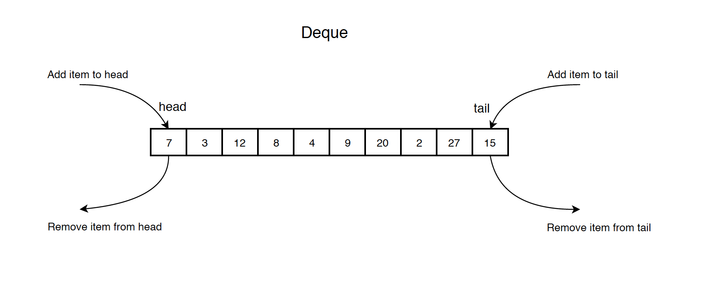

# Deque

## Contents

-   [Introduction](#introduction)
-   [Operations & Complexities](#operations--complexities)

## Introduction

A double-ended queue (abbreviated to deque) is an abstract data type that generalizes a queue, for which elements can be added to or removed from either the front (head) or back (tail). It has four principal operations:

<ul>
    <li>addFirst: add an element to the head</li>
    <li>addLast: add an element to the tail</li>
    <li>removeFirst: remove the first element</li>
    <li>removeLast: remove the last element</li>
</ul>



## Operations & Complexities

| Operation   | Complexity |
| ----------- | ---------- |
| addFirst    | O(1)       |
| addLast     | O(1)       |
| removeFirst | O(1)       |
| removeLast  | O(1)       |
| peekFirst   | O(1)       |
| peekLast    | O(1)       |
| isEmpty    | O(1)       |

## Implementation of Deque
### Using Circular Array

```java showLineNumbers
public class CircularArrayDeque {
    private int head; // the first node in deque, not the first item in array
    private int tail; // the last node in deque, not the first item in array
    private int[] arr;
    private int size;
 
    public CircularArrayDeque(int capacity) {
        arr = new int[capacity];
        head = 0;
        tail = 0;
        size = 0;
    }
 
    // Add item to the head of the deque
    public void addFirst(int value) {
        // check if deque is full
        if (isFull()) {
            return;
        }
 
        head = head - 1;
        if (head < 0) {
            head = arr.length - 1;
        }
        arr[head] = value;
        size += 1;
    }
 
    // Remove the first item from the deque and return its value
    public int removeFirst() throws Exception {
        if (isEmpty()) {
            throw new Exception("Circular Array Deque is empty when dequeue!");
        }
        int value = arr[head];
        head = (head + 1) % arr.length;
        size -= 1;
        return value;
    }
 
    // Get the first item
    public int peekFirst() throws Exception {
        if (isEmpty()) {
            throw new Exception("Circular Array Deque is empty when peek!");
        }
        return arr[head];
    }
 
    // Add item to the end of the deque
    public void addLast(int value) {
        // check if deque is full
        if (isFull()) {
            return;
        }
        tail = (head + size) % arr.length;
        arr[tail] = value;
        size += 1;
    }
 
    // Remove the last item from the deque and return its value
    public int removeLast() throws Exception {
        if (isEmpty()) {
            throw new Exception("Circular Array Deque is empty when dequeue!");
        }
 
        int value = arr[tail];
        tail = tail - 1;
        if (tail < 0) {
            tail = arr.length - 1;
        }
        size -= 1;
        return value;
    }
 
    // Get the last item
    public int peekLast() throws Exception {
        if (isEmpty()) {
            throw new Exception("Circular Array Deque is empty when peek!");
        }
        return arr[tail];
    }
 
    // Return whether the queue is full
    public boolean isFull() {
        return size == arr.length;
    }
 
    // Return whether the queue is empty
    public boolean isEmpty() {
        return size == 0;
    }
}
```

### Using Linked List

```java showLineNumbers 

public class ListNode {
    public int val;
    public ListNode prev;
    public ListNode next;
    public ListNode(int val) {
        this.val = val;
        this.prev = null;
        this.next = null;
    }
}

public class LinkedListDeque {
    private ListNode head; // the first node
    private ListNode tail; // the last node
 
    public LinkedListDeque() {
        head = null;
        tail = null;
    }
 
    // Add item to the head of the list
    public void addFirst(int value) {
        if (head == null) {
            head = new ListNode(value);
            tail = head;
        } else {
            head.prev = new ListNode(value);
            head.prev.next = head;
            head = head.prev;
        }
    }
 
    // Remove the head from the list and return its value
    public int removeFirst() throws Exception {
        if (head == null) {
            throw new Exception();
        }
        int value = head.val;
        head = head.next;
        if (head != null) {
            head.prev = null;
        } else {
            tail = null;
        }
        return value;
    }
 
    // Get the value of the head
    public int peekFirst() throws Exception {
        if (head == null) {
            throw new Exception();
        }
        return head.val;
    }
 
    // Add item to the tail of the list
    public void addLast(int value) {
        if (tail == null) {
            tail = new ListNode(value);
            head = tail;
        } else {
            tail.next = new ListNode(value);
            tail.next.prev = tail;
            tail = tail.next;
        }
    }
 
    // Remove the tail from the list and return its value
    public int removeLast() throws Exception {
        if (tail == null) {
            throw new Exception();
        }
        int value = tail.val;
        tail = tail.prev;
        if (tail != null) {
            tail.next = null;
        } else {
            head = null;
        }
        return value;
    }
 
    // Get the value of the tail
    public int peekLast() throws Exception {
        if (tail == null) {
            throw new Exception();
        }
        return tail.val;
    }
 
    // Return whether the deque is empty
    public boolean isEmpty() {
        return head == null || tail == null;
    }
}
```